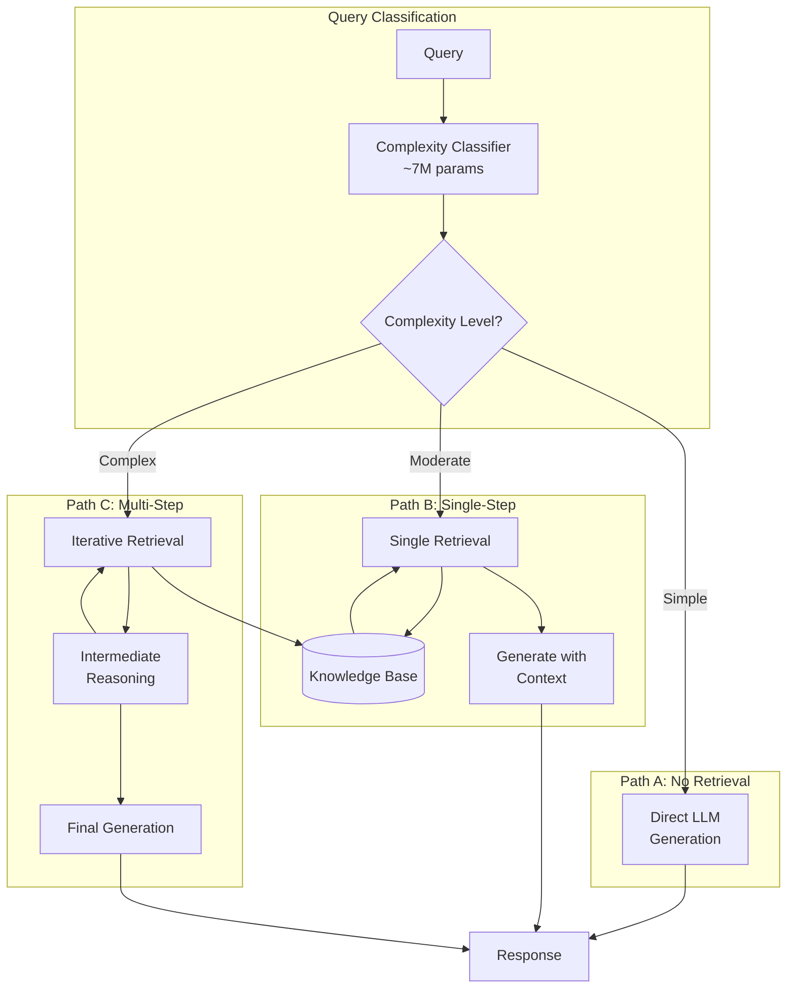

# Adaptive-RAG

**Category**: Adaptive/Routing
**Maturity**: Research
**Primary Source**: Jeong, S., et al. (2024). "Adaptive-RAG: Learning to Adapt Retrieval-Augmented Large Language Models through Question Complexity." [arXiv:2403.14403](https://arxiv.org/abs/2403.14403)

---

## Overview

Adaptive-RAG introduces intelligent query routing based on question complexity. Rather than applying the same retrieval strategy to all queries, it uses a trained classifier to predict whether a query needs:
1. **No retrieval**: Simple queries answerable from model knowledge
2. **Single-step retrieval**: Straightforward factual queries
3. **Multi-step retrieval**: Complex queries requiring iterative reasoning

The key insight is that applying heavy-duty retrieval to simple queries wastes resources, while applying simple retrieval to complex queries produces poor results. A lightweight classifier (~7M parameters) routes each query to the appropriate strategy, optimizing the accuracy-efficiency tradeoff.

This approach is **distinct from CRAG**: CRAG evaluates retrieval *quality* after retrieval and takes corrective action; Adaptive-RAG predicts query *complexity* before retrieval and routes accordingly.

---

## Architecture Diagram



---

## How It Works

### Query Complexity Classification

The classifier predicts three categories:

| Level | Query Type | Example | Strategy |
|-------|-----------|---------|----------|
| **A** | Simple factual | "What is the capital of France?" | No retrieval (LLM knowledge) |
| **B** | Single-hop factual | "When was the Eiffel Tower built?" | Single retrieval pass |
| **C** | Multi-hop reasoning | "Who was president when the Eiffel Tower was built?" | Iterative retrieval |

### Classifier Training

The classifier is trained on:
1. **Query embeddings** from a pretrained encoder
2. **Complexity labels** derived from:
   - Query structure analysis (single vs. compound)
   - Reasoning hop annotations (from datasets like HotpotQA)
   - Synthetic complexity scores

### Routing Strategies

**No Retrieval (Level A)**:
```
Query → LLM → Response
```

**Single-Step (Level B)**:
```
Query → Embed → Retrieve top-k → Prompt with context → LLM → Response
```

**Multi-Step (Level C)**:
```
Query → Decompose into sub-queries → For each sub-query:
    Retrieve → Extract answer → Add to context
→ Synthesize final answer with all evidence
```

---

## Implementation

### Complexity Classifier

```python
from transformers import AutoModel, AutoTokenizer
import torch
import torch.nn as nn

class ComplexityClassifier(nn.Module):
    """
    Lightweight classifier to predict query complexity.
    Routes queries to appropriate RAG strategy.
    """

    def __init__(
        self,
        encoder_name: str = "sentence-transformers/all-MiniLM-L6-v2",
        hidden_dim: int = 256,
        num_classes: int = 3  # A, B, C
    ):
        super().__init__()
        self.encoder = AutoModel.from_pretrained(encoder_name)
        self.tokenizer = AutoTokenizer.from_pretrained(encoder_name)

        # Freeze encoder (use as feature extractor)
        for param in self.encoder.parameters():
            param.requires_grad = False

        # Classification head
        self.classifier = nn.Sequential(
            nn.Linear(384, hidden_dim),  # 384 = MiniLM embedding dim
            nn.ReLU(),
            nn.Dropout(0.1),
            nn.Linear(hidden_dim, num_classes)
        )

        self.class_names = ["no_retrieval", "single_step", "multi_step"]

    def forward(self, query: str) -> tuple[str, torch.Tensor]:
        """
        Classify query complexity.

        Returns:
            strategy: "no_retrieval", "single_step", or "multi_step"
            probs: Probability distribution over classes
        """
        # Encode query
        inputs = self.tokenizer(
            query,
            return_tensors="pt",
            truncation=True,
            max_length=128
        )

        with torch.no_grad():
            outputs = self.encoder(**inputs)
            embedding = outputs.last_hidden_state[:, 0, :]  # CLS token

        # Classify
        logits = self.classifier(embedding)
        probs = torch.softmax(logits, dim=-1)

        # Get prediction
        pred_idx = probs.argmax().item()
        strategy = self.class_names[pred_idx]

        return strategy, probs[0]

    def train_classifier(
        self,
        train_data: List[tuple[str, int]],  # (query, complexity_label)
        epochs: int = 10,
        lr: float = 1e-3
    ):
        """Train the classification head on labeled data."""
        optimizer = torch.optim.Adam(self.classifier.parameters(), lr=lr)
        criterion = nn.CrossEntropyLoss()

        for epoch in range(epochs):
            for query, label in train_data:
                optimizer.zero_grad()

                inputs = self.tokenizer(query, return_tensors="pt", truncation=True)
                with torch.no_grad():
                    embedding = self.encoder(**inputs).last_hidden_state[:, 0, :]

                logits = self.classifier(embedding)
                loss = criterion(logits, torch.tensor([label]))

                loss.backward()
                optimizer.step()
```

### Adaptive RAG Pipeline

```python
from typing import Optional, List

class AdaptiveRAG:
    """
    RAG system that adapts retrieval strategy based on query complexity.
    """

    def __init__(
        self,
        classifier: ComplexityClassifier,
        retriever: Retriever,
        generator: LanguageModel
    ):
        self.classifier = classifier
        self.retriever = retriever
        self.generator = generator

    def answer(self, query: str) -> str:
        """
        Route query to appropriate strategy and generate answer.
        """
        # Step 1: Classify query complexity
        strategy, probs = self.classifier(query)

        # Step 2: Route to appropriate handler
        if strategy == "no_retrieval":
            return self._no_retrieval(query)
        elif strategy == "single_step":
            return self._single_step(query)
        else:  # multi_step
            return self._multi_step(query)

    def _no_retrieval(self, query: str) -> str:
        """Handle simple queries with LLM knowledge only."""
        prompt = f"""Answer the following question concisely.
If you're not certain, say so.

Question: {query}

Answer:"""
        return self.generator.generate(prompt)

    def _single_step(self, query: str, top_k: int = 5) -> str:
        """Handle moderate queries with single retrieval pass."""
        # Retrieve relevant documents
        docs = self.retriever.retrieve(query, top_k=top_k)
        context = "\n\n".join([d.text for d in docs])

        prompt = f"""Answer the question based on the provided context.

Context:
{context}

Question: {query}

Answer:"""
        return self.generator.generate(prompt)

    def _multi_step(self, query: str, max_hops: int = 3) -> str:
        """Handle complex queries with iterative retrieval."""
        # Step 1: Decompose query into sub-questions
        sub_questions = self._decompose_query(query)

        # Step 2: Iteratively retrieve and answer
        evidence = []
        for sub_q in sub_questions:
            docs = self.retriever.retrieve(sub_q, top_k=3)

            # Extract relevant information
            sub_context = "\n".join([d.text for d in docs])
            sub_answer = self._extract_answer(sub_q, sub_context)

            evidence.append({
                "question": sub_q,
                "answer": sub_answer,
                "sources": [d.text[:200] for d in docs]
            })

        # Step 3: Synthesize final answer
        evidence_text = "\n".join([
            f"Q: {e['question']}\nA: {e['answer']}"
            for e in evidence
        ])

        prompt = f"""Based on the following evidence, answer the original question.

Evidence:
{evidence_text}

Original Question: {query}

Final Answer:"""
        return self.generator.generate(prompt)

    def _decompose_query(self, query: str) -> List[str]:
        """Break complex query into sub-questions."""
        prompt = f"""Break down this complex question into simpler sub-questions
that can be answered independently.

Complex question: {query}

Sub-questions (one per line):"""

        response = self.generator.generate(prompt)
        sub_questions = [q.strip() for q in response.split('\n') if q.strip()]
        return sub_questions[:3]  # Limit to 3 sub-questions

    def _extract_answer(self, question: str, context: str) -> str:
        """Extract answer to sub-question from context."""
        prompt = f"""Extract a brief answer to the question from the context.

Context: {context}

Question: {question}

Brief Answer:"""
        return self.generator.generate(prompt)
```

---

## Use Cases

### Example 1: Enterprise Search with Variable Query Types
- **Scenario**: Internal knowledge base serving both "What's the PTO policy?" and "How does our healthcare plan compare to competitors for remote employees in California?"
- **Why this architecture**: Simple queries route to fast path; complex queries get multi-hop treatment
- **Expected outcome**: Faster average response time; better accuracy on complex queries

### Example 2: Customer Support Triage
- **Scenario**: Support system handling "How do I reset my password?" alongside "My order from last week hasn't arrived and the tracking shows delivered but I didn't receive it"
- **Why this architecture**: Complexity classifier routes appropriately; avoids over/under-processing
- **Expected outcome**: Optimized resource usage; matched query complexity to retrieval depth

### Example 3: Research Assistant
- **Scenario**: Academic tool answering simple definition queries and complex comparative analysis
- **Why this architecture**: "What is BERT?" vs "How does BERT compare to GPT for sequence labeling tasks?"
- **Expected outcome**: Fast response for simple queries; thorough multi-hop for complex ones

---

## Pros and Cons

### Advantages

- **Efficiency optimization**: Avoids expensive retrieval for simple queries
- **Better accuracy on complex queries**: Multi-hop strategy handles reasoning
- **Lightweight classifier**: ~7M parameters, <10ms inference
- **Flexible integration**: Can use any retrieval and generation backend
- **Measurable routing**: Classification confidence provides uncertainty signal

### Limitations

- **Classifier accuracy ceiling**: Routing is only as good as classification
- **Training data needed**: Requires complexity-labeled queries for classifier
- **Fixed categories**: Three-way split may not capture all query types
- **Decomposition quality**: Multi-step relies on good query decomposition
- **No dynamic adjustment**: Can't switch strategies mid-generation

### Compared to Alternatives

- **vs. CRAG**: CRAG evaluates retrieval quality post-hoc; Adaptive-RAG predicts complexity pre-hoc. Different decision points.
- **vs. Self-RAG**: Self-RAG makes per-segment decisions; Adaptive-RAG routes entire query. Self-RAG is more granular but slower.
- **vs. Agentic RAG**: Agentic uses LLM reasoning for all decisions; Adaptive-RAG uses fast classifier for initial routing.

---

## Classifier Training Data

### Data Sources

1. **Simple queries (Class A)**:
   - Trivia questions from knowledge bases
   - Definition queries
   - Single-entity factual questions

2. **Single-hop queries (Class B)**:
   - Standard QA datasets (Natural Questions, TriviaQA)
   - Single-document queries

3. **Multi-hop queries (Class C)**:
   - HotpotQA, 2WikiMultiHopQA
   - Comparative questions
   - Temporal reasoning questions

### Synthetic Generation

```python
def generate_training_data():
    """Generate complexity-labeled training data."""
    data = []

    # Class A: Simple (no retrieval needed)
    simple_patterns = [
        "What is the capital of {country}?",
        "How many {unit} in a {larger_unit}?",
        "What color is {object}?"
    ]

    # Class B: Single-hop (one retrieval)
    single_patterns = [
        "When was {entity} founded?",
        "Who wrote {book}?",
        "What is the population of {city}?"
    ]

    # Class C: Multi-hop (iterative retrieval)
    multi_patterns = [
        "Who was the president when {event} happened?",
        "Compare {entity1} and {entity2} in terms of {aspect}.",
        "What were the consequences of {event} for {affected_group}?"
    ]

    # Generate examples from patterns...
    return data
```

---

## Performance Considerations

### Latency by Strategy

| Strategy | Typical Latency | Components |
|----------|-----------------|------------|
| No Retrieval | 100-500ms | Classifier + LLM |
| Single-Step | 200-800ms | Classifier + Retrieval + LLM |
| Multi-Step | 1-5s | Classifier + 3x(Retrieval + LLM) |

### Cost Optimization

```python
# Monitor and log routing distribution
routing_stats = {"no_retrieval": 0, "single_step": 0, "multi_step": 0}

def track_routing(strategy: str):
    routing_stats[strategy] += 1

# Adjust classifier thresholds if distribution is unbalanced
# e.g., if too many queries route to multi_step, raise threshold
```

---

## References

1. Jeong, S., et al. (2024). "Adaptive-RAG: Learning to Adapt Retrieval-Augmented Large Language Models through Question Complexity." [arXiv:2403.14403](https://arxiv.org/abs/2403.14403)
2. Sharma, C. (2025). "Retrieval-Augmented Generation: A Comprehensive Survey." [arXiv:2506.00054](https://arxiv.org/abs/2506.00054)
