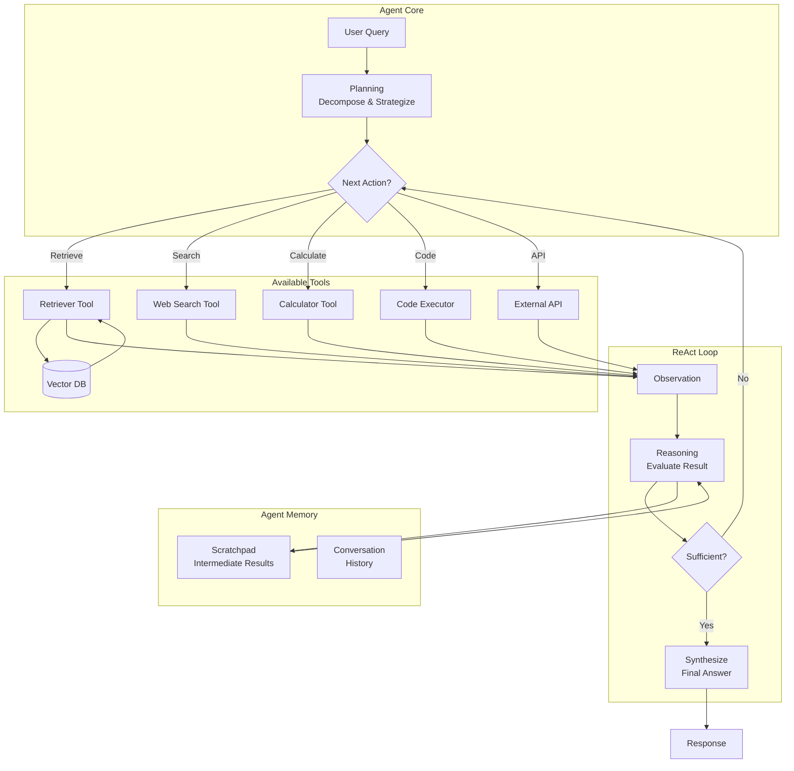

# Agentic RAG

**Category**: Agentic
**Maturity**: Production-Proven
**Primary Source**: Singh, B., et al. (2024). "Agentic Retrieval-Augmented Generation: A Survey." [arXiv:2501.09136](https://arxiv.org/abs/2501.09136)

---

## Overview

Agentic RAG transforms the language model from a passive consumer of retrieved content into an active orchestrator that decides what tools to use, when to retrieve, and how to refine its approach based on intermediate results. Rather than following a fixed retrieve-then-generate pipeline, the agent reasons about the query, formulates a plan, executes retrieval as one of many available tools, and iteratively refines until satisfied.

The key insight is that complex information needs often require multiple retrieval steps, tool use beyond retrieval (calculations, code execution, API calls), and dynamic adaptation based on what's found. An agent can:
- Decompose complex queries into sub-queries
- Retry with reformulated queries when initial retrieval fails
- Combine information from multiple sources
- Use tools for computation, not just retrieval
- Self-correct based on contradictions or gaps

Major frameworks include LangGraph, LlamaIndex, CrewAI, and OpenAI's function calling, making Agentic RAG increasingly accessible for production use.

---

## Architecture Diagram



---

## How It Works

### Agent Types

| Agent Type | Behavior | Use Case |
|------------|----------|----------|
| **Routing Agent** | Directs queries to appropriate tools/sources | Multi-source knowledge bases |
| **Query Planning Agent** | Decomposes complex queries into sub-queries | Multi-hop reasoning |
| **ReAct Agent** | Interleaves reasoning and action | General purpose |
| **Plan-and-Execute** | Creates full plan, then executes | Multi-step workflows |

### ReAct Framework

The ReAct (Reason + Act) pattern alternates between:
1. **Thought**: Reason about current state and next action
2. **Action**: Execute a tool (retrieve, search, calculate, etc.)
3. **Observation**: Receive tool output
4. **Repeat** until sufficient information gathered

```
Thought: I need to find when the Eiffel Tower was built and who was president then.
Action: retrieve("Eiffel Tower construction date")
Observation: The Eiffel Tower was completed in 1889.

Thought: Now I need to find who was the French president in 1889.
Action: retrieve("French president 1889")
Observation: Sadi Carnot was President of France from 1887 to 1894.

Thought: I have both pieces of information.
Answer: Sadi Carnot was the French president when the Eiffel Tower was built in 1889.
```

### Tool Definitions

Tools are defined with:
- **Name**: Identifier for the tool
- **Description**: When to use it (for LLM to decide)
- **Parameters**: What inputs it takes
- **Returns**: What output to expect

---

## Implementation

### Tool Definitions

```python
from typing import List, Dict, Callable, Any
from dataclasses import dataclass

@dataclass
class Tool:
    """Definition of a tool available to the agent."""
    name: str
    description: str
    parameters: Dict[str, str]
    function: Callable

# Define retrieval tool
def retriever_function(query: str, top_k: int = 5) -> List[Dict]:
    """Retrieve relevant documents from knowledge base."""
    embedding = embedding_model.encode([query])[0]
    results = vector_index.search(embedding, top_k=top_k)
    return [{"text": r.metadata["text"], "score": r.score} for r in results]

retriever_tool = Tool(
    name="retrieve",
    description="Search the knowledge base for information. Use when you need specific facts or documents.",
    parameters={"query": "search query string", "top_k": "number of results (default 5)"},
    function=retriever_function
)

# Define web search tool
def web_search_function(query: str, num_results: int = 5) -> List[Dict]:
    """Search the web for current information."""
    results = web_search_api.search(query, num_results=num_results)
    return [{"title": r.title, "snippet": r.snippet, "url": r.url} for r in results]

web_search_tool = Tool(
    name="web_search",
    description="Search the web for current events or information not in the knowledge base.",
    parameters={"query": "search query", "num_results": "number of results"},
    function=web_search_function
)

# Define calculator tool
def calculator_function(expression: str) -> float:
    """Evaluate a mathematical expression."""
    import ast
    import operator

    ops = {ast.Add: operator.add, ast.Sub: operator.sub,
           ast.Mult: operator.mul, ast.Div: operator.truediv}

    def eval_expr(node):
        if isinstance(node, ast.Num):
            return node.n
        elif isinstance(node, ast.BinOp):
            return ops[type(node.op)](eval_expr(node.left), eval_expr(node.right))
        raise ValueError("Invalid expression")

    return eval_expr(ast.parse(expression, mode='eval').body)

calculator_tool = Tool(
    name="calculate",
    description="Perform mathematical calculations. Use for arithmetic, percentages, etc.",
    parameters={"expression": "mathematical expression as string"},
    function=calculator_function
)
```

### ReAct Agent

```python
from typing import List, Optional
import re

class ReActAgent:
    """
    ReAct agent that interleaves reasoning and action.
    """

    def __init__(
        self,
        llm: LanguageModel,
        tools: List[Tool],
        max_iterations: int = 10
    ):
        self.llm = llm
        self.tools = {tool.name: tool for tool in tools}
        self.max_iterations = max_iterations

    def run(self, query: str) -> str:
        """
        Execute ReAct loop to answer query.
        """
        # Build tool descriptions for prompt
        tool_desc = "\n".join([
            f"- {t.name}: {t.description}"
            for t in self.tools.values()
        ])

        # Initialize scratchpad
        scratchpad = ""

        for iteration in range(self.max_iterations):
            # Generate next thought and action
            prompt = f"""You are an AI assistant that answers questions by using tools.

Available tools:
{tool_desc}

Answer the following question by reasoning step-by-step.
Format your response as:
Thought: <your reasoning>
Action: <tool_name>(<parameters>)

When you have enough information to answer, respond:
Thought: <final reasoning>
Answer: <your answer>

Question: {query}

{scratchpad}"""

            response = self.llm.generate(prompt)

            # Parse response
            if "Answer:" in response:
                # Extract final answer
                answer = response.split("Answer:")[-1].strip()
                return answer

            # Parse thought and action
            thought, action = self._parse_response(response)
            scratchpad += f"\nThought: {thought}\n"

            if action:
                # Execute action
                tool_name, params = self._parse_action(action)

                if tool_name in self.tools:
                    try:
                        result = self.tools[tool_name].function(**params)
                        observation = f"Observation: {result}"
                    except Exception as e:
                        observation = f"Observation: Error - {str(e)}"
                else:
                    observation = f"Observation: Unknown tool '{tool_name}'"

                scratchpad += f"Action: {action}\n{observation}\n"
            else:
                scratchpad += "Observation: No valid action found.\n"

        return "I was unable to find a complete answer within the allowed iterations."

    def _parse_response(self, response: str) -> tuple[str, Optional[str]]:
        """Parse thought and action from response."""
        thought = ""
        action = None

        if "Thought:" in response:
            thought = response.split("Thought:")[-1].split("Action:")[0].strip()

        if "Action:" in response:
            action = response.split("Action:")[-1].split("\n")[0].strip()

        return thought, action

    def _parse_action(self, action: str) -> tuple[str, dict]:
        """Parse action string into tool name and parameters."""
        match = re.match(r"(\w+)\((.*)\)", action)
        if match:
            tool_name = match.group(1)
            params_str = match.group(2)
            # Simple parameter parsing
            params = {}
            if params_str:
                for param in params_str.split(","):
                    if "=" in param:
                        key, value = param.split("=", 1)
                        params[key.strip()] = eval(value.strip())
                    else:
                        params["query"] = eval(param.strip())
            return tool_name, params
        return action, {}
```

### Multi-Agent System

```python
from typing import List, Dict
from dataclasses import dataclass

@dataclass
class AgentRole:
    """Definition of an agent role in multi-agent system."""
    name: str
    description: str
    tools: List[Tool]
    system_prompt: str

class MultiAgentRAG:
    """
    Multi-agent RAG system with specialized agents.
    """

    def __init__(self, llm: LanguageModel, roles: List[AgentRole]):
        self.llm = llm
        self.agents = {
            role.name: ReActAgent(llm, role.tools)
            for role in roles
        }
        self.roles = {role.name: role for role in roles}

    def run(self, query: str) -> str:
        """
        Orchestrate multiple agents to answer query.
        """
        # Step 1: Route query to appropriate agent(s)
        routing = self._route_query(query)

        # Step 2: Execute with selected agents
        results = {}
        for agent_name in routing:
            agent = self.agents[agent_name]
            result = agent.run(query)
            results[agent_name] = result

        # Step 3: Synthesize results if multiple agents
        if len(results) > 1:
            return self._synthesize_results(query, results)
        else:
            return list(results.values())[0]

    def _route_query(self, query: str) -> List[str]:
        """Determine which agents should handle the query."""
        agent_descriptions = "\n".join([
            f"- {name}: {role.description}"
            for name, role in self.roles.items()
        ])

        prompt = f"""Given this query, which agent(s) should handle it?

Agents:
{agent_descriptions}

Query: {query}

Return a comma-separated list of agent names:"""

        response = self.llm.generate(prompt)
        agents = [a.strip() for a in response.split(",")]
        return [a for a in agents if a in self.agents]

    def _synthesize_results(self, query: str, results: Dict[str, str]) -> str:
        """Combine results from multiple agents."""
        results_text = "\n\n".join([
            f"From {name}:\n{result}"
            for name, result in results.items()
        ])

        prompt = f"""Synthesize these results from different specialists into a comprehensive answer.

Results:
{results_text}

Original Question: {query}

Synthesized Answer:"""

        return self.llm.generate(prompt)
```

---

## Use Cases

### Example 1: Research Analysis
- **Scenario**: "Compare the market cap growth of Apple and Microsoft over the last 5 years and calculate the CAGR"
- **Why this architecture**: Requires multiple retrievals + calculation tool
- **Expected outcome**: Agent retrieves historical data, uses calculator for CAGR, synthesizes comparison

### Example 2: Multi-Document Synthesis
- **Scenario**: "What do our Q1-Q4 reports say about customer satisfaction trends?"
- **Why this architecture**: Must retrieve from 4 documents, synthesize findings, identify patterns
- **Expected outcome**: Comprehensive trend analysis across documents

### Example 3: Troubleshooting Workflow
- **Scenario**: "Debug why our API latency increased after the latest deployment"
- **Why this architecture**: May need to check logs, metrics, code changes, run diagnostics
- **Expected outcome**: Root cause analysis with evidence from multiple sources

---

## Pros and Cons

### Advantages

- **Handles complex queries**: Decomposes and iteratively solves
- **Tool flexibility**: Can use any tool, not just retrieval
- **Self-correction**: Can retry with different approaches
- **Transparent reasoning**: ReAct trace shows decision process
- **Production-ready frameworks**: LangGraph, LlamaIndex make implementation easier

### Limitations

- **High latency**: Multiple LLM calls + tool execution; 5-60s typical
- **High cost**: Each iteration costs LLM tokens; complex queries may cost $0.10-1.00
- **Unpredictable behavior**: Agent may take unexpected paths
- **Harder to debug**: Non-deterministic execution makes testing difficult
- **Requires careful prompting**: System prompts need tuning per use case

### Compared to Alternatives

- **vs. Traditional RAG**: Agentic handles complex queries; Traditional is faster for simple ones
- **vs. Self-RAG**: Self-RAG is faster with trained tokens; Agentic is more flexible with tools
- **vs. GraphRAG**: GraphRAG pre-computes structure; Agentic reasons at runtime. GraphRAG faster for global queries.

---

## Framework Comparison

| Framework | Strengths | Best For |
|-----------|-----------|----------|
| **LangGraph** | State machines, complex workflows | Production multi-step agents |
| **LlamaIndex** | Data connectors, query engines | Document-heavy applications |
| **CrewAI** | Multi-agent collaboration | Specialized role-based tasks |
| **OpenAI Assistants** | Built-in tools, hosted | Quick prototypes, simple agents |
| **DSPy** | Programmatic optimization | Research, prompt optimization |

---

## Cost and Latency

| Complexity | Typical Iterations | Latency | Cost per Query |
|------------|-------------------|---------|----------------|
| Simple | 1-2 | 2-5s | $0.02-0.05 |
| Moderate | 3-5 | 5-15s | $0.05-0.15 |
| Complex | 5-10+ | 15-60s | $0.15-1.00 |

---

## References

1. Singh, B., et al. (2024). "Agentic Retrieval-Augmented Generation: A Survey." [arXiv:2501.09136](https://arxiv.org/abs/2501.09136)
2. Yao, S., et al. (2022). "ReAct: Synergizing Reasoning and Acting in Language Models." [arXiv:2210.03629](https://arxiv.org/abs/2210.03629)
3. Weaviate. (November 2024). "What is Agentic RAG." [weaviate.io](https://weaviate.io/blog)
4. IBM. (2024). "What is Agentic RAG."
