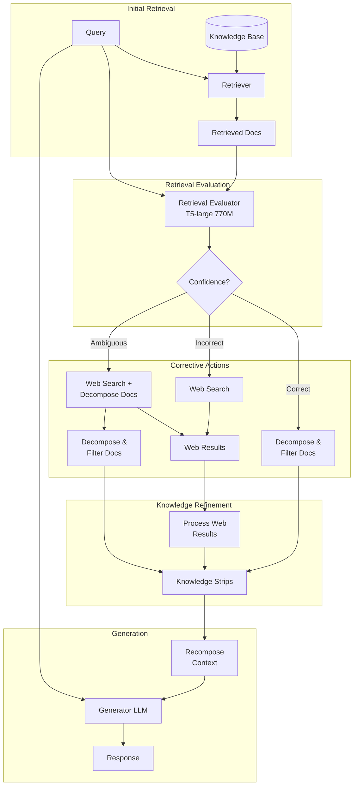

# CRAG (Corrective Retrieval Augmented Generation)

**Category**: Adaptive/Routing
**Maturity**: Early Adoption
**Primary Source**: Yan, S., et al. (2024). "Corrective Retrieval Augmented Generation." [arXiv:2401.15884](https://arxiv.org/abs/2401.15884)

---

## Overview

CRAG (Corrective Retrieval Augmented Generation) addresses a critical weakness in traditional RAG: when retrieval fails, the entire system fails. Instead of blindly trusting retrieved documents, CRAG introduces a lightweight evaluator that assesses retrieval quality and triggers corrective actions when needed.

The key innovation is a **retrieval evaluator** (fine-tuned T5-large, 770M parameters) that classifies retrieved documents as "Correct," "Incorrect," or "Ambiguous." Based on this assessment:
- **Correct**: Proceed with retrieved documents (standard RAG)
- **Incorrect**: Fall back to web search for fresh information
- **Ambiguous**: Use both retrieved documents and web search

Additionally, CRAG includes a **decompose-then-recompose** algorithm that extracts relevant knowledge strips from documents, filtering out irrelevant content before generation.

The approach is explicitly designed as **plug-and-play**—it can be added to any existing RAG system without modifying the base retriever or generator.

---

## Architecture Diagram



---

## How It Works

### Retrieval Evaluation
The evaluator assigns a confidence score to each retrieved document:

```
Confidence(d, q) = P(relevant | d, q)
```

Documents are classified based on thresholds:
- **Correct**: confidence > upper_threshold (e.g., 0.8)
- **Incorrect**: confidence < lower_threshold (e.g., 0.3)
- **Ambiguous**: between thresholds

For a set of retrieved documents, the overall action is determined by the distribution:
- All/most correct → use retrieved docs
- All/most incorrect → trigger web search
- Mixed → combine both sources

### Decompose-then-Recompose Algorithm

**Step 1: Decompose** - Break documents into knowledge strips (sentences or semantic units)

**Step 2: Evaluate** - Score each strip for relevance to the query

**Step 3: Filter** - Remove strips below relevance threshold

**Step 4: Recompose** - Concatenate relevant strips into refined context

This process removes irrelevant noise that can distract the generator, improving response quality even when retrieval is partially correct.

---

## Implementation

### Retrieval Evaluator

```python
from transformers import T5ForSequenceClassification, T5Tokenizer
from typing import List, Tuple

class RetrievalEvaluator:
    """
    Lightweight retrieval quality evaluator based on T5-large.
    Classifies documents as Correct/Incorrect/Ambiguous.
    """

    def __init__(self, model_path: str = "crag-evaluator-t5-large"):
        self.tokenizer = T5Tokenizer.from_pretrained(model_path)
        self.model = T5ForSequenceClassification.from_pretrained(model_path)
        self.upper_threshold = 0.8
        self.lower_threshold = 0.3

    def evaluate(
        self,
        query: str,
        documents: List[str]
    ) -> Tuple[str, List[float]]:
        """
        Evaluate retrieval quality and determine corrective action.

        Returns:
            action: "correct", "incorrect", or "ambiguous"
            scores: relevance score for each document
        """
        scores = []

        for doc in documents:
            # Format input for T5 evaluator
            input_text = f"Query: {query} Document: {doc[:512]}"
            inputs = self.tokenizer(
                input_text,
                return_tensors="pt",
                truncation=True,
                max_length=512
            )

            # Get relevance score
            outputs = self.model(**inputs)
            score = torch.softmax(outputs.logits, dim=-1)[0][1].item()
            scores.append(score)

        # Determine overall action
        avg_score = sum(scores) / len(scores)
        high_conf_count = sum(1 for s in scores if s > self.upper_threshold)
        low_conf_count = sum(1 for s in scores if s < self.lower_threshold)

        if high_conf_count >= len(scores) * 0.5:
            action = "correct"
        elif low_conf_count >= len(scores) * 0.5:
            action = "incorrect"
        else:
            action = "ambiguous"

        return action, scores
```

### Knowledge Decomposition and Filtering

```python
from typing import List, Dict

def decompose_and_filter(
    documents: List[str],
    query: str,
    relevance_threshold: float = 0.5
) -> List[str]:
    """
    Decompose documents into knowledge strips and filter irrelevant ones.

    Steps:
    1. Split documents into sentences/strips
    2. Score each strip for relevance
    3. Filter strips below threshold
    4. Return relevant strips
    """
    all_strips = []

    # Step 1: Decompose into strips
    for doc in documents:
        sentences = split_into_sentences(doc)
        all_strips.extend(sentences)

    # Step 2: Score strips for relevance
    scored_strips = []
    for strip in all_strips:
        # Use embedding similarity or small model for scoring
        score = compute_relevance(query, strip)
        scored_strips.append({"text": strip, "score": score})

    # Step 3: Filter by threshold
    relevant_strips = [
        s["text"] for s in scored_strips
        if s["score"] >= relevance_threshold
    ]

    # Step 4: Deduplicate and return
    return list(dict.fromkeys(relevant_strips))

def compute_relevance(query: str, strip: str) -> float:
    """Compute relevance score between query and strip."""
    query_emb = embedding_model.encode([query])[0]
    strip_emb = embedding_model.encode([strip])[0]
    return cosine_similarity(query_emb, strip_emb)
```

### Full CRAG Pipeline

```python
async def crag_retrieve_and_generate(
    query: str,
    retriever: Retriever,
    evaluator: RetrievalEvaluator,
    web_searcher: WebSearcher,
    generator: LanguageModel,
    top_k: int = 5
) -> str:
    """
    Full CRAG pipeline with corrective retrieval.

    Steps:
    1. Initial retrieval from knowledge base
    2. Evaluate retrieval quality
    3. Take corrective action if needed
    4. Decompose and filter knowledge
    5. Generate response
    """
    # Step 1: Initial retrieval
    documents = retriever.retrieve(query, top_k=top_k)
    doc_texts = [d.text for d in documents]

    # Step 2: Evaluate retrieval quality
    action, scores = evaluator.evaluate(query, doc_texts)

    # Step 3: Corrective action based on evaluation
    knowledge_strips = []

    if action == "correct":
        # Use retrieved documents directly
        knowledge_strips = decompose_and_filter(doc_texts, query)

    elif action == "incorrect":
        # Fall back to web search
        web_results = await web_searcher.search(query, num_results=5)
        web_texts = [r.snippet for r in web_results]
        knowledge_strips = decompose_and_filter(web_texts, query)

    else:  # ambiguous
        # Combine both sources
        # Filter retrieved docs to high-confidence ones
        good_docs = [d for d, s in zip(doc_texts, scores) if s > 0.5]
        knowledge_strips = decompose_and_filter(good_docs, query)

        # Add web search results
        web_results = await web_searcher.search(query, num_results=3)
        web_texts = [r.snippet for r in web_results]
        web_strips = decompose_and_filter(web_texts, query)
        knowledge_strips.extend(web_strips)

    # Step 4: Recompose context
    context = "\n\n".join(knowledge_strips[:20])  # Limit context size

    # Step 5: Generate response
    prompt = f"""Answer the question based on the following knowledge:

{context}

Question: {query}

Answer:"""

    response = generator.generate(prompt)
    return response
```

---

## Use Cases

### Example 1: Customer Support with Dynamic Information
- **Scenario**: Support system where knowledge base may be outdated (product recalls, pricing changes, policy updates)
- **Why this architecture**: Evaluator detects stale/irrelevant KB content; web fallback retrieves current information
- **Expected outcome**: Prevents outdated answers; maintains accuracy during rapid information changes

### Example 2: News and Current Events Q&A
- **Scenario**: Questions about recent events not in static knowledge base
- **Why this architecture**: Evaluator identifies when KB lacks relevant content; web search provides current information
- **Expected outcome**: Handles "what happened today" queries that pure RAG cannot answer

### Example 3: Technical Troubleshooting
- **Scenario**: IT helpdesk with knowledge base that may not cover all edge cases
- **Why this architecture**: Web fallback finds solutions for unusual problems not in documentation
- **Expected outcome**: Reduced "I don't know" responses; better coverage of long-tail issues

---

## Pros and Cons

### Advantages

- **Graceful degradation**: When retrieval fails, system corrects itself rather than hallucinating
- **Plug-and-play**: Can be added to existing RAG systems without modification
- **Lightweight evaluation**: T5-large (770M params) adds minimal latency (~100-200ms)
- **Improved accuracy**: Filtering irrelevant content reduces noise in generation
- **Flexible thresholds**: Can tune confidence thresholds for precision/recall tradeoff

### Limitations

- **Web search dependency**: Requires access to web search API; may not be suitable for air-gapped deployments
- **Added latency**: Evaluation + potential web search adds 200-500ms to response time
- **Evaluator training**: Need training data for retrieval quality classification
- **Web result quality**: Web search may return unreliable sources; no built-in fact-checking
- **Cost**: Web search APIs have per-query costs ($5-15 per 1000 queries for Google/Bing)

### Compared to Alternatives

- **vs. Self-RAG**: Self-RAG trains the generator to self-critique; CRAG uses separate evaluator. Self-RAG is more integrated but requires fine-tuning.
- **vs. Adaptive-RAG**: Adaptive-RAG routes based on query complexity; CRAG routes based on retrieval quality. Different decision points.
- **vs. Agentic RAG**: Agentic RAG uses LLM for decisions; CRAG uses lightweight classifier. CRAG is faster but less flexible.

---

## Evaluator Training

The T5-based evaluator is trained on:

1. **Positive examples**: Query-document pairs where the document answers the query
2. **Negative examples**: Query-document pairs with irrelevant documents
3. **Ambiguous examples**: Partially relevant documents

Training data can be generated by:
- Using existing QA datasets (Natural Questions, MS MARCO)
- Synthetic generation with LLMs
- Human annotation of retrieval results

---

## Performance Benchmarks

| Dataset | Method | Accuracy | Source |
|---------|--------|----------|--------|
| PopQA | RAG (baseline) | - | Yan et al., 2024 |
| PopQA | CRAG | +10-15% improvement | Yan et al., 2024 |

*Note: Specific benchmark numbers vary by dataset; the paper shows consistent improvements across multiple QA benchmarks.*

---

## Integration Considerations

### Web Search Options

| Provider | Cost | Latency | Quality |
|----------|------|---------|---------|
| Google Custom Search | $5/1K queries | 200-400ms | High |
| Bing Search | $7/1K queries | 200-400ms | High |
| Serper | $2.5/1K queries | 100-200ms | Medium |
| Self-hosted (Searx) | Compute only | Variable | Variable |

### Threshold Tuning

```python
# Conservative (minimize web search, trust KB more)
upper_threshold = 0.9
lower_threshold = 0.2

# Balanced (default)
upper_threshold = 0.8
lower_threshold = 0.3

# Aggressive (frequently use web search)
upper_threshold = 0.7
lower_threshold = 0.4
```

---

## References

1. Yan, S., et al. (2024). "Corrective Retrieval Augmented Generation." [arXiv:2401.15884](https://arxiv.org/abs/2401.15884)
2. Gao, Y., et al. (2023). "Retrieval-Augmented Generation for Large Language Models: A Survey." [arXiv:2312.10997](https://arxiv.org/abs/2312.10997)
