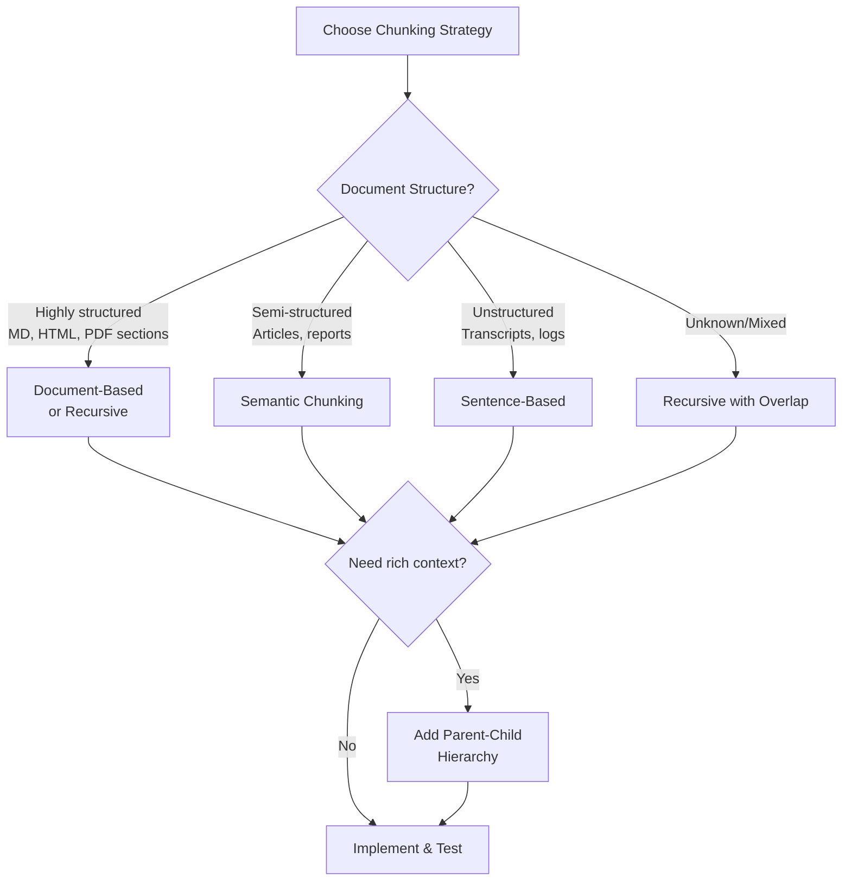

# Chunking Strategies for RAG Systems

**Category**: Foundational Concepts
**Impact**: High - Chunking is often the #1 source of RAG failures
**Audience**: Engineers implementing retrieval systems

---

## Overview

Chunking—how you split documents into retrievable units—is arguably the most impactful decision in RAG system design. Poor chunking leads to:
- **Context loss**: "This agreement" without knowing what agreement
- **Retrieval failures**: Relevant information split across chunks
- **Noise in context**: Irrelevant content diluting relevant passages

This document covers chunking strategies from simple to sophisticated, with guidance on when to use each.

---

## Quick Reference: Strategy Comparison

| Strategy | Chunk Size | Context Preservation | Complexity | Best For |
|----------|-----------|---------------------|------------|----------|
| **Fixed-Size** | 256-1024 tokens | Low | Very Low | Quick prototypes, uniform docs |
| **Fixed + Overlap** | 256-1024 + 10-20% | Medium | Low | General purpose baseline |
| **Sentence-Based** | Variable | Medium | Low | Conversational content |
| **Semantic** | Variable | High | Medium | Varied document structures |
| **Recursive** | Variable | High | Medium | Structured documents (MD, HTML) |
| **Document-Based** | Per section/page | High | Low | PDFs, structured reports |
| **Parent-Child** | Small + Large | Very High | High | Precision + context needs |
| **Agentic/Dynamic** | Query-dependent | Highest | Very High | Complex retrieval needs |

---

## Chunking Strategies in Detail

### 1. Fixed-Size Chunking

The simplest approach: split text into chunks of N tokens/characters.

#### How It Works

```python
def fixed_size_chunking(
    text: str,
    chunk_size: int = 512,
    unit: str = "tokens"  # or "characters"
) -> List[str]:
    """
    Split text into fixed-size chunks.

    Simple but loses context at boundaries.
    """
    if unit == "tokens":
        tokens = tokenizer.encode(text)
        chunks = []
        for i in range(0, len(tokens), chunk_size):
            chunk_tokens = tokens[i:i + chunk_size]
            chunks.append(tokenizer.decode(chunk_tokens))
        return chunks
    else:  # characters
        return [text[i:i + chunk_size] for i in range(0, len(text), chunk_size)]
```

#### Pros & Cons

| Pros | Cons |
|------|------|
| Simple to implement | Cuts mid-sentence/paragraph |
| Predictable chunk sizes | No semantic coherence |
| Fast processing | High context loss |
| Works with any text | Poor for structured docs |

#### When to Use
- Quick prototypes
- Uniform documents (e.g., transcripts)
- When chunk size consistency matters for downstream processing

---

### 2. Fixed-Size with Overlap

Adds overlap between chunks to preserve context at boundaries.

#### How It Works

```python
def fixed_size_overlap_chunking(
    text: str,
    chunk_size: int = 512,
    overlap: int = 50  # tokens of overlap
) -> List[str]:
    """
    Fixed-size chunks with overlap to preserve boundary context.

    Overlap should be 10-20% of chunk_size.
    """
    tokens = tokenizer.encode(text)
    chunks = []

    start = 0
    while start < len(tokens):
        end = min(start + chunk_size, len(tokens))
        chunk_tokens = tokens[start:end]
        chunks.append(tokenizer.decode(chunk_tokens))

        # Move forward by (chunk_size - overlap)
        start += chunk_size - overlap

        # Avoid tiny final chunks
        if len(tokens) - start < overlap:
            break

    return chunks
```

#### Overlap Guidelines

| Chunk Size | Recommended Overlap | Overlap % |
|------------|--------------------| ---------|
| 256 tokens | 25-50 tokens | 10-20% |
| 512 tokens | 50-100 tokens | 10-20% |
| 1024 tokens | 100-200 tokens | 10-20% |

#### Pros & Cons

| Pros | Cons |
|------|------|
| Preserves boundary context | Still cuts arbitrarily |
| Simple improvement over fixed | Duplicated content in index |
| Industry standard baseline | Increased storage |

#### When to Use
- **Default choice** for most RAG systems
- When you need a balance of simplicity and quality
- General-purpose applications

---

### 3. Sentence-Based Chunking

Split on sentence boundaries, then group sentences to target size.

#### How It Works

```python
import nltk
from typing import List

def sentence_chunking(
    text: str,
    target_chunk_size: int = 512,
    min_chunk_size: int = 100
) -> List[str]:
    """
    Chunk by sentences, grouping to target size.

    Never splits mid-sentence.
    """
    # Split into sentences
    sentences = nltk.sent_tokenize(text)

    chunks = []
    current_chunk = []
    current_size = 0

    for sentence in sentences:
        sentence_size = len(tokenizer.encode(sentence))

        # If adding this sentence exceeds target, start new chunk
        if current_size + sentence_size > target_chunk_size and current_chunk:
            chunks.append(" ".join(current_chunk))
            current_chunk = []
            current_size = 0

        current_chunk.append(sentence)
        current_size += sentence_size

    # Don't forget last chunk
    if current_chunk:
        # Merge tiny final chunk with previous if possible
        if current_size < min_chunk_size and chunks:
            chunks[-1] += " " + " ".join(current_chunk)
        else:
            chunks.append(" ".join(current_chunk))

    return chunks
```

#### Pros & Cons

| Pros | Cons |
|------|------|
| Respects sentence boundaries | Variable chunk sizes |
| Better semantic coherence | May create very small chunks |
| Natural reading units | Sentence detection can fail |

#### When to Use
- Conversational content (chat logs, transcripts)
- Well-written prose
- When sentence boundaries are clear

---

### 4. Semantic Chunking

Split based on semantic similarity—when the topic changes, create a new chunk.

#### How It Works

```python
import numpy as np
from typing import List

def semantic_chunking(
    text: str,
    embedding_model,
    similarity_threshold: float = 0.5,
    min_chunk_size: int = 100,
    max_chunk_size: int = 1000
) -> List[str]:
    """
    Chunk based on semantic similarity between sentences.

    Creates new chunk when topic/meaning shifts.
    """
    sentences = nltk.sent_tokenize(text)

    if len(sentences) <= 1:
        return [text]

    # Embed all sentences
    embeddings = embedding_model.encode(sentences)

    chunks = []
    current_chunk = [sentences[0]]
    current_embedding = embeddings[0]

    for i in range(1, len(sentences)):
        # Compare current sentence to chunk's running embedding
        similarity = cosine_similarity(embeddings[i], current_embedding)
        current_size = sum(len(s) for s in current_chunk)

        # Start new chunk if: low similarity AND chunk big enough
        # OR chunk exceeds max size
        if (similarity < similarity_threshold and current_size >= min_chunk_size) \
           or current_size >= max_chunk_size:
            chunks.append(" ".join(current_chunk))
            current_chunk = [sentences[i]]
            current_embedding = embeddings[i]
        else:
            current_chunk.append(sentences[i])
            # Update running embedding (average)
            current_embedding = np.mean(
                [current_embedding, embeddings[i]], axis=0
            )

    if current_chunk:
        chunks.append(" ".join(current_chunk))

    return chunks


def cosine_similarity(a: np.ndarray, b: np.ndarray) -> float:
    return np.dot(a, b) / (np.linalg.norm(a) * np.linalg.norm(b))
```

#### Threshold Tuning

| Threshold | Behavior | Result |
|-----------|----------|--------|
| 0.3 | Low similarity required | Many small, focused chunks |
| 0.5 | Balanced (recommended) | Medium chunks, topic-aligned |
| 0.7 | High similarity required | Fewer, larger chunks |

#### Pros & Cons

| Pros | Cons |
|------|------|
| Topic-coherent chunks | Requires embedding model |
| Adapts to content structure | Slower processing |
| Better retrieval relevance | Threshold tuning needed |

#### When to Use
- Documents with varying topics
- Long-form content (articles, reports)
- When topic coherence matters for retrieval

---

### 5. Recursive Chunking

Split hierarchically using document structure (headers, paragraphs, sentences).

#### How It Works

```python
from typing import List

# Define separators in order of preference (most to least structural)
SEPARATORS = [
    "\n## ",      # Markdown H2
    "\n### ",     # Markdown H3
    "\n\n",       # Paragraph
    "\n",         # Line break
    ". ",         # Sentence
    " ",          # Word (last resort)
]

def recursive_chunking(
    text: str,
    chunk_size: int = 512,
    chunk_overlap: int = 50,
    separators: List[str] = None
) -> List[str]:
    """
    Recursively split text using hierarchical separators.

    Tries to split on most meaningful boundaries first.
    Used by LangChain's RecursiveCharacterTextSplitter.
    """
    if separators is None:
        separators = SEPARATORS

    chunks = []

    def split_text(text: str, sep_idx: int = 0) -> List[str]:
        # Base case: text is small enough
        if len(tokenizer.encode(text)) <= chunk_size:
            return [text.strip()] if text.strip() else []

        # Try current separator
        if sep_idx >= len(separators):
            # No more separators, force split
            return fixed_size_overlap_chunking(text, chunk_size, chunk_overlap)

        separator = separators[sep_idx]

        if separator in text:
            parts = text.split(separator)
            result = []
            current = ""

            for part in parts:
                # Add separator back (except for the first part)
                test_chunk = current + separator + part if current else part

                if len(tokenizer.encode(test_chunk)) <= chunk_size:
                    current = test_chunk
                else:
                    if current:
                        result.extend(split_text(current, sep_idx + 1))
                    current = part

            if current:
                result.extend(split_text(current, sep_idx + 1))

            return result
        else:
            # Separator not found, try next one
            return split_text(text, sep_idx + 1)

    return split_text(text)
```

#### Pros & Cons

| Pros | Cons |
|------|------|
| Respects document structure | Separator list is content-dependent |
| Widely used (LangChain default) | May not handle all formats |
| Good balance of speed & quality | Still somewhat arbitrary |

#### When to Use
- **Markdown documents** (README, docs)
- **HTML content** (after extraction)
- Structured text with clear hierarchy
- **Default choice** for LangChain users

---

### 6. Document-Based Chunking

Use natural document boundaries: pages, sections, slides.

#### How It Works

```python
from typing import List, Dict
import fitz  # PyMuPDF

def pdf_page_chunking(pdf_path: str) -> List[Dict]:
    """
    Chunk PDF by page—each page is a chunk.

    Preserves natural document structure.
    """
    doc = fitz.open(pdf_path)
    chunks = []

    for page_num, page in enumerate(doc):
        text = page.get_text()
        chunks.append({
            "text": text,
            "metadata": {
                "page": page_num + 1,
                "source": pdf_path
            }
        })

    return chunks


def markdown_section_chunking(text: str) -> List[Dict]:
    """
    Chunk Markdown by sections (headers).

    Each section becomes a chunk with header hierarchy metadata.
    """
    import re

    # Split on headers
    pattern = r'^(#{1,6})\s+(.+)$'
    lines = text.split('\n')

    chunks = []
    current_chunk = []
    current_headers = {}

    for line in lines:
        header_match = re.match(pattern, line)

        if header_match:
            # Save previous chunk
            if current_chunk:
                chunks.append({
                    "text": "\n".join(current_chunk),
                    "metadata": current_headers.copy()
                })
                current_chunk = []

            # Update header hierarchy
            level = len(header_match.group(1))
            title = header_match.group(2)
            current_headers[f"h{level}"] = title

            # Clear lower-level headers
            for i in range(level + 1, 7):
                current_headers.pop(f"h{i}", None)

        current_chunk.append(line)

    # Don't forget last chunk
    if current_chunk:
        chunks.append({
            "text": "\n".join(current_chunk),
            "metadata": current_headers.copy()
        })

    return chunks
```

#### Pros & Cons

| Pros | Cons |
|------|------|
| Preserves natural structure | Variable chunk sizes |
| Rich metadata available | Large pages may need sub-chunking |
| Easy to cite sources | Small sections may lack context |

#### When to Use
- PDFs (reports, papers, contracts)
- Slide decks (one slide = one chunk)
- Structured documents with clear sections

---

### 7. Parent-Child (Hierarchical) Chunking

Index small chunks for precision; retrieve parent chunks for context.

#### How It Works

```python
from typing import List, Dict
import uuid

def parent_child_chunking(
    text: str,
    parent_chunk_size: int = 2000,
    child_chunk_size: int = 400,
    child_overlap: int = 50
) -> tuple[List[Dict], List[Dict]]:
    """
    Create two-level hierarchy: large parents, small children.

    - Index children for precise retrieval
    - Return parents for rich context
    """
    parents = []
    children = []

    # Create parent chunks
    parent_texts = fixed_size_overlap_chunking(
        text, parent_chunk_size, overlap=200
    )

    for parent_text in parent_texts:
        parent_id = str(uuid.uuid4())

        parents.append({
            "id": parent_id,
            "text": parent_text,
            "type": "parent"
        })

        # Create child chunks within this parent
        child_texts = fixed_size_overlap_chunking(
            parent_text, child_chunk_size, child_overlap
        )

        for child_text in child_texts:
            children.append({
                "id": str(uuid.uuid4()),
                "parent_id": parent_id,
                "text": child_text,
                "type": "child"
            })

    return parents, children


class ParentChildRetriever:
    """
    Retrieve children, return parents.
    """

    def __init__(self, vector_store, parent_store):
        self.vector_store = vector_store  # Indexed on children
        self.parent_store = parent_store  # Stores parents by ID

    def retrieve(self, query: str, top_k: int = 5) -> List[str]:
        # Find relevant children
        child_results = self.vector_store.search(query, top_k=top_k * 2)

        # Get unique parent IDs
        parent_ids = list(set(r["parent_id"] for r in child_results))

        # Return parent chunks (richer context)
        parents = [self.parent_store.get(pid) for pid in parent_ids[:top_k]]

        return [p["text"] for p in parents]
```

#### Why It Works

| Children (for retrieval) | Parents (for context) |
|-------------------------|----------------------|
| Small (200-500 tokens) | Large (1000-3000 tokens) |
| Precise semantic match | Rich surrounding context |
| Many chunks, fine-grained | Fewer chunks, complete thoughts |

#### Pros & Cons

| Pros | Cons |
|------|------|
| Best of both worlds | More complex indexing |
| Precise retrieval + rich context | Two storage systems |
| Reduces "lost context" problem | Careful ID management needed |

#### When to Use
- When retrieval precision AND context richness both matter
- Documents where surrounding context is critical
- Enterprise RAG with quality requirements

---

### 8. Agentic/Dynamic Chunking

Let an LLM or agent decide chunk boundaries based on content.

#### How It Works

```python
async def llm_based_chunking(
    text: str,
    llm: LanguageModel,
    target_chunks: int = 10
) -> List[str]:
    """
    Use LLM to identify natural chunk boundaries.

    Most accurate but expensive.
    """
    prompt = f"""Analyze this document and identify {target_chunks} natural
    section boundaries. Return the character positions where each section ends.

    Consider:
    - Topic changes
    - Logical breaks in argument
    - Shifts in subject matter

    Document:
    {text[:10000]}  # Truncate for context limits

    Return a JSON array of character positions: [pos1, pos2, ...]"""

    response = await llm.generate(prompt)
    positions = json.loads(response)

    # Create chunks at identified boundaries
    chunks = []
    start = 0
    for pos in positions:
        chunks.append(text[start:pos].strip())
        start = pos
    chunks.append(text[start:].strip())

    return [c for c in chunks if c]  # Filter empty
```

#### Pros & Cons

| Pros | Cons |
|------|------|
| Highest quality boundaries | Expensive (LLM call per doc) |
| Adapts to any content type | Slow processing |
| Understands semantics deeply | Non-deterministic |

#### When to Use
- High-value documents where quality justifies cost
- Complex documents with unusual structures
- When other methods fail

---

## Chunk Size Guidelines

### Empirical Recommendations

| Use Case | Chunk Size | Overlap | Rationale |
|----------|-----------|---------|-----------|
| **General Q&A** | 512 tokens | 50 tokens | Balance of precision and context |
| **Detailed lookup** | 256 tokens | 25 tokens | More precise matching |
| **Summarization** | 1024 tokens | 100 tokens | More context per chunk |
| **Code** | 1000-2000 chars | 200 chars | Function/class boundaries |
| **Legal/Medical** | 512 tokens | 100 tokens | Need precision + context |

### Context Window Considerations

```
Available context = Model context window - System prompt - Output tokens

Example (GPT-4 Turbo, 128K context):
- System prompt: ~500 tokens
- Output budget: ~2000 tokens
- Safety margin: ~500 tokens
- Available for retrieval: ~125,000 tokens

With 512-token chunks and top-20 retrieval:
20 chunks × 512 tokens = 10,240 tokens ✓ (plenty of room)
```

### The Goldilocks Problem

| Too Small | Just Right | Too Large |
|-----------|------------|-----------|
| Loses context | Complete thoughts | Dilutes relevance |
| Many irrelevant matches | Semantic coherence | Misses specific facts |
| "He said..." without "he" | Topic-focused | Includes off-topic content |

---

## Practical Recommendations

### Decision Tree



### Quick Start Recommendations

1. **Start with**: Fixed-size + overlap (512 tokens, 50 overlap)
2. **If structured docs**: Use recursive chunking
3. **If retrieval quality suffers**: Try semantic chunking
4. **If context is lost**: Add parent-child hierarchy
5. **Always**: Test with real queries and measure

---

## Common Pitfalls

### 1. Ignoring Chunk Boundaries in Metadata

```python
# WRONG: No boundary tracking
chunks = split(text)

# RIGHT: Track positions for citation
chunks = []
for i, chunk in enumerate(split(text)):
    chunks.append({
        "text": chunk,
        "start_char": ...,
        "end_char": ...,
        "chunk_index": i
    })
```

### 2. Inconsistent Tokenization

```python
# WRONG: Chunking with one tokenizer, embedding with another
chunks = chunk_with_nltk(text)
embeddings = openai_embed(chunks)  # Different tokenization!

# RIGHT: Use same tokenizer throughout, or chunk by characters
```

### 3. Not Testing with Real Queries

```python
# Always validate chunking with actual retrieval tests
def evaluate_chunking(chunks, test_queries, ground_truth):
    for query, expected_chunk_idx in zip(test_queries, ground_truth):
        retrieved = retriever.search(query, top_k=5)
        if expected_chunk_idx not in [r.idx for r in retrieved]:
            print(f"FAIL: '{query}' didn't retrieve expected chunk")
```

---

## References

1. LangChain. "Text Splitters." [docs.langchain.com](https://docs.langchain.com)
2. LlamaIndex. "Node Parsers." [docs.llamaindex.ai](https://docs.llamaindex.ai)
3. Anthropic. (September 2024). "Introducing Contextual Retrieval." [anthropic.com](https://www.anthropic.com/news/contextual-retrieval)
4. Pinecone. "Chunking Strategies for LLM Applications." [pinecone.io](https://www.pinecone.io/learn/)
