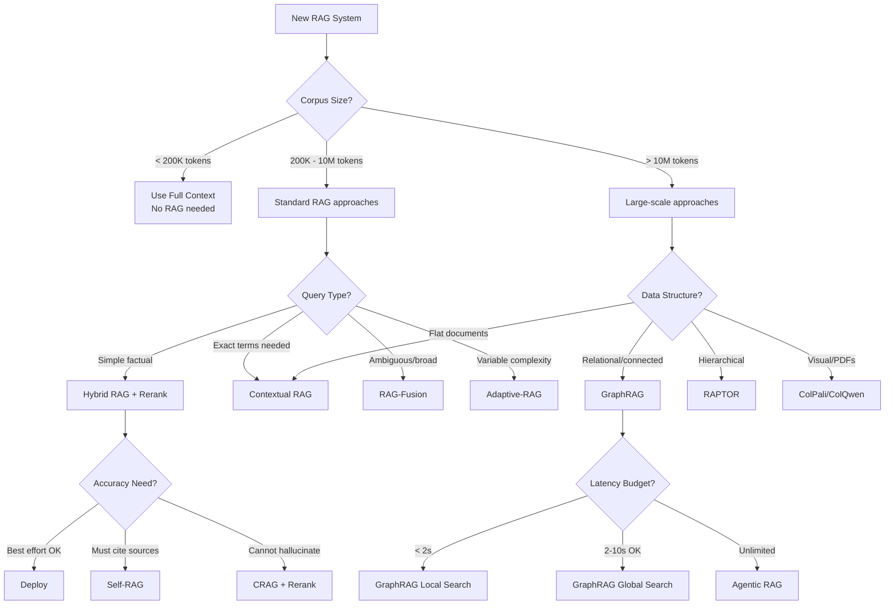

# RAG Architecture Comparison Memo

**Generated**: January 2026
**Scope**: 16 architectures + 4 foundational guides
**Audience**: Implementation engineers
**Sources**: 40+ primary sources cited

---

## Executive Summary

Retrieval-Augmented Generation has evolved from a simple retrieve-then-generate pipeline into a diverse ecosystem of specialized architectures. The field has matured significantly through 2024-2025, with three major trends reshaping the landscape:

**1. Adaptive Retrieval**: Rather than always retrieving, modern architectures (Self-RAG, Adaptive-RAG, FLARE) decide dynamically *when* and *what* to retrieve. Self-RAG's reflection tokens and FLARE's confidence-based triggers reduce unnecessary retrieval while improving factuality.

**2. Structure-Aware Retrieval**: GraphRAG, RAPTOR, and hierarchical approaches address the fundamental limitation of flat chunk retrieval—they enable multi-hop reasoning and global sensemaking through knowledge graphs and tree-structured summaries.

**3. Multimodal & Long-Context Convergence**: ColPali/ColQwen enable visual document retrieval without OCR, while MemoRAG bridges long-context windows with retrieval through memory-enhanced architectures. Meanwhile, 1M+ token context windows (Gemini 1.5, Claude) challenge the assumption that retrieval is always necessary.

**Key Decision Factors for Engineers**:
- **Corpus size**: <200K tokens → full context; 200K-10M → Hybrid/Contextual RAG; >10M → consider GraphRAG or Agentic
- **Query complexity**: Simple factual → Traditional; Multi-hop → GraphRAG/RAPTOR; Variable → Adaptive-RAG
- **Accuracy requirements**: Best-effort → Hybrid; Must cite sources → Self-RAG; Cannot hallucinate → CRAG + reranking
- **Latency budget**: <500ms → Traditional/Hybrid; 1-5s → Contextual + Rerank; 5-30s → Agentic/GraphRAG
- **Data structure**: Flat documents → Contextual RAG; Relational → GraphRAG; Hierarchical → RAPTOR; Visual → ColPali

---

## Quick Reference: Comparison Table

| Architecture | Core Mechanism | Best Use Case | Complexity | Latency | Maturity | Detail Link |
|--------------|----------------|---------------|------------|---------|----------|-------------|
| **Traditional RAG** | Vector similarity top-k | Simple FAQ, documentation | Low | 50-200ms | Production | [→](./RAG_Traditional.md) |
| **Hybrid RAG** | Dense + BM25 + Rerank | Technical docs, legal/medical | Low-Med | 100-500ms | Production | [→](./RAG_Hybrid.md) |
| **Contextual RAG** | Chunk contextualization before embedding | Enterprise knowledge bases | Medium | 200-800ms | Production | [→](./RAG_Contextual.md) |
| **RAG-Fusion** | Multi-query + Reciprocal Rank Fusion | Ambiguous queries, broad search | Medium | 300-1000ms | Production | [→](./RAG_Fusion.md) |
| **CRAG** | Quality evaluator + web fallback | Customer support, dynamic info | Medium | 500-2000ms | Early Adoption | [→](./RAG_CRAG.md) |
| **Self-RAG** | Reflection tokens, on-demand retrieval | High-stakes: legal, medical, finance | High | 1-5s | Research | [→](./RAG_SelfRAG.md) |
| **Adaptive-RAG** | Complexity classifier → routing | Variable-complexity queries | Medium | 200-2000ms | Research | [→](./RAG_Adaptive.md) |
| **GraphRAG** | Entity KG + community summaries | Investigative, multi-hop reasoning | High | 2-10s | Early Adoption | [→](./RAG_GraphRAG.md) |
| **Agentic RAG** | LLM orchestrates retrieval tools | Complex research, multi-document | High | 5-60s | Production | [→](./RAG_Agentic.md) |
| **Long-Context** | Full corpus in context window | Single-doc deep analysis, <200K | Low | 1-10s | Production | [→](./RAG_LongContext.md) |
| **FLARE** | Confidence-triggered active retrieval | Long-form generation | Medium | 2-10s | Research | [→](./RAG_FLARE.md) |
| **RAPTOR** | Recursive tree of summaries | Thematic questions, books | High | 1-3s | Research | [→](./RAG_RAPTOR.md) |
| **HyDE** | Hypothetical document embedding | Zero-shot, cross-lingual | Low-Med | 200-500ms | Production | [→](./RAG_HyDE.md) |
| **MemoRAG** | Dual-system with memory model | Ambiguous queries, 1M+ tokens | High | 2-5s | Research | [→](./RAG_MemoRAG.md) |
| **Late Chunking** | Context-aware chunk embeddings | Long documents, precision retrieval | Medium | 100-400ms | Early Adoption | [→](./RAG_LateChunking.md) |
| **Multimodal RAG** | Vision embeddings (ColPali/ColQwen) | PDFs, charts, complex layouts | High | 500-2000ms | Early Adoption | [→](./RAG_Multimodal.md) |

**Complexity Legend**: Low = off-the-shelf components; Medium = custom pipeline; High = model fine-tuning or specialized infrastructure

---

## Foundational Concepts

Before diving into architectures, ensure you understand these fundamentals:

| Topic | Document | Key Contents |
|-------|----------|--------------|
| **Semantic Search & Distance Metrics** | [→](./RAG_SemanticSearch_Fundamentals.md) | Cosine similarity, dot product, L2/Euclidean, Manhattan; normalization; vector DB configuration |
| **Chunking Strategies** | [→](./RAG_Chunking_Strategies.md) | Fixed-size, semantic, recursive, parent-child chunking; size guidelines; common pitfalls |
| **Embedding Models** | [→](./RAG_Embedding_Models.md) | OpenAI, Cohere, Voyage, BGE comparison; MTEB benchmarks; cost analysis; selection guide |
| **Evaluation & Metrics** | [→](./RAG_Evaluation_Metrics.md) | Recall, MRR, NDCG; Faithfulness, Relevance; RAGAS framework; evaluation strategies |

---

## Architecture Selection Guide

### Decision Flowchart



### "Choose X When..." Quick Reference

**Traditional RAG**: When you have < 1M documents, simple factual queries, need <200ms latency, and cost is primary concern. Avoid for multi-hop or thematic questions.

**Hybrid RAG**: When queries contain specific terminology (product codes, legal citations, technical terms) that semantic search misses. The BM25 component catches exact matches.

**Contextual RAG (Anthropic)**: When chunks lose meaning without document context (e.g., "this agreement" referring to a contract header). Worth the 35-67% retrieval improvement for enterprise knowledge bases.

**RAG-Fusion**: When users ask ambiguous questions that could be interpreted multiple ways. Generating 3-5 query variants with RRF improves recall without reranking latency.

**CRAG**: When retrieval quality is unreliable and you have web search as fallback. The T5-based evaluator adds ~200ms but prevents low-quality generations.

**Self-RAG**: When you need citation accuracy and factual grounding in high-stakes domains. Requires fine-tuning (7B-13B model, ~$500 compute) but achieves 2% vs 15-20% hallucination rates.

**Adaptive-RAG**: When query complexity varies widely—some need no retrieval, others need multi-hop. The classifier routes efficiently, saving compute on simple queries.

**GraphRAG**: When answering "what are the main themes?" or similar global sensemaking questions across large document collections. Excels at multi-hop reasoning over entity relationships.

**Agentic RAG**: When tasks require tool use beyond retrieval (code execution, API calls, calculations) or iterative refinement across multiple knowledge sources.

**Long-Context**: When analyzing a single document deeply (contracts, research papers) and you have budget for 1M+ token inference. Avoid for multi-document comparison.

**FLARE**: When generating long-form content (reports, articles) where different sections need different retrievals. Triggers retrieval on low-confidence tokens.

**RAPTOR**: When documents have natural hierarchy and questions span abstraction levels ("what's the book about?" vs "what happened in chapter 3?").

**HyDE**: When you have no training data for fine-tuning retrievers, or need cross-lingual retrieval. Zero-shot approach using hypothetical documents as queries.

**MemoRAG**: When dealing with 1M+ token contexts and ambiguous queries where traditional RAG's explicit query requirement fails. The memory model infers user intent.

**Late Chunking**: When you need precision retrieval from long documents without losing inter-chunk context. Better than naive chunking, cheaper than ColBERT.

**Multimodal RAG (ColPali)**: When documents contain tables, charts, or complex layouts where OCR fails. Treats pages as images, preserving visual structure.

---

## Architecture Categories

### By Primary Innovation

| Category | Architectures | Key Insight |
|----------|--------------|-------------|
| **Retriever-Centric** | Hybrid, Contextual, HyDE, Late Chunking, ColPali | Improve what/how we retrieve |
| **Generator-Centric** | Self-RAG, FLARE | LLM controls retrieval decisions |
| **Structure-Aware** | GraphRAG, RAPTOR | Exploit document relationships |
| **Adaptive/Routing** | Adaptive-RAG, CRAG, Agentic | Dynamic pipeline selection |
| **Context-Extended** | Long-Context, MemoRAG | Reduce retrieval dependency |

### By Production Readiness (January 2026)

| Maturity | Architectures | Characteristics |
|----------|--------------|-----------------|
| **Production-Proven** | Traditional, Hybrid, Agentic, Long-Context, HyDE | SDKs available, battle-tested at scale |
| **Early Adoption** | Contextual, GraphRAG, CRAG, Late Chunking, ColPali | Working implementations, active development |
| **Research** | Self-RAG, Adaptive-RAG, FLARE, RAPTOR, MemoRAG | Papers published, limited production use |

---

## Cost & Latency Summary

| Architecture | Indexing Cost (per 1M tokens) | Query Latency | Query Cost (per 1K queries) |
|--------------|------------------------------|---------------|----------------------------|
| Traditional RAG | $0.10-0.50 (embedding) | 50-200ms | $0.50-2.00 |
| Hybrid RAG + Rerank | $0.10-0.50 | 100-500ms | $2.00-5.00 |
| Contextual RAG | $1.02 + embedding | 200-800ms | $2.00-5.00 |
| GraphRAG | $5-20 (entity extraction + summaries) | 2-10s | $10-50 |
| Self-RAG | Training: ~$500 one-time | 1-5s | $5-15 |
| Long-Context (1M) | $0 | 5-30s | $15-60 |
| ColPali/ColQwen | $1-5 (image embedding) | 500-2000ms | $5-15 |

*Costs are estimates based on cloud API pricing as of January 2026. Self-hosted costs vary significantly.*

---

## Implementation Patterns

### Minimal Viable RAG Stack
```
Documents → Chunk (500-1000 tokens) → Embed (text-embedding-3-small) →
Vector DB (pgvector/Pinecone) → Top-k retrieval → LLM generation
```

### Production RAG Stack
```
Documents → Chunk → Contextualize (Claude) → Embed + BM25 index →
Hybrid retrieval → Rerank (Cohere/cross-encoder) → LLM generation
```

### Enterprise RAG Stack
```
Documents → Entity extraction → Knowledge graph + Vector index + BM25 →
Query analysis → Route to appropriate retriever →
Retrieve + Rerank + Filter → LLM generation with citations
```

---

## References

### Primary Papers

1. Lewis, P., et al. (2020). "Retrieval-Augmented Generation for Knowledge-Intensive NLP Tasks." *NeurIPS*. [arXiv:2005.11401](https://arxiv.org/abs/2005.11401)

2. Asai, A., et al. (2023). "Self-RAG: Learning to Retrieve, Generate, and Critique through Self-Reflection." *ICLR 2024*. [arXiv:2310.11511](https://arxiv.org/abs/2310.11511)

3. Yan, S., et al. (2024). "Corrective Retrieval Augmented Generation." *arXiv*. [arXiv:2401.15884](https://arxiv.org/abs/2401.15884)

4. Jeong, S., et al. (2024). "Adaptive-RAG: Learning to Adapt Retrieval-Augmented Large Language Models through Question Complexity." *arXiv*. [arXiv:2403.14403](https://arxiv.org/abs/2403.14403)

5. Edge, D., et al. (2024). "From Local to Global: A Graph RAG Approach to Query-Focused Summarization." *arXiv*. [arXiv:2404.16130](https://arxiv.org/abs/2404.16130)

6. Sarthi, P., et al. (2024). "RAPTOR: Recursive Abstractive Processing for Tree-Organized Retrieval." *ICLR 2024*. [arXiv:2401.18059](https://arxiv.org/abs/2401.18059)

7. Jiang, Z., et al. (2023). "Active Retrieval Augmented Generation." *EMNLP 2023*. [arXiv:2305.06983](https://arxiv.org/abs/2305.06983)

8. Gao, L., et al. (2022). "Precise Zero-Shot Dense Retrieval without Relevance Labels." *ACL 2023*. [arXiv:2212.10496](https://arxiv.org/abs/2212.10496)

9. Rackauckas, Z. (2024). "RAG-Fusion: A New Take on Retrieval-Augmented Generation." [arXiv:2402.03367](https://arxiv.org/abs/2402.03367)

10. Qian, H., et al. (2024). "MemoRAG: Moving towards Next-Gen RAG Via Memory-Inspired Knowledge Discovery." *TheWebConf 2025*. [arXiv:2409.05591](https://arxiv.org/abs/2409.05591)

11. Faysse, M., et al. (2024). "ColPali: Efficient Document Retrieval with Vision Language Models." [arXiv:2407.01449](https://arxiv.org/abs/2407.01449)

12. Gao, Y., et al. (2023). "Retrieval-Augmented Generation for Large Language Models: A Survey." [arXiv:2312.10997](https://arxiv.org/abs/2312.10997)

13. Sharma, C. (2025). "Retrieval-Augmented Generation: A Comprehensive Survey of Architectures, Enhancements, and Robustness Frontiers." [arXiv:2506.00054](https://arxiv.org/abs/2506.00054)

### Industry Documentation

14. Anthropic. (September 2024). "Introducing Contextual Retrieval." [anthropic.com/news/contextual-retrieval](https://www.anthropic.com/news/contextual-retrieval)

15. Microsoft Research. (2024). "GraphRAG: New tool for complex data discovery now on GitHub." [microsoft.github.io/graphrag](https://microsoft.github.io/graphrag/)

16. Google. (February 2024). "Introducing Gemini 1.5." Technical Report.

17. Jina AI. (2024). "What is ColBERT and Late Interaction and Why They Matter in Search?" [jina.ai/news](https://jina.ai/news/what-is-colbert-and-late-interaction-and-why-they-matter-in-search/)

18. Weaviate. (November 2024). "What is Agentic RAG." [weaviate.io/blog](https://weaviate.io/blog)

---

*This document provides an overview. See individual architecture files for implementation details, pseudocode, and specific performance benchmarks.*
