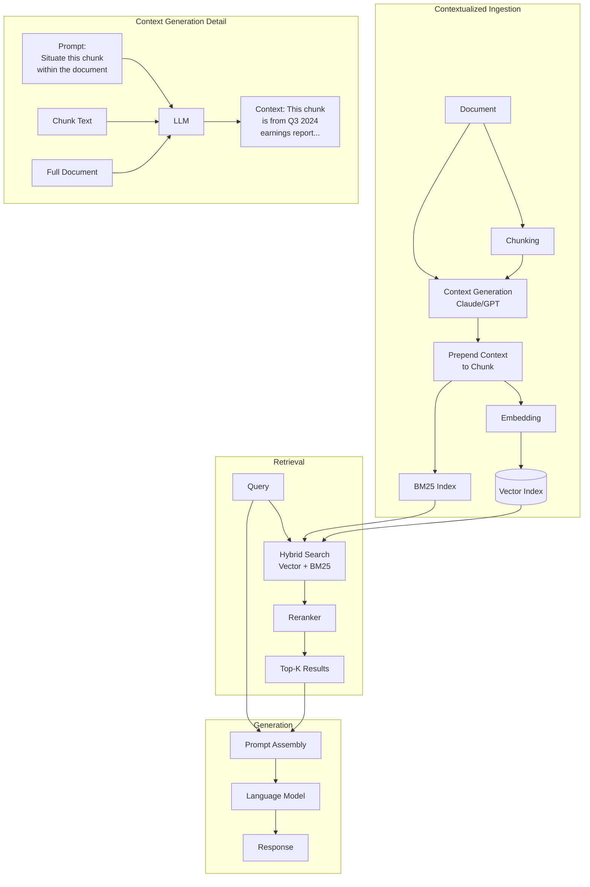

# Contextual RAG (Anthropic)

**Category**: Retriever-centric
**Maturity**: Production-Proven
**Primary Source**: Anthropic. (September 2024). "Introducing Contextual Retrieval." [anthropic.com](https://www.anthropic.com/news/contextual-retrieval)

---

## Overview

Contextual RAG, introduced by Anthropic in September 2024, addresses a fundamental problem in traditional chunking: when documents are split into chunks, critical context is lost. A chunk containing "the company's revenue increased 15%" loses meaning without knowing which company and time period are being discussed.

The key innovation is **chunk contextualization before embedding**: before embedding each chunk, an LLM generates a short (50-100 token) explanation that situates the chunk within its source document. This context is prepended to the chunk text, and the combined text is then embedded and indexed.

The approach is applied to both embeddings ("Contextual Embeddings") and BM25 indexing ("Contextual BM25"), ensuring both retrieval methods benefit from the added context. When combined with reranking, Anthropic reports a 67% reduction in retrieval failure rate compared to traditional RAG.

---

## Architecture Diagram



---

## How It Works

### The Contextualization Prompt
Anthropic's recommended prompt for generating chunk context:

```
<document>
{{WHOLE_DOCUMENT}}
</document>

Here is the chunk we want to situate within the whole document:
<chunk>
{{CHUNK_CONTENT}}
</chunk>

Please give a short succinct context to situate this chunk within the overall document for the purposes of improving search retrieval of the chunk. Answer only with the succinct context and nothing else.
```

### Example Context Generation

**Original Chunk:**
```
The company's Q3 revenue increased by 15% year-over-year, driven primarily
by growth in the enterprise segment. Operating margins improved to 28%.
```

**Generated Context:**
```
This chunk is from Acme Corp's Q3 2024 earnings report, discussing
financial performance in the cloud services division.
```

**Contextualized Chunk (for embedding):**
```
This chunk is from Acme Corp's Q3 2024 earnings report, discussing
financial performance in the cloud services division.
The company's Q3 revenue increased by 15% year-over-year, driven primarily
by growth in the enterprise segment. Operating margins improved to 28%.
```

### Cost Optimization with Prompt Caching
Processing the full document for each chunk would be expensive. Anthropic's prompt caching allows the document to be cached and reused across all chunks:

- First chunk: Full document processing cost
- Subsequent chunks: Only chunk text + context generation
- Net result: ~$1.02 per million document tokens for contextualization

---

## Implementation

### Ingestion Pipeline

```python
from typing import List, Dict
import asyncio

async def ingest_with_context(
    documents: List[Dict],  # [{"id": str, "text": str}]
    chunk_size: int = 800,
    chunk_overlap: int = 100,
    context_model: str = "claude-3-haiku",
    embedding_model: str = "text-embedding-3-small"
) -> tuple[VectorIndex, BM25Index]:
    """
    Ingest documents with chunk contextualization.

    Steps:
    1. Chunk each document
    2. Generate context for each chunk using full document
    3. Prepend context to chunks
    4. Create both vector and BM25 indices
    """
    all_chunks = []

    for doc in documents:
        # Step 1: Chunk the document
        chunks = split_into_chunks(doc["text"], chunk_size, chunk_overlap)

        # Step 2: Generate context for all chunks (with document caching)
        contextualized = await generate_contexts_batch(
            document=doc["text"],
            chunks=chunks,
            model=context_model
        )

        for i, (chunk, context) in enumerate(zip(chunks, contextualized)):
            # Step 3: Prepend context
            contextualized_chunk = f"{context}\n\n{chunk}"
            all_chunks.append({
                "doc_id": doc["id"],
                "chunk_idx": i,
                "original_chunk": chunk,
                "context": context,
                "contextualized_chunk": contextualized_chunk
            })

    # Step 4a: Create vector index from contextualized chunks
    texts = [c["contextualized_chunk"] for c in all_chunks]
    embeddings = embedding_model.encode(texts, batch_size=32)
    vector_index = VectorIndex(dimension=embeddings.shape[1])
    vector_index.add(embeddings, all_chunks)

    # Step 4b: Create BM25 index from contextualized chunks
    tokenized = [tokenize(c["contextualized_chunk"]) for c in all_chunks]
    bm25_index = BM25Okapi(tokenized)
    bm25_index.metadata = all_chunks

    return vector_index, bm25_index

async def generate_contexts_batch(
    document: str,
    chunks: List[str],
    model: str
) -> List[str]:
    """
    Generate context for multiple chunks from the same document.
    Uses prompt caching to avoid re-processing the document.
    """
    contexts = []

    # Create cached prompt with document
    system_prompt = f"""<document>
{document}
</document>

You will be given chunks from this document. For each chunk, provide a short
succinct context (50-100 tokens) to situate it within the overall document
for improving search retrieval. Answer only with the context."""

    # Process chunks (document is cached after first call)
    for chunk in chunks:
        user_prompt = f"""<chunk>
{chunk}
</chunk>

Provide the situating context:"""

        response = await llm.generate(
            system=system_prompt,
            user=user_prompt,
            cache_control={"type": "ephemeral"}  # Enable prompt caching
        )
        contexts.append(response.strip())

    return contexts
```

### Retrieval Pipeline

```python
def retrieve_contextual(
    query: str,
    vector_index: VectorIndex,
    bm25_index: BM25Index,
    reranker: CrossEncoder = None,
    top_k_retrieval: int = 150,
    top_k_final: int = 20
) -> List[Dict]:
    """
    Retrieve using contextual embeddings and BM25.

    Steps:
    1. Hybrid retrieval (vector + BM25)
    2. RRF fusion
    3. Optional reranking
    4. Return original chunks (without prepended context for generation)
    """
    # Step 1: Dense retrieval
    query_embedding = embedding_model.encode([query])[0]
    dense_results = vector_index.search(query_embedding, top_k=top_k_retrieval)

    # Step 2: BM25 retrieval (query matches against contextualized chunks)
    query_tokens = tokenize(query)
    bm25_scores = bm25_index.get_scores(query_tokens)
    top_bm25 = sorted(
        enumerate(bm25_scores),
        key=lambda x: x[1],
        reverse=True
    )[:top_k_retrieval]

    # Step 3: RRF fusion
    fused = reciprocal_rank_fusion(dense_results, top_bm25, k=60)
    candidates = fused[:top_k_retrieval]

    # Step 4: Rerank using ORIGINAL chunks (not contextualized)
    # This prevents the reranker from seeing artificially boosted context
    if reranker:
        pairs = [(query, c["original_chunk"]) for c in candidates]
        scores = reranker.predict(pairs)
        for i, score in enumerate(scores):
            candidates[i]["rerank_score"] = score
        candidates.sort(key=lambda x: x["rerank_score"], reverse=True)

    # Return top-k with original chunks for generation
    results = candidates[:top_k_final]

    # Use original chunks in generation (context was for retrieval only)
    for r in results:
        r["text_for_generation"] = r["original_chunk"]

    return results
```

---

## Use Cases

### Example 1: Enterprise Knowledge Base
- **Scenario**: Company with 50,000 internal documents (policies, procedures, technical specs) where chunks often reference "this policy," "the procedure above," etc.
- **Why this architecture**: Context resolves ambiguous references; "this policy" becomes "Acme Corp's 2024 Remote Work Policy"
- **Expected outcome**: 35-67% reduction in retrieval failures; better handling of cross-reference heavy documents

### Example 2: Legal Contract Analysis
- **Scenario**: Repository of 10,000 contracts where clauses reference defined terms from earlier sections
- **Why this architecture**: A chunk about "the Term" is meaningless without knowing it means "5-year lease period starting January 2024"
- **Expected outcome**: Significantly improved retrieval for clause-specific queries

### Example 3: Research Paper Corpus
- **Scenario**: Collection of academic papers where methodology sections reference results and vice versa
- **Why this architecture**: "These results" in a discussion section can be contextualized with the specific experiment details
- **Expected outcome**: Better thematic retrieval across paper sections

---

## Pros and Cons

### Advantages

- **67% retrieval improvement**: When combined with BM25 and reranking (Anthropic, 2024)
- **35% improvement standalone**: Contextual embeddings alone vs. regular embeddings
- **Drop-in enhancement**: Can be added to existing pipelines without architectural changes
- **Cost-effective**: $1.02 per million document tokens with prompt caching
- **Addresses root cause**: Fixes chunking context loss rather than working around it

### Limitations

- **One-time indexing cost**: ~$1.02 per million tokens for context generation
- **Context quality dependency**: Poor context generation degrades retrieval
- **Document size limits**: Very large documents may exceed context windows for generation
- **Increased storage**: ~50-100 tokens added per chunk increases index size by 10-20%
- **No runtime adaptation**: Context is fixed at indexing time; can't adapt to query

### Compared to Alternatives

- **vs. Hybrid RAG**: Contextual addresses *what* is indexed; Hybrid addresses *how* retrieval combines methods. Best used together.
- **vs. Late Chunking**: Late Chunking preserves context through the embedding model architecture; Contextual explicitly generates it. Similar goals, different mechanisms.
- **vs. RAPTOR**: RAPTOR creates hierarchical summaries; Contextual adds per-chunk context. RAPTOR better for multi-level abstraction.

---

## Performance Benchmarks

| Configuration | Top-20 Failure Rate | Reduction | Source |
|--------------|---------------------|-----------|--------|
| Baseline (embeddings) | 5.7% | - | Anthropic, 2024 |
| Contextual Embeddings | 3.7% | 35% | Anthropic, 2024 |
| Contextual Embed + BM25 | 2.9% | 49% | Anthropic, 2024 |
| Contextual + BM25 + Rerank | 1.9% | 67% | Anthropic, 2024 |

**Best embedding models tested**: Gemini Text 004, Voyage

---

## Cost Analysis

Assuming:
- 800 token chunks
- 8,000 token average documents
- 50 token context instruction
- 100 token generated context per chunk

**One-time contextualization cost**: $1.02 per million document tokens

For a 10 million token corpus:
- Contextualization: ~$10.20
- Embedding (text-embedding-3-small): ~$1.00
- **Total indexing**: ~$11.20

---

## References

1. Anthropic. (September 2024). "Introducing Contextual Retrieval." [anthropic.com](https://www.anthropic.com/news/contextual-retrieval)
2. AWS. (2024). "Contextual retrieval in Anthropic using Amazon Bedrock Knowledge Bases." [aws.amazon.com](https://aws.amazon.com/blogs/machine-learning/contextual-retrieval-in-anthropic-using-amazon-bedrock-knowledge-bases/)
3. Together.ai. (2024). "How To Implement Contextual RAG From Anthropic." [docs.together.ai](https://docs.together.ai/docs/how-to-implement-contextual-rag-from-anthropic)
