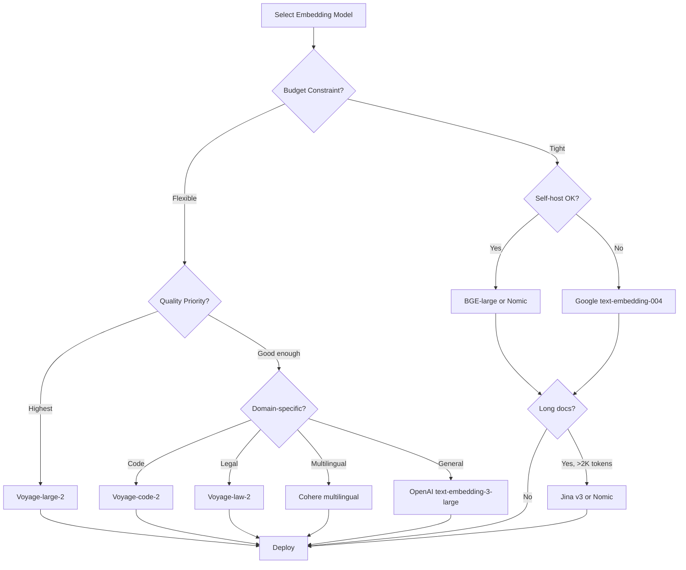

# Embedding Models Comparison for RAG

**Category**: Foundational Concepts
**Impact**: High - Embedding quality directly affects retrieval accuracy
**Audience**: Engineers selecting and deploying embedding models

---

## Overview

The embedding model converts text into dense vectors that capture semantic meaning. Your choice of embedding model affects:
- **Retrieval accuracy**: Better embeddings → more relevant results
- **Latency**: Model size affects encoding speed
- **Cost**: API pricing varies significantly
- **Dimension**: Affects storage and search speed

This document compares major embedding models with benchmarks, costs, and selection guidance.

---

## Quick Reference: Model Comparison

### Top Models (January 2025)

| Model | Dimensions | Max Tokens | MTEB Avg | Normalized | Cost/1M tokens |
|-------|------------|------------|----------|------------|----------------|
| **OpenAI text-embedding-3-large** | 3072 (or 256-3072) | 8191 | 64.6 | Yes | $0.13 |
| **OpenAI text-embedding-3-small** | 1536 (or 256-1536) | 8191 | 62.3 | Yes | $0.02 |
| **Cohere embed-v3** | 1024 | 512 | 64.5 | Yes | $0.10 |
| **Voyage AI voyage-large-2** | 1536 | 16000 | 68.3 | Yes | $0.12 |
| **Voyage AI voyage-code-2** | 1536 | 16000 | - | Yes | $0.12 |
| **Google text-embedding-004** | 768 | 2048 | 66.3 | Yes | $0.00625 |
| **Jina jina-embeddings-v3** | 1024 | 8192 | 65.5 | Yes | Variable |
| **BGE-large-en-v1.5** | 1024 | 512 | 64.2 | No | Self-hosted |
| **GTE-large** | 1024 | 512 | 63.1 | No | Self-hosted |
| **E5-large-v2** | 1024 | 512 | 62.7 | No | Self-hosted |
| **Nomic nomic-embed-text-v1.5** | 768 | 8192 | 62.3 | Yes | Open source |

*MTEB = Massive Text Embedding Benchmark (higher is better)*

### Model Categories

| Category | Best For | Top Picks |
|----------|----------|-----------|
| **Best Overall** | General RAG, production | text-embedding-3-large, Voyage-large-2 |
| **Best Value** | Cost-sensitive, high volume | text-embedding-3-small, Google text-embedding-004 |
| **Best for Code** | Code search, technical docs | Voyage-code-2, CodeBERT |
| **Best Open Source** | Self-hosted, privacy | BGE-large, Nomic, GTE |
| **Best Long Context** | Long documents | Voyage (16K), Jina v3 (8K) |
| **Best Multilingual** | Non-English content | Cohere multilingual, BGE-M3 |

---

## Detailed Model Analysis

### OpenAI Embeddings

#### text-embedding-3-large

```python
from openai import OpenAI

client = OpenAI()

def embed_openai_large(texts: List[str], dimensions: int = 3072) -> np.ndarray:
    """
    OpenAI's best embedding model.

    Supports dimension reduction via 'dimensions' parameter.
    """
    response = client.embeddings.create(
        model="text-embedding-3-large",
        input=texts,
        dimensions=dimensions  # Can reduce to 256, 512, 1024, etc.
    )
    return np.array([e.embedding for e in response.data])
```

| Aspect | Details |
|--------|---------|
| **Dimensions** | 3072 default; reducible to 256-3072 |
| **Max tokens** | 8191 |
| **MTEB score** | 64.6 |
| **Normalized** | Yes |
| **Cost** | $0.13 / 1M tokens |
| **Strengths** | High quality, flexible dimensions, well-documented |
| **Weaknesses** | Higher cost than alternatives |

#### text-embedding-3-small

| Aspect | Details |
|--------|---------|
| **Dimensions** | 1536 default; reducible to 256-1536 |
| **Max tokens** | 8191 |
| **MTEB score** | 62.3 |
| **Normalized** | Yes |
| **Cost** | $0.02 / 1M tokens (6.5x cheaper than large) |
| **Strengths** | Excellent value, good quality |
| **Weaknesses** | Slightly lower accuracy than large |

#### Dimension Reduction Trade-off

```python
# OpenAI's Matryoshka representation allows dimension reduction
# Quality vs. dimension trade-off:

dimensions_perf = {
    3072: 64.6,  # Full quality
    1536: 64.2,  # -0.4 MTEB
    1024: 63.8,  # -0.8 MTEB
    512:  62.9,  # -1.7 MTEB
    256:  61.5,  # -3.1 MTEB
}

# Recommendation: Use 1024-1536 for good quality/size balance
```

---

### Voyage AI Embeddings

#### voyage-large-2

```python
import voyageai

client = voyageai.Client()

def embed_voyage(texts: List[str], input_type: str = "document") -> np.ndarray:
    """
    Voyage AI embeddings - top MTEB performance.

    input_type: "document" for indexing, "query" for searching
    """
    response = client.embed(
        texts,
        model="voyage-large-2",
        input_type=input_type  # Important for asymmetric search
    )
    return np.array(response.embeddings)
```

| Aspect | Details |
|--------|---------|
| **Dimensions** | 1536 |
| **Max tokens** | 16000 (best in class!) |
| **MTEB score** | 68.3 (top performer) |
| **Normalized** | Yes |
| **Cost** | $0.12 / 1M tokens |
| **Strengths** | Highest quality, long context, query/doc modes |
| **Weaknesses** | Newer, smaller ecosystem |

#### Specialized Models

| Model | Use Case | MTEB Domain Score |
|-------|----------|------------------|
| voyage-large-2 | General purpose | 68.3 overall |
| voyage-code-2 | Code retrieval | Best for code |
| voyage-law-2 | Legal documents | Best for legal |
| voyage-finance-2 | Financial docs | Best for finance |

---

### Cohere Embeddings

#### embed-v3 (embed-english-v3.0)

```python
import cohere

co = cohere.Client()

def embed_cohere(texts: List[str], input_type: str = "search_document") -> np.ndarray:
    """
    Cohere embeddings with input type specification.

    input_type options:
    - "search_document": For documents being indexed
    - "search_query": For search queries
    - "classification": For classification tasks
    - "clustering": For clustering tasks
    """
    response = co.embed(
        texts=texts,
        model="embed-english-v3.0",
        input_type=input_type,
        embedding_types=["float"]
    )
    return np.array(response.embeddings.float)
```

| Aspect | Details |
|--------|---------|
| **Dimensions** | 1024 |
| **Max tokens** | 512 |
| **MTEB score** | 64.5 |
| **Normalized** | Yes |
| **Cost** | $0.10 / 1M tokens |
| **Strengths** | Good quality, task-specific input types, compression options |
| **Weaknesses** | Shorter context (512 tokens) |

#### Multilingual Support

```python
# Cohere embed-multilingual-v3.0
# Supports 100+ languages

response = co.embed(
    texts=["Hello world", "Bonjour le monde", "こんにちは世界"],
    model="embed-multilingual-v3.0",
    input_type="search_document"
)
```

---

### Google Embeddings

#### text-embedding-004

```python
from google.cloud import aiplatform
from vertexai.language_models import TextEmbeddingModel

def embed_google(texts: List[str]) -> np.ndarray:
    """
    Google's Vertex AI text embeddings.

    Very cost-effective at $0.00625/1M tokens.
    """
    model = TextEmbeddingModel.from_pretrained("text-embedding-004")
    embeddings = model.get_embeddings(texts)
    return np.array([e.values for e in embeddings])
```

| Aspect | Details |
|--------|---------|
| **Dimensions** | 768 |
| **Max tokens** | 2048 |
| **MTEB score** | 66.3 |
| **Normalized** | Yes |
| **Cost** | $0.00625 / 1M tokens (cheapest API!) |
| **Strengths** | Excellent value, good quality |
| **Weaknesses** | GCP dependency, smaller dimension |

---

### Open Source Models

#### BGE (BAAI General Embedding)

```python
from sentence_transformers import SentenceTransformer

def embed_bge(texts: List[str]) -> np.ndarray:
    """
    BGE embeddings - best open source option.

    Instruction-tuned for better retrieval.
    """
    model = SentenceTransformer('BAAI/bge-large-en-v1.5')

    # BGE recommends adding instruction prefix for queries
    # (not for documents)
    return model.encode(texts, normalize_embeddings=True)

# For queries, prepend instruction:
query = "Represent this sentence for searching relevant passages: " + query
```

| Model | Dimensions | MTEB | Notes |
|-------|------------|------|-------|
| bge-large-en-v1.5 | 1024 | 64.2 | Best quality |
| bge-base-en-v1.5 | 768 | 63.5 | Balanced |
| bge-small-en-v1.5 | 384 | 62.1 | Fast/small |
| bge-m3 | 1024 | 65.0 | Multilingual, multi-granularity |

#### Nomic Embed

```python
from sentence_transformers import SentenceTransformer

model = SentenceTransformer('nomic-ai/nomic-embed-text-v1.5', trust_remote_code=True)

# Supports task prefixes
queries = ["search_query: What is RAG?"]
documents = ["search_document: RAG combines retrieval with generation..."]

query_embeddings = model.encode(queries)
doc_embeddings = model.encode(documents)
```

| Aspect | Details |
|--------|---------|
| **Dimensions** | 768 (Matryoshka: 64-768) |
| **Max tokens** | 8192 |
| **MTEB score** | 62.3 |
| **License** | Apache 2.0 |
| **Strengths** | Long context, open source, Matryoshka |

#### GTE (General Text Embeddings)

```python
from sentence_transformers import SentenceTransformer

model = SentenceTransformer('thenlper/gte-large')
embeddings = model.encode(texts)
```

| Model | Dimensions | MTEB | Notes |
|-------|------------|------|-------|
| gte-large | 1024 | 63.1 | Best GTE |
| gte-base | 768 | 62.4 | Balanced |
| gte-small | 384 | 61.4 | Fast |

---

## Benchmark Comparison

### MTEB Leaderboard (Retrieval Tasks)

| Rank | Model | Retrieval Score | Overall MTEB |
|------|-------|-----------------|--------------|
| 1 | voyage-large-2 | 58.3 | 68.3 |
| 2 | text-embedding-004 | 55.1 | 66.3 |
| 3 | text-embedding-3-large | 54.9 | 64.6 |
| 4 | Cohere embed-v3 | 54.5 | 64.5 |
| 5 | bge-large-en-v1.5 | 54.3 | 64.2 |

### Domain-Specific Performance

| Domain | Best Model | Why |
|--------|-----------|-----|
| **General** | voyage-large-2, text-embedding-3-large | Highest overall MTEB |
| **Code** | voyage-code-2, CodeBERT | Trained on code |
| **Legal** | voyage-law-2 | Domain-specific training |
| **Medical** | PubMedBERT, BioLORD | Medical corpus training |
| **Scientific** | SPECTER2 | Scientific papers |
| **Multilingual** | Cohere multilingual, BGE-M3 | 100+ languages |

---

## Cost Analysis

### API Pricing Comparison (per 1M tokens)

| Provider | Model | Price | Relative Cost |
|----------|-------|-------|---------------|
| Google | text-embedding-004 | $0.00625 | 1x (baseline) |
| OpenAI | text-embedding-3-small | $0.02 | 3.2x |
| Cohere | embed-v3 | $0.10 | 16x |
| Voyage | voyage-large-2 | $0.12 | 19x |
| OpenAI | text-embedding-3-large | $0.13 | 21x |

### Cost Calculator

```python
def estimate_embedding_cost(
    num_documents: int,
    avg_tokens_per_doc: int,
    model: str,
    include_queries: bool = True,
    queries_per_month: int = 10000,
    avg_query_tokens: int = 50
) -> dict:
    """Estimate monthly embedding costs."""

    pricing = {
        "text-embedding-3-small": 0.02,
        "text-embedding-3-large": 0.13,
        "text-embedding-004": 0.00625,
        "embed-v3": 0.10,
        "voyage-large-2": 0.12,
    }

    price_per_million = pricing.get(model, 0.10)

    # One-time indexing cost
    index_tokens = num_documents * avg_tokens_per_doc
    index_cost = (index_tokens / 1_000_000) * price_per_million

    # Monthly query cost
    query_cost = 0
    if include_queries:
        query_tokens = queries_per_month * avg_query_tokens
        query_cost = (query_tokens / 1_000_000) * price_per_million

    return {
        "model": model,
        "index_tokens": index_tokens,
        "index_cost": f"${index_cost:.2f}",
        "monthly_query_cost": f"${query_cost:.2f}",
        "annual_query_cost": f"${query_cost * 12:.2f}"
    }

# Example: 100K documents, 500 tokens each, 10K queries/month
print(estimate_embedding_cost(100_000, 500, "text-embedding-3-small"))
# {'index_cost': '$1.00', 'monthly_query_cost': '$0.01', 'annual_query_cost': '$0.12'}

print(estimate_embedding_cost(100_000, 500, "voyage-large-2"))
# {'index_cost': '$6.00', 'monthly_query_cost': '$0.06', 'annual_query_cost': '$0.72'}
```

### Break-Even: API vs Self-Hosted

```python
# Rough calculation for self-hosting BGE-large

# API costs (OpenAI small): ~$0.02/1M tokens
# Self-hosted costs:
#   - GPU instance: ~$0.50-2.00/hour
#   - Throughput: ~1000-5000 embeddings/second
#   - ~500 tokens/embedding average

# Break-even point:
# If processing > 25-100M tokens/month, self-hosting may be cheaper
# But consider: maintenance, scaling, reliability
```

---

## Selection Guide

### Decision Flowchart



### Quick Recommendations

| Scenario | Recommended Model | Rationale |
|----------|-------------------|-----------|
| **Starting out** | text-embedding-3-small | Good quality, low cost, well-documented |
| **Production, quality matters** | text-embedding-3-large or voyage-large-2 | Top MTEB scores |
| **High volume, cost-sensitive** | Google text-embedding-004 | 5-20x cheaper |
| **Long documents** | voyage-large-2 (16K) or Jina v3 (8K) | Long context support |
| **Code search** | voyage-code-2 | Domain-specific training |
| **Privacy/self-hosted** | BGE-large-en-v1.5 | Best open source |
| **Multilingual** | Cohere multilingual-v3 | 100+ languages |

---

## Implementation Best Practices

### 1. Batch Embedding

```python
# WRONG: One API call per text
for text in texts:
    embedding = embed(text)  # Slow, expensive!

# RIGHT: Batch API calls
batch_size = 100
embeddings = []
for i in range(0, len(texts), batch_size):
    batch = texts[i:i + batch_size]
    batch_embeddings = embed(batch)
    embeddings.extend(batch_embeddings)
```

### 2. Caching Embeddings

```python
import hashlib
import pickle

def get_or_compute_embedding(text: str, cache_dir: str = "./embedding_cache"):
    """Cache embeddings to avoid recomputation."""
    text_hash = hashlib.md5(text.encode()).hexdigest()
    cache_path = f"{cache_dir}/{text_hash}.pkl"

    if os.path.exists(cache_path):
        with open(cache_path, "rb") as f:
            return pickle.load(f)

    embedding = embed([text])[0]

    with open(cache_path, "wb") as f:
        pickle.dump(embedding, f)

    return embedding
```

### 3. Asymmetric Search

```python
# Some models (Cohere, Voyage) support asymmetric search
# Different encoding for queries vs documents

# Indexing
doc_embeddings = embed(documents, input_type="search_document")

# Querying
query_embedding = embed([query], input_type="search_query")

# This improves retrieval quality for short queries against long docs
```

### 4. Dimension Selection

```python
# For OpenAI and Nomic (Matryoshka models)
# Smaller dimensions = faster search, less storage, slightly lower quality

def choose_dimensions(num_documents: int, quality_requirement: str):
    """Recommend dimension based on scale and quality needs."""

    if quality_requirement == "highest":
        return 3072 if num_documents < 1_000_000 else 1536
    elif quality_requirement == "balanced":
        return 1536 if num_documents < 1_000_000 else 1024
    else:  # "efficient"
        return 1024 if num_documents < 1_000_000 else 512
```

---

## Evaluation & Testing

### Test Your Embedding Choice

```python
from typing import List, Tuple

def evaluate_embedding_model(
    model_fn,
    test_queries: List[str],
    relevant_docs: List[List[str]],  # For each query, list of relevant doc IDs
    corpus: List[str],
    k: int = 10
) -> dict:
    """
    Evaluate embedding model on retrieval task.
    """
    # Embed corpus
    corpus_embeddings = model_fn(corpus)

    # Evaluate
    hits_at_k = 0
    mrr_sum = 0

    for query, relevant in zip(test_queries, relevant_docs):
        query_embedding = model_fn([query])[0]

        # Compute similarities
        similarities = np.dot(corpus_embeddings, query_embedding)
        top_k_indices = np.argsort(similarities)[-k:][::-1]

        # Check hits
        for rank, idx in enumerate(top_k_indices):
            if idx in relevant:
                hits_at_k += 1
                mrr_sum += 1 / (rank + 1)
                break

    return {
        "recall@k": hits_at_k / len(test_queries),
        "mrr": mrr_sum / len(test_queries)
    }
```

---

## References

1. **MTEB Leaderboard**: [huggingface.co/spaces/mteb/leaderboard](https://huggingface.co/spaces/mteb/leaderboard)
2. **OpenAI Embeddings**: [platform.openai.com/docs/guides/embeddings](https://platform.openai.com/docs/guides/embeddings)
3. **Voyage AI**: [docs.voyageai.com](https://docs.voyageai.com)
4. **Cohere Embed**: [docs.cohere.com/docs/embeddings](https://docs.cohere.com/docs/embeddings)
5. **BGE**: [huggingface.co/BAAI/bge-large-en-v1.5](https://huggingface.co/BAAI/bge-large-en-v1.5)
6. **Nomic**: [huggingface.co/nomic-ai/nomic-embed-text-v1.5](https://huggingface.co/nomic-ai/nomic-embed-text-v1.5)
