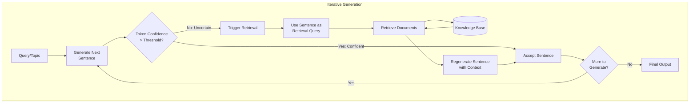

# FLARE (Forward-Looking Active REtrieval)

**Category**: Generator-centric
**Maturity**: Research
**Primary Source**: Jiang, Z., et al. (2023). "Active Retrieval Augmented Generation." *EMNLP 2023*. [arXiv:2305.06983](https://arxiv.org/abs/2305.06983)

---

## Overview

FLARE (Forward-Looking Active REtrieval augmented generation) addresses the challenge of long-form generation where different parts of the output require different knowledge. Rather than retrieving once at the beginning, FLARE iteratively decides when to retrieve during generation based on the model's confidence.

The key insight is that the model itself knows when it's uncertain. FLARE monitors token probabilities during generation: when confidence drops below a threshold (indicating the model is about to generate uncertain content), it pauses generation, uses the upcoming sentence as a retrieval query, fetches relevant documents, and regenerates that segment with the new context.

This "active retrieval" approach is particularly effective for:
- Long-form generation (articles, reports, essays)
- Topics that span multiple knowledge areas
- Content where the model's parametric knowledge is incomplete

---

## Architecture Diagram



---

## How It Works

### Confidence-Based Retrieval Triggering

FLARE monitors the probability of generated tokens. When probabilities fall below a threshold (e.g., 0.5), it indicates uncertainty:

```
Generating: "The Eiffel Tower was designed by"

Token probabilities:
- "The": 0.95 ✓
- "Eiffel": 0.92 ✓
- "Tower": 0.94 ✓
- "was": 0.91 ✓
- "designed": 0.88 ✓
- "by": 0.85 ✓
- "Gustave": 0.42 ✗  ← Low confidence! Trigger retrieval

Action: Use "The Eiffel Tower was designed by [MASK]" as query
Retrieve documents about Eiffel Tower design
Regenerate with retrieved context
```

### Forward-Looking Query Generation

Instead of using the already-generated text as the query, FLARE looks ahead by:
1. Generating a "draft" continuation
2. Masking low-confidence tokens with [MASK]
3. Using this masked sentence as the retrieval query

This retrieves documents relevant to what the model is *about to* generate, not what it already said.

### Iterative Refinement

The process continues sentence-by-sentence:
1. Generate sentence
2. Check confidence
3. If low: retrieve and regenerate
4. Accept sentence
5. Move to next sentence
6. Repeat until complete

---

## Implementation

### Confidence Monitoring

```python
import torch
from typing import List, Tuple, Optional

class FLAREGenerator:
    """
    FLARE: Forward-Looking Active REtrieval augmented generation.
    Retrieves based on generation confidence.
    """

    def __init__(
        self,
        llm: LanguageModel,
        retriever: Retriever,
        confidence_threshold: float = 0.5,
        max_retrieval_per_sentence: int = 3
    ):
        self.llm = llm
        self.retriever = retriever
        self.confidence_threshold = confidence_threshold
        self.max_retrieval = max_retrieval_per_sentence

    def generate_with_active_retrieval(
        self,
        prompt: str,
        max_sentences: int = 20
    ) -> str:
        """
        Generate long-form content with active retrieval.

        For each sentence:
        1. Generate draft with confidence scores
        2. If low confidence, retrieve and regenerate
        3. Accept and continue
        """
        generated_text = ""
        context = prompt

        for _ in range(max_sentences):
            # Generate next sentence with token probabilities
            sentence, token_probs = self._generate_sentence_with_probs(context)

            if sentence.strip() == "" or sentence.strip() in [".", ""]:
                break

            # Check if confidence is too low
            min_confidence = min(token_probs) if token_probs else 1.0

            if min_confidence < self.confidence_threshold:
                # Trigger active retrieval
                sentence = self._retrieve_and_regenerate(
                    context, sentence, token_probs
                )

            generated_text += " " + sentence
            context = prompt + generated_text

        return generated_text.strip()

    def _generate_sentence_with_probs(
        self,
        context: str
    ) -> Tuple[str, List[float]]:
        """Generate next sentence and return token probabilities."""
        # Generate with logprobs
        response = self.llm.generate(
            context,
            max_tokens=100,
            stop=["."],
            logprobs=True
        )

        sentence = response.text + "."
        token_probs = [
            torch.exp(torch.tensor(lp)).item()
            for lp in response.logprobs
        ]

        return sentence, token_probs

    def _retrieve_and_regenerate(
        self,
        context: str,
        draft_sentence: str,
        token_probs: List[float]
    ) -> str:
        """
        Use low-confidence sentence as query, retrieve, and regenerate.
        """
        # Create query by masking low-confidence tokens
        query = self._create_masked_query(draft_sentence, token_probs)

        # Retrieve relevant documents
        docs = self.retriever.retrieve(query, top_k=3)
        retrieved_context = "\n".join([d.text for d in docs])

        # Regenerate with retrieved context
        augmented_prompt = f"""{context}

Relevant information:
{retrieved_context}

Continue:"""

        response = self.llm.generate(
            augmented_prompt,
            max_tokens=100,
            stop=["."]
        )

        return response.text + "."

    def _create_masked_query(
        self,
        sentence: str,
        token_probs: List[float]
    ) -> str:
        """
        Create retrieval query by masking low-confidence tokens.
        """
        tokens = sentence.split()

        # Align probs with tokens (simplified)
        masked_tokens = []
        for i, token in enumerate(tokens):
            if i < len(token_probs) and token_probs[i] < self.confidence_threshold:
                masked_tokens.append("[MASK]")
            else:
                masked_tokens.append(token)

        return " ".join(masked_tokens)
```

### Full FLARE Pipeline

```python
def flare_generate(
    topic: str,
    retriever: Retriever,
    llm: LanguageModel,
    target_length: int = 500  # words
) -> str:
    """
    Generate long-form content on a topic using FLARE.

    Steps:
    1. Start with topic introduction
    2. Iteratively generate sentences
    3. Retrieve when confidence is low
    4. Continue until target length
    """
    flare = FLAREGenerator(
        llm=llm,
        retriever=retriever,
        confidence_threshold=0.5
    )

    # Initial prompt
    prompt = f"""Write a comprehensive article about: {topic}

Article:"""

    # Generate with active retrieval
    article = flare.generate_with_active_retrieval(
        prompt,
        max_sentences=target_length // 15  # ~15 words per sentence
    )

    return article


# Alternative: Simpler threshold-based approach
def simple_flare(
    query: str,
    retriever: Retriever,
    llm: LanguageModel,
    sentences_per_retrieval: int = 2
) -> str:
    """
    Simplified FLARE: retrieve every N sentences.
    Less sophisticated but more predictable.
    """
    generated = ""
    context = query

    for i in range(10):  # Max 10 retrieval cycles
        # Generate N sentences
        response = llm.generate(
            context + generated,
            max_tokens=100 * sentences_per_retrieval
        )

        new_content = response.text
        if not new_content.strip():
            break

        generated += new_content

        # Retrieve for next iteration
        docs = retriever.retrieve(new_content, top_k=3)
        retrieval_context = "\n".join([d.text for d in docs])

        # Update context for next iteration
        context = f"""{query}

Relevant information for the next part:
{retrieval_context}

Continue from: {generated[-200:]}"""

    return generated
```

---

## Use Cases

### Example 1: Long-Form Article Generation
- **Scenario**: Writing a 2000-word article about climate change solutions
- **Why this architecture**: Different sections need different facts (solar, wind, policy, economics)
- **Expected outcome**: Each section is grounded in retrieved facts relevant to that subtopic

### Example 2: Technical Documentation
- **Scenario**: Generating API documentation that references multiple code modules
- **Why this architecture**: Each function description needs context from different parts of codebase
- **Expected outcome**: Accurate documentation with correct function signatures and behaviors

### Example 3: Research Report Synthesis
- **Scenario**: Writing a literature review spanning multiple papers
- **Why this architecture**: Each paragraph discussing different papers needs different sources
- **Expected outcome**: Properly cited synthesis with relevant information per section

---

## Pros and Cons

### Advantages

- **Targeted retrieval**: Only retrieves when needed, not wastefully
- **Long-form capable**: Designed specifically for extended generation
- **Self-aware uncertainty**: Uses model's own confidence as retrieval signal
- **No special training**: Works with any LLM that provides logprobs
- **Efficient**: Avoids retrieval for facts the model already knows

### Limitations

- **Logprobs required**: Needs access to token probabilities (not all APIs provide)
- **Latency**: Multiple retrieval calls during generation increase total time
- **Threshold tuning**: Confidence threshold needs tuning per model/domain
- **Token alignment**: Mapping token probs to semantic units is imperfect
- **Not real-time**: 2-10 seconds per generated paragraph

### Compared to Alternatives

- **vs. Traditional RAG**: FLARE retrieves multiple times during generation; Traditional retrieves once upfront
- **vs. Self-RAG**: Self-RAG uses trained reflection tokens; FLARE uses raw probabilities. Self-RAG is more accurate but requires fine-tuning.
- **vs. Agentic RAG**: Agentic uses LLM reasoning for decisions; FLARE uses probability thresholds. FLARE is faster but less flexible.

---

## Configuration Guidance

### Confidence Threshold Selection

| Threshold | Behavior | Use Case |
|-----------|----------|----------|
| 0.3 | Rarely retrieves | Well-known topics, speed priority |
| 0.5 | Balanced (recommended) | General purpose |
| 0.7 | Frequently retrieves | Specialized domains, accuracy priority |
| 0.9 | Almost always retrieves | High-stakes, maximum grounding |

### Performance Tuning

```python
# For speed: higher threshold, fewer retrievals
flare_fast = FLAREGenerator(
    llm=llm,
    retriever=retriever,
    confidence_threshold=0.3,
    max_retrieval_per_sentence=1
)

# For accuracy: lower threshold, more retrievals
flare_accurate = FLAREGenerator(
    llm=llm,
    retriever=retriever,
    confidence_threshold=0.7,
    max_retrieval_per_sentence=5
)
```

---

## Performance Considerations

| Configuration | Retrieval Calls | Total Latency | Quality |
|--------------|-----------------|---------------|---------|
| No FLARE (baseline) | 0 | 2-5s | Lower |
| FLARE (threshold=0.5) | 3-5 per 500 words | 10-20s | Higher |
| FLARE (threshold=0.7) | 8-12 per 500 words | 20-40s | Highest |

---

## References

1. Jiang, Z., et al. (2023). "Active Retrieval Augmented Generation." *EMNLP 2023*. [arXiv:2305.06983](https://arxiv.org/abs/2305.06983)
2. GitHub: [jzbjyb/FLARE](https://github.com/jzbjyb/FLARE)
3. Gao, Y., et al. (2023). "Retrieval-Augmented Generation for Large Language Models: A Survey." [arXiv:2312.10997](https://arxiv.org/abs/2312.10997)
