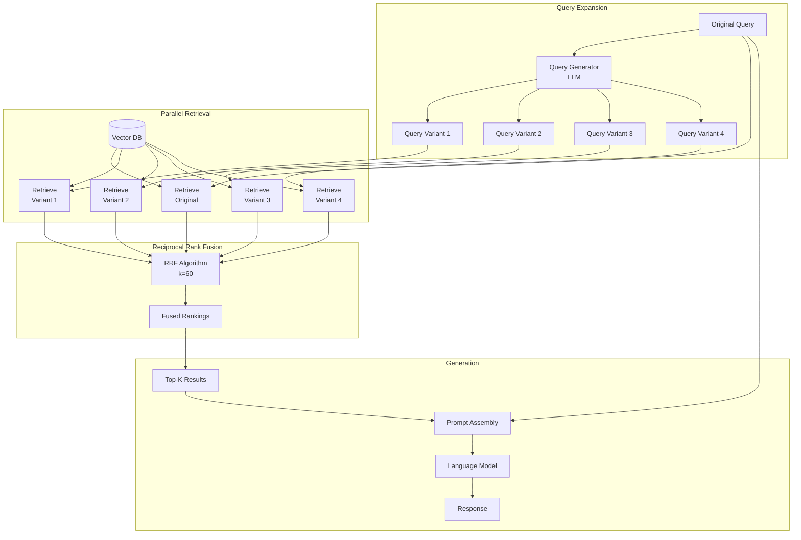

# RAG-Fusion (Multi-Query + Reciprocal Rank Fusion)

**Category**: Retriever-centric
**Maturity**: Production-Proven
**Primary Source**: Rackauckas, Z. (2024). "RAG-Fusion: A New Take on Retrieval-Augmented Generation." [arXiv:2402.03367](https://arxiv.org/abs/2402.03367)

---

## Overview

RAG-Fusion addresses the limitation that a single query may not fully capture user intent or may miss relevant documents due to vocabulary mismatch. The approach generates multiple query variants from the original query, executes retrieval for each, then combines results using Reciprocal Rank Fusion (RRF).

The key insight is that different phrasings of the same question will retrieve different documents. By fusing results from multiple query perspectives, RAG-Fusion achieves broader recall and more robust retrieval. A query like "How do I fix a slow computer?" might generate variants like "laptop performance optimization," "Windows speed improvements," and "diagnose computer lag," each retrieving complementary documents.

This technique is particularly effective for ambiguous queries where the user's exact information need is unclear, and for domains where vocabulary varies significantly between query language and document language.

---

## Architecture Diagram



---

## How It Works

### Query Generation
An LLM generates 3-5 alternative queries that represent different perspectives on the user's information need:

**Original**: "What are the side effects of ibuprofen?"

**Generated Variants**:
1. "Ibuprofen adverse reactions and risks"
2. "NSAIDs negative health effects"
3. "Problems from taking ibuprofen long term"
4. "Ibuprofen safety concerns warnings"

### Parallel Retrieval
Each query (original + variants) is embedded and used to retrieve top-k documents independently. This can be parallelized for latency optimization.

### Reciprocal Rank Fusion
Documents from all retrieval lists are combined using RRF:

```
RRF_score(d) = Σ 1 / (k + rank_i(d))
```

Where:
- `k` is a constant (typically 60) that prevents high ranks from dominating
- `rank_i(d)` is the rank of document `d` in retrieval list `i`
- Documents appearing in multiple lists receive boosted scores

**Example**:
- Document A: Rank 1 in list 1, Rank 3 in list 2
- RRF_score(A) = 1/(60+1) + 1/(60+3) = 0.0164 + 0.0159 = 0.0323

- Document B: Rank 2 in list 1, not in list 2
- RRF_score(B) = 1/(60+2) = 0.0161

Document A ranks higher due to appearing in multiple lists.

---

## Implementation

### Query Generation

```python
from typing import List

def generate_query_variants(
    original_query: str,
    num_variants: int = 4,
    model: str = "gpt-4o-mini"
) -> List[str]:
    """
    Generate alternative query formulations for broader retrieval.

    The LLM generates semantically similar but lexically diverse queries
    to capture different aspects of the user's information need.
    """
    prompt = f"""You are a helpful assistant that generates alternative search queries.
Given the original query, generate {num_variants} alternative queries that:
1. Capture the same information need from different angles
2. Use different vocabulary and phrasing
3. Might retrieve complementary relevant documents
4. Range from more specific to more general

Original query: {original_query}

Generate {num_variants} alternative queries, one per line:"""

    response = llm.generate(prompt, model=model)

    # Parse variants (one per line)
    variants = [line.strip() for line in response.strip().split('\n') if line.strip()]

    # Ensure we have the requested number
    return variants[:num_variants]

# Example output for "How do I fix a slow computer?":
# 1. "laptop performance optimization tips"
# 2. "Windows computer running slow troubleshooting"
# 3. "speed up PC performance guide"
# 4. "diagnose and fix computer lag issues"
```

### Retrieval and Fusion Pipeline

```python
import asyncio
from typing import List, Dict
from collections import defaultdict

async def retrieve_with_fusion(
    original_query: str,
    vector_index: VectorIndex,
    num_variants: int = 4,
    top_k_per_query: int = 10,
    rrf_k: int = 60,
    final_top_k: int = 10
) -> List[Dict]:
    """
    RAG-Fusion: Multi-query retrieval with reciprocal rank fusion.

    Steps:
    1. Generate query variants
    2. Retrieve for all queries in parallel
    3. Fuse results using RRF
    4. Return top-k fused results
    """
    # Step 1: Generate query variants
    variants = generate_query_variants(original_query, num_variants)
    all_queries = [original_query] + variants

    # Step 2: Parallel retrieval for all queries
    async def retrieve_single(query: str) -> List[Dict]:
        embedding = embedding_model.encode([query])[0]
        results = vector_index.search(embedding, top_k=top_k_per_query)
        return [{"doc_id": r.metadata["doc_id"],
                 "chunk_idx": r.metadata["chunk_idx"],
                 "text": r.metadata["text"],
                 "score": r.score} for r in results]

    retrieval_tasks = [retrieve_single(q) for q in all_queries]
    all_results = await asyncio.gather(*retrieval_tasks)

    # Step 3: Reciprocal Rank Fusion
    fused_scores = defaultdict(float)
    doc_data = {}

    for query_idx, results in enumerate(all_results):
        for rank, result in enumerate(results):
            key = (result["doc_id"], result["chunk_idx"])
            # RRF formula: 1 / (k + rank)
            fused_scores[key] += 1 / (rrf_k + rank + 1)
            doc_data[key] = result  # Store document data

    # Step 4: Sort by fused score and return top-k
    sorted_docs = sorted(
        fused_scores.items(),
        key=lambda x: x[1],
        reverse=True
    )

    final_results = []
    for key, score in sorted_docs[:final_top_k]:
        result = doc_data[key].copy()
        result["rrf_score"] = score
        result["original_score"] = doc_data[key]["score"]
        final_results.append(result)

    return final_results

def generate_response(
    query: str,
    retrieved_docs: List[Dict],
    llm: LanguageModel
) -> str:
    """Generate final response from fused retrieval results."""
    context = "\n\n---\n\n".join([doc["text"] for doc in retrieved_docs])

    prompt = f"""Answer the question based on the provided context.

Context:
{context}

Question: {query}

Answer:"""

    return llm.generate(prompt)
```

---

## Use Cases

### Example 1: Customer Support with Variable Terminology
- **Scenario**: Users describe issues in many ways: "app crashes," "software stops working," "program freezes," "application hangs"
- **Why this architecture**: Query variants cover the vocabulary space; RRF ensures docs matching multiple phrasings rank highest
- **Expected outcome**: Higher recall for support queries; fewer "no relevant results found" cases

### Example 2: Academic Literature Search
- **Scenario**: Researchers search for papers using informal terms; papers use formal terminology
- **Why this architecture**: "machine learning for medicine" generates variants like "deep learning clinical applications," "AI healthcare diagnostics"
- **Expected outcome**: Better bridge between query vocabulary and academic language

### Example 3: E-commerce Product Discovery
- **Scenario**: Users search "comfortable work shoes" but products are tagged as "ergonomic office footwear"
- **Why this architecture**: Variants help match user intent to product descriptions despite vocabulary mismatch
- **Expected outcome**: Improved product discovery; reduced need for synonym dictionaries

---

## Pros and Cons

### Advantages

- **Improved recall**: Multiple queries cover more of the relevant document space
- **Vocabulary robustness**: Reduces sensitivity to exact query phrasing
- **Easy to implement**: Adds a query expansion step to existing RAG pipelines
- **Parallelizable**: All query retrievals can run concurrently
- **No retraining required**: Works with any existing embedding model and index

### Limitations

- **Increased latency**: Query generation adds 200-500ms; multiple retrievals add overhead (mitigated by parallelization)
- **Query drift risk**: Generated variants may stray from original intent, retrieving irrelevant documents
- **LLM cost**: Query generation requires additional LLM calls (~4 calls per user query)
- **RRF parameter sensitivity**: k value affects fusion behavior; may need tuning
- **Diminishing returns**: Beyond 4-5 variants, improvement plateaus

### Compared to Alternatives

- **vs. HyDE**: HyDE generates hypothetical *documents*; RAG-Fusion generates alternative *queries*. HyDE bridges query-document gap; RAG-Fusion increases coverage.
- **vs. Hybrid RAG**: Hybrid uses different retrieval *methods* (dense + sparse); RAG-Fusion uses different *queries* with same method. Complementary approaches.
- **vs. Query Rewriting**: Single rewrite vs. multiple variants. RAG-Fusion preserves diversity through fusion.

---

## Performance Considerations

### Latency Optimization

```python
# Sequential: 200ms query gen + 5 * 100ms retrieval = 700ms
# Parallel: 200ms query gen + 100ms parallel retrieval = 300ms

# Further optimization: Pre-generate common query patterns
# Cache frequently used query variants
```

### RRF Parameter Tuning

| k Value | Behavior | Use Case |
|---------|----------|----------|
| k = 1 | High ranks dominate | When first result is critical |
| k = 60 | Balanced (default) | General purpose |
| k = 100+ | More uniform weighting | When all sources equally trusted |

---

## Integration with Other Techniques

RAG-Fusion combines well with:

1. **Hybrid RAG**: Generate variants, run each through hybrid (dense + BM25), then fuse
2. **Reranking**: Apply cross-encoder reranking after RRF fusion
3. **Contextual RAG**: Use contextualized embeddings for each query variant

```python
# Combined pipeline example
variants = generate_variants(query)
results_per_variant = [hybrid_retrieve(v) for v in variants]  # Dense + BM25
fused = reciprocal_rank_fusion(results_per_variant)
reranked = cross_encoder_rerank(query, fused[:50])
final = reranked[:10]
```

---

## References

1. Rackauckas, Z. (2024). "RAG-Fusion: A New Take on Retrieval-Augmented Generation." [arXiv:2402.03367](https://arxiv.org/abs/2402.03367)
2. Cormack, G. V., Clarke, C. L., & Buettcher, S. (2009). "Reciprocal Rank Fusion outperforms Condorcet and individual Rank Learning Methods." *SIGIR*.
3. GitHub: [Raudaschl/rag-fusion](https://github.com/Raudaschl/rag-fusion) - Reference implementation
