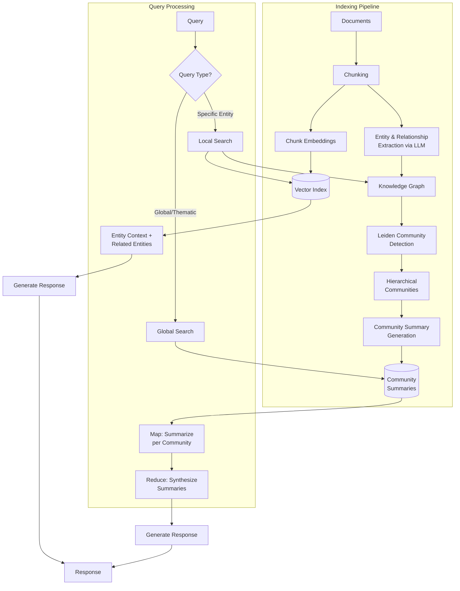

# GraphRAG

**Category**: Structure-Aware
**Maturity**: Early Adoption
**Primary Source**: Edge, D., et al. (2024). "From Local to Global: A Graph RAG Approach to Query-Focused Summarization." Microsoft Research. [arXiv:2404.16130](https://arxiv.org/abs/2404.16130)

---

## Overview

GraphRAG, developed by Microsoft Research, addresses a fundamental limitation of traditional RAG: inability to answer "global" questions that require synthesizing information across an entire corpus. Questions like "What are the main themes in this dataset?" or "How do these entities relate to each other?" require holistic understanding that keyword-based retrieval cannot provide.

The key innovation is a **two-stage indexing process**:
1. **Entity Extraction**: Build a knowledge graph of entities and relationships from source documents
2. **Community Detection**: Use the Leiden algorithm to cluster entities into communities and generate summaries at multiple hierarchy levels

At query time, GraphRAG supports two modes:
- **Local Search**: Traditional entity-based retrieval for specific questions
- **Global Search**: Uses community summaries for holistic, sensemaking questions

In evaluations on 1M+ token datasets, GraphRAG achieves 70-80% win rates over naive RAG on comprehensiveness and diversity for global queries.

---

## Architecture Diagram



---

## How It Works

### 1. Entity and Relationship Extraction

An LLM processes each chunk to extract:
- **Entities**: People, organizations, concepts, events
- **Relationships**: How entities connect (e.g., "works for," "located in")
- **Claims/Facts**: Specific assertions with supporting evidence

```
Document chunk: "In 2023, CEO Sarah Chen led Acme Corp's acquisition of TechStart.
The deal was valued at $500M."

Extracted:
- Entities: Sarah Chen (Person), Acme Corp (Organization), TechStart (Organization)
- Relationships:
  - (Sarah Chen, CEO_OF, Acme Corp)
  - (Acme Corp, ACQUIRED, TechStart)
- Claims:
  - Acquisition date: 2023
  - Deal value: $500M
```

### 2. Leiden Community Detection

The knowledge graph is partitioned using the Leiden algorithm:
- **Level 0**: Original graph with all entities
- **Level 1**: First-level communities (closely connected entity groups)
- **Level 2+**: Higher-level aggregations

This creates a hierarchy where:
- Low levels = Fine-grained, specific communities
- High levels = Broad, thematic communities

### 3. Community Summary Generation

For each community at each level, an LLM generates a summary:
- What entities are in this community?
- What are the key relationships?
- What themes or topics does this community represent?

These summaries are pre-computed during indexing.

### 4. Query Processing

**Local Search** (specific queries):
1. Find relevant entities via keyword/embedding match
2. Expand to related entities in graph
3. Retrieve associated text chunks
4. Generate response with entity context

**Global Search** (thematic queries):
1. Map: Query each community summary for relevant insights
2. Reduce: Synthesize all community responses into final answer
3. This enables answering "what are the main themes?" across millions of tokens

---

## Implementation

### Entity Extraction

```python
from typing import List, Dict, Tuple
import json

def extract_entities_and_relationships(
    chunk: str,
    llm: LanguageModel
) -> Dict:
    """
    Extract entities and relationships from a text chunk using LLM.
    """
    prompt = f"""Extract entities and relationships from the following text.

Text:
{chunk}

Output in JSON format:
{{
    "entities": [
        {{"name": "entity name", "type": "PERSON|ORG|CONCEPT|EVENT|LOCATION", "description": "brief description"}}
    ],
    "relationships": [
        {{"source": "entity1", "target": "entity2", "type": "relationship type", "description": "brief description"}}
    ]
}}

JSON Output:"""

    response = llm.generate(prompt)

    try:
        return json.loads(response)
    except json.JSONDecodeError:
        return {"entities": [], "relationships": []}


def build_knowledge_graph(
    documents: List[str],
    chunk_size: int = 1000,
    llm: LanguageModel = None
) -> KnowledgeGraph:
    """
    Build knowledge graph from documents via entity extraction.
    """
    graph = KnowledgeGraph()

    for doc in documents:
        chunks = split_into_chunks(doc, chunk_size)

        for chunk_idx, chunk in enumerate(chunks):
            # Extract entities and relationships
            extracted = extract_entities_and_relationships(chunk, llm)

            # Add entities to graph
            for entity in extracted["entities"]:
                graph.add_node(
                    entity["name"],
                    type=entity["type"],
                    description=entity["description"],
                    source_chunk=chunk_idx
                )

            # Add relationships
            for rel in extracted["relationships"]:
                graph.add_edge(
                    rel["source"],
                    rel["target"],
                    type=rel["type"],
                    description=rel["description"]
                )

    return graph
```

### Community Detection and Summarization

```python
import networkx as nx
from cdlib import algorithms

def detect_communities(
    graph: KnowledgeGraph,
    resolution: float = 1.0
) -> Dict[int, List[List[str]]]:
    """
    Detect hierarchical communities using Leiden algorithm.

    Returns:
        communities: {level: [[entity_names in community 1], [community 2], ...]}
    """
    # Convert to NetworkX for Leiden
    nx_graph = graph.to_networkx()

    communities_by_level = {}

    # Level 0: Initial community detection
    communities = algorithms.leiden(nx_graph, resolution_parameter=resolution)
    communities_by_level[0] = [list(c) for c in communities.communities]

    # Level 1+: Hierarchical aggregation
    current_graph = nx_graph
    level = 1

    while len(current_graph.nodes()) > 10:  # Stop when graph is small
        # Create meta-graph from communities
        meta_graph = create_meta_graph(current_graph, communities_by_level[level-1])

        # Detect communities in meta-graph
        meta_communities = algorithms.leiden(meta_graph, resolution_parameter=resolution)
        communities_by_level[level] = [list(c) for c in meta_communities.communities]

        current_graph = meta_graph
        level += 1

    return communities_by_level


def generate_community_summaries(
    graph: KnowledgeGraph,
    communities: Dict[int, List[List[str]]],
    llm: LanguageModel
) -> Dict[Tuple[int, int], str]:
    """
    Generate summaries for each community at each level.

    Returns:
        summaries: {(level, community_idx): summary_text}
    """
    summaries = {}

    for level, level_communities in communities.items():
        for comm_idx, community_entities in enumerate(level_communities):
            # Gather entity information
            entity_info = []
            for entity_name in community_entities:
                node = graph.get_node(entity_name)
                entity_info.append(f"- {entity_name} ({node['type']}): {node['description']}")

            # Gather relationships within community
            rel_info = []
            for e1 in community_entities:
                for e2 in community_entities:
                    edge = graph.get_edge(e1, e2)
                    if edge:
                        rel_info.append(f"- {e1} {edge['type']} {e2}")

            prompt = f"""Summarize this community of entities and their relationships.

Entities:
{chr(10).join(entity_info[:50])}

Relationships:
{chr(10).join(rel_info[:30])}

Write a 2-3 paragraph summary describing:
1. What this community represents
2. Key themes and topics
3. Important relationships

Summary:"""

            summary = llm.generate(prompt)
            summaries[(level, comm_idx)] = summary

    return summaries
```

### Query Processing

```python
class GraphRAG:
    """GraphRAG with local and global search modes."""

    def __init__(
        self,
        graph: KnowledgeGraph,
        communities: Dict,
        summaries: Dict,
        vector_index: VectorIndex,
        llm: LanguageModel
    ):
        self.graph = graph
        self.communities = communities
        self.summaries = summaries
        self.vector_index = vector_index
        self.llm = llm

    def query(self, question: str, mode: str = "auto") -> str:
        """Answer question using local or global search."""
        if mode == "auto":
            mode = self._classify_query(question)

        if mode == "local":
            return self._local_search(question)
        else:
            return self._global_search(question)

    def _classify_query(self, question: str) -> str:
        """Classify query as local (specific) or global (thematic)."""
        prompt = f"""Classify this question:
- "local" if it asks about specific entities, facts, or details
- "global" if it asks about themes, patterns, or holistic understanding

Question: {question}

Classification (local/global):"""

        response = self.llm.generate(prompt).strip().lower()
        return "global" if "global" in response else "local"

    def _local_search(self, question: str, top_k: int = 10) -> str:
        """Local search: entity-based retrieval with graph expansion."""
        # Find relevant entities
        query_embedding = embedding_model.encode([question])[0]
        entity_results = self.vector_index.search(query_embedding, top_k=top_k)

        # Expand to related entities via graph
        expanded_entities = set()
        for result in entity_results:
            entity = result.metadata["entity"]
            expanded_entities.add(entity)
            # Add 1-hop neighbors
            neighbors = self.graph.get_neighbors(entity)
            expanded_entities.update(neighbors[:5])

        # Gather context
        context_parts = []
        for entity in expanded_entities:
            node = self.graph.get_node(entity)
            context_parts.append(f"{entity}: {node.get('description', '')}")

        context = "\n".join(context_parts)

        prompt = f"""Answer the question based on the entity information.

Entity Context:
{context}

Question: {question}

Answer:"""

        return self.llm.generate(prompt)

    def _global_search(self, question: str, level: int = 1) -> str:
        """Global search: map-reduce over community summaries."""
        level_communities = self.communities.get(level, [])

        # MAP: Get insights from each community
        community_insights = []
        for comm_idx in range(len(level_communities)):
            summary = self.summaries.get((level, comm_idx), "")

            map_prompt = f"""Given this community summary, extract insights relevant to the question.
If the community is not relevant, respond with "NOT RELEVANT".

Community Summary:
{summary}

Question: {question}

Relevant Insights:"""

            insight = self.llm.generate(map_prompt)
            if "NOT RELEVANT" not in insight.upper():
                community_insights.append(insight)

        # REDUCE: Synthesize all insights
        all_insights = "\n\n---\n\n".join(community_insights)

        reduce_prompt = f"""Synthesize these insights to answer the question comprehensively.

Insights from different parts of the knowledge base:
{all_insights}

Question: {question}

Comprehensive Answer:"""

        return self.llm.generate(reduce_prompt)
```

---

## Use Cases

### Example 1: Investigative Journalism
- **Scenario**: Analyzing leaked documents (e.g., Panama Papers) to understand connections between entities
- **Why this architecture**: Knowledge graph reveals hidden relationships; global search identifies patterns across thousands of documents
- **Expected outcome**: Discovery of entity networks, thematic patterns, and key actors

### Example 2: Legal Discovery
- **Scenario**: E-discovery in litigation with millions of documents
- **Why this architecture**: Entity extraction identifies key players; community detection groups related matters
- **Expected outcome**: Faster identification of relevant documents; relationship mapping

### Example 3: Academic Literature Review
- **Scenario**: Synthesizing research themes across 10,000 papers in a field
- **Why this architecture**: "What are the main research directions?" requires global sensemaking
- **Expected outcome**: Thematic clustering; identification of research gaps

---

## Pros and Cons

### Advantages

- **Global sensemaking**: Answers "what are the main themes?" queries that traditional RAG cannot
- **Multi-hop reasoning**: Graph traversal enables connecting information across documents
- **70-80% win rate**: Over naive RAG on comprehensiveness/diversity for global queries (Microsoft, 2024)
- **Hierarchical abstraction**: Different community levels for different granularity needs
- **Explainable**: Graph structure provides interpretable entity relationships

### Limitations

- **High indexing cost**: Entity extraction via LLM is expensive; >10 LLM calls per document chunk
- **Cost estimate**: $5-20 per million tokens for full indexing (vs. $0.10-0.50 for basic RAG)
- **Global query cost**: Map-reduce over communities can require 200K+ tokens per query
- **Static graph**: Updates require re-indexing; no incremental updates
- **Entity extraction quality**: Graph quality depends on LLM extraction accuracy
- **Latency**: 2-10 seconds for global queries

### Compared to Alternatives

- **vs. Traditional RAG**: GraphRAG wins on global queries; traditional RAG is faster/cheaper for local queries
- **vs. RAPTOR**: Both create hierarchical structures; GraphRAG uses entity graphs, RAPTOR uses summary trees. GraphRAG better for relational data.
- **vs. Agentic RAG**: Agentic is more flexible but slower; GraphRAG pre-computes structure for faster queries

---

## Performance Benchmarks

| Metric | GraphRAG | Naive RAG | Source |
|--------|----------|-----------|--------|
| Comprehensiveness (global) | 70-80% win | 20-30% win | Microsoft, 2024 |
| Diversity (global) | 70-80% win | 20-30% win | Microsoft, 2024 |
| Token efficiency (high-level) | 2-3% of source | 100% | Microsoft, 2024 |

---

## Cost Analysis

### Indexing Costs

For 1 million tokens of source documents:
- **Entity extraction**: ~100 LLM calls × $0.03 = ~$3
- **Community summarization**: ~50 calls × $0.05 = ~$2.50
- **Embedding**: $0.10
- **Total**: ~$5-6 per million tokens

### Query Costs

| Query Type | Typical Cost |
|------------|--------------|
| Local search | $0.02-0.05 |
| Global search (low level) | $0.50-2.00 |
| Global search (high level) | $0.10-0.50 |

---

## References

1. Edge, D., et al. (2024). "From Local to Global: A Graph RAG Approach to Query-Focused Summarization." [arXiv:2404.16130](https://arxiv.org/abs/2404.16130)
2. Microsoft Research. (2024). "GraphRAG: New tool for complex data discovery now on GitHub." [microsoft.github.io/graphrag](https://microsoft.github.io/graphrag/)
3. Han, J., et al. (2024). "Retrieval-Augmented Generation with Graphs." [arXiv:2501.00309](https://arxiv.org/abs/2501.00309)
