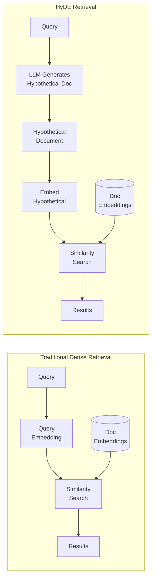

# HyDE (Hypothetical Document Embeddings)

**Category**: Retriever-centric
**Maturity**: Production-Proven
**Primary Source**: Gao, L., et al. (2022). "Precise Zero-Shot Dense Retrieval without Relevance Labels." *ACL 2023*. [arXiv:2212.10496](https://arxiv.org/abs/2212.10496)

---

## Overview

HyDE (Hypothetical Document Embeddings) solves a fundamental problem in dense retrieval: the embedding space mismatch between queries and documents. Queries are typically short questions ("What causes climate change?") while documents are longer, descriptive passages written in a different style. This stylistic gap means query embeddings may not be close to relevant document embeddings even when semantically related.

HyDE's elegant solution: **generate a hypothetical document that would answer the query, then use that document's embedding for retrieval**. The LLM generates a plausible (but potentially inaccurate) answer, which is embedded and used to find real documents that are stylistically similar.

The key insight is that the generated document doesn't need to be factually correct—it just needs to be in the same "language" as real documents. A hypothetical answer about climate change will be stylistically similar to real climate science documents, even if some details are wrong.

HyDE is particularly valuable for:
- **Zero-shot retrieval**: No training data needed
- **Cross-lingual search**: Works across languages
- **Domain adaptation**: Bridges query-document vocabulary gaps

---

## Architecture Diagram



---

## How It Works

### The Problem: Query-Document Mismatch

```
Query: "What are effective treatments for insomnia?"
       ↓ (embedding)
Query Vector: [0.2, -0.3, 0.8, ...]

Relevant Document: "Sleep disorders can be managed through cognitive
behavioral therapy (CBT-I), which addresses the thoughts and behaviors
that prevent restful sleep. Studies show 70-80% of patients improve..."
       ↓ (embedding)
Document Vector: [0.5, 0.1, 0.4, ...]

Problem: Vectors may not be close despite semantic relevance!
```

### HyDE Solution

```
Query: "What are effective treatments for insomnia?"
       ↓ (LLM generation)
Hypothetical Doc: "Insomnia treatment options include cognitive behavioral
therapy for insomnia (CBT-I), which is considered first-line treatment.
Medication options include benzodiazepines and non-benzodiazepine
hypnotics. Sleep hygiene practices and relaxation techniques also help."
       ↓ (embedding)
Hypothetical Vector: [0.48, 0.15, 0.42, ...]  ← Much closer to real docs!
```

### Multiple Hypotheticals

For better coverage, generate multiple hypothetical documents and average their embeddings:

```
Query → [Hyp Doc 1, Hyp Doc 2, Hyp Doc 3]
     → [Embedding 1, Embedding 2, Embedding 3]
     → Average Embedding
     → Retrieval
```

---

## Implementation

### Basic HyDE

```python
from typing import List, Optional
import numpy as np

class HyDERetriever:
    """
    HyDE: Hypothetical Document Embeddings for zero-shot retrieval.
    """

    def __init__(
        self,
        llm: LanguageModel,
        embedding_model,
        vector_index: VectorIndex,
        num_hypotheticals: int = 1
    ):
        self.llm = llm
        self.embedding_model = embedding_model
        self.vector_index = vector_index
        self.num_hypotheticals = num_hypotheticals

    def retrieve(
        self,
        query: str,
        top_k: int = 5,
        domain: Optional[str] = None
    ) -> List[Dict]:
        """
        Retrieve documents using hypothetical document embeddings.

        Steps:
        1. Generate hypothetical document(s) that would answer the query
        2. Embed the hypothetical document(s)
        3. Search for similar real documents
        """
        # Step 1: Generate hypothetical document(s)
        hypotheticals = self._generate_hypotheticals(query, domain)

        # Step 2: Embed hypothetical documents
        hyp_embeddings = self.embedding_model.encode(hypotheticals)

        # Step 3: Average embeddings if multiple
        if len(hyp_embeddings) > 1:
            search_embedding = np.mean(hyp_embeddings, axis=0)
        else:
            search_embedding = hyp_embeddings[0]

        # Step 4: Search for similar real documents
        results = self.vector_index.search(search_embedding, top_k=top_k)

        return results

    def _generate_hypotheticals(
        self,
        query: str,
        domain: Optional[str] = None
    ) -> List[str]:
        """Generate hypothetical documents that would answer the query."""
        hypotheticals = []

        for i in range(self.num_hypotheticals):
            prompt = self._build_prompt(query, domain, variation=i)
            response = self.llm.generate(prompt, max_tokens=200)
            hypotheticals.append(response)

        return hypotheticals

    def _build_prompt(
        self,
        query: str,
        domain: Optional[str],
        variation: int
    ) -> str:
        """Build prompt for hypothetical document generation."""
        domain_context = f" about {domain}" if domain else ""

        # Different prompt styles for variation
        prompts = [
            f"""Write a short passage{domain_context} that directly answers this question:

Question: {query}

Passage:""",

            f"""Generate a paragraph from a document{domain_context} that would be relevant to this query:

Query: {query}

Document excerpt:""",

            f"""Write a factual, informative response{domain_context} to:

{query}

Response:"""
        ]

        return prompts[variation % len(prompts)]
```

### Domain-Specific HyDE

```python
class DomainHyDE(HyDERetriever):
    """HyDE with domain-specific prompts for better hypothetical generation."""

    DOMAIN_PROMPTS = {
        "medical": """You are a medical professional. Write a clinical passage
that would answer this patient question:

Question: {query}

Clinical Information:""",

        "legal": """You are a legal expert. Write a passage from a legal
document or case law that addresses:

Question: {query}

Legal Text:""",

        "technical": """You are a software engineer. Write technical
documentation that explains:

Question: {query}

Documentation:""",

        "scientific": """You are a researcher. Write an excerpt from a
scientific paper that discusses:

Question: {query}

Paper Excerpt:"""
    }

    def _build_prompt(
        self,
        query: str,
        domain: Optional[str],
        variation: int
    ) -> str:
        """Use domain-specific prompt if available."""
        if domain and domain.lower() in self.DOMAIN_PROMPTS:
            template = self.DOMAIN_PROMPTS[domain.lower()]
            return template.format(query=query)
        return super()._build_prompt(query, domain, variation)
```

### HyDE + RAG Pipeline

```python
def hyde_rag_pipeline(
    query: str,
    vector_index: VectorIndex,
    llm: LanguageModel,
    embedding_model,
    top_k: int = 5
) -> str:
    """
    Complete HyDE-RAG pipeline: hypothetical retrieval + generation.
    """
    # Step 1: HyDE retrieval
    hyde = HyDERetriever(
        llm=llm,
        embedding_model=embedding_model,
        vector_index=vector_index,
        num_hypotheticals=3
    )

    retrieved_docs = hyde.retrieve(query, top_k=top_k)

    # Step 2: Generate final answer using retrieved docs
    context = "\n\n".join([doc.text for doc in retrieved_docs])

    prompt = f"""Answer the question based on the provided context.

Context:
{context}

Question: {query}

Answer:"""

    return llm.generate(prompt)
```

---

## Use Cases

### Example 1: Zero-Shot Domain Retrieval
- **Scenario**: Legal firm deploying RAG without labeled training data
- **Why this architecture**: No query-document pairs available for fine-tuning; HyDE works zero-shot
- **Expected outcome**: Effective retrieval without training data

### Example 2: Cross-Lingual Search
- **Scenario**: English queries against multilingual document corpus
- **Why this architecture**: Generate hypothetical in target language; bridge language gap
- **Expected outcome**: Find relevant documents regardless of query language

### Example 3: Technical Support
- **Scenario**: Users ask informal questions; docs are formal technical writing
- **Why this architecture**: Hypothetical bridges "my app crashes" → technical error documentation
- **Expected outcome**: Better matching despite vocabulary mismatch

---

## Pros and Cons

### Advantages

- **Zero-shot capability**: No training data or fine-tuning required
- **Cross-lingual**: Works across languages with multilingual LLMs
- **Domain agnostic**: Adapts to any domain through prompt engineering
- **Easy implementation**: Adds one LLM call to existing RAG pipeline
- **Complementary**: Can combine with other techniques (reranking, hybrid search)

### Limitations

- **Added latency**: LLM call for hypothesis generation (200-500ms)
- **LLM dependency**: Quality depends on LLM's generation capability
- **Token cost**: Additional tokens for hypothesis generation
- **Potential bias**: Hypothetical may introduce LLM biases into retrieval
- **Not always better**: For well-matched query-document corpora, may not improve over direct embedding

### Compared to Alternatives

- **vs. Traditional Dense**: HyDE adds query expansion; better for vocabulary mismatch
- **vs. RAG-Fusion**: RAG-Fusion generates multiple queries; HyDE generates hypothetical documents. Different expansion strategies.
- **vs. Query Rewriting**: Query rewriting stays in query space; HyDE moves to document space

---

## When HyDE Helps Most

| Scenario | HyDE Benefit |
|----------|--------------|
| Short queries | High: Expands sparse queries to document-like text |
| Domain mismatch | High: Bridges vocabulary gap |
| Zero-shot | High: Only option without training data |
| Well-matched corpus | Low: Direct embedding may suffice |
| Speed-critical | Low: LLM call adds latency |

---

## Performance Considerations

### Latency Breakdown

| Component | Time |
|-----------|------|
| Hypothesis generation | 200-500ms |
| Embedding | 10-50ms |
| Vector search | 10-50ms |
| **Total HyDE** | **220-600ms** |
| Traditional (no HyDE) | 20-100ms |

### Cost per Query

| Component | Cost |
|-----------|------|
| 1 hypothetical (GPT-4o-mini) | ~$0.0003 |
| 3 hypotheticals | ~$0.001 |
| Embedding | ~$0.00001 |

### Optimization Tips

```python
# Use fast model for hypotheticals
hyde = HyDERetriever(
    llm=fast_llm,  # GPT-4o-mini, Claude Haiku
    ...
)

# Cache hypotheticals for repeated queries
from functools import lru_cache

@lru_cache(maxsize=1000)
def cached_hypothetical(query: str) -> str:
    return llm.generate(hyde_prompt(query))
```

---

## References

1. Gao, L., et al. (2022). "Precise Zero-Shot Dense Retrieval without Relevance Labels." *ACL 2023*. [arXiv:2212.10496](https://arxiv.org/abs/2212.10496)
2. Haystack Documentation. "Hypothetical Document Embeddings (HyDE)." [docs.haystack.deepset.ai](https://docs.haystack.deepset.ai/docs/hypothetical-document-embeddings-hyde)
