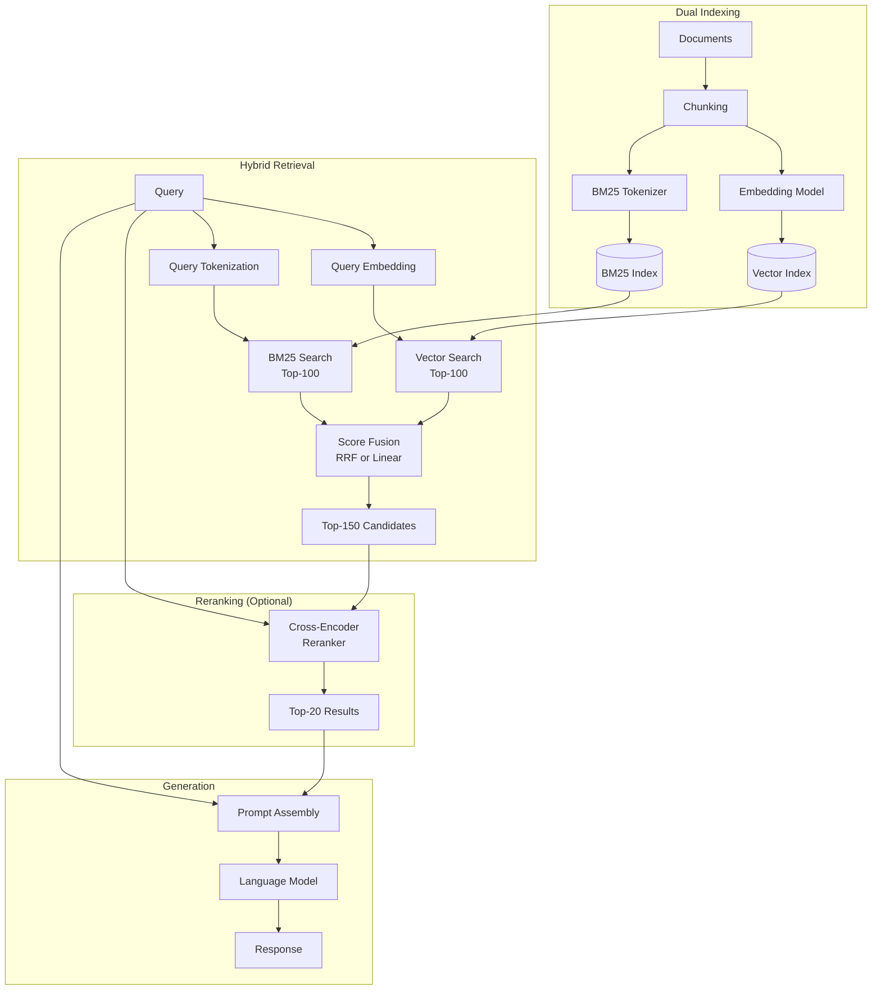

# Hybrid RAG (Dense + BM25 + Rerank)

**Category**: Retriever-centric
**Maturity**: Production-Proven
**Primary Source**: Anthropic. (September 2024). "Introducing Contextual Retrieval." [anthropic.com](https://www.anthropic.com/news/contextual-retrieval)

---

## Overview

Hybrid RAG combines dense vector embeddings with sparse retrieval (BM25) and optionally adds a reranking step. This addresses a fundamental limitation of pure semantic search: dense embeddings excel at capturing meaning but can miss exact keyword matches, while BM25 (a statistical text matching algorithm) catches these but lacks semantic understanding.

The key insight is that different retrieval methods have complementary failure modes. Dense retrieval might miss "Error code 0x8007045D" because it doesn't appear semantically related to storage issues, while BM25 would match it exactly. Conversely, BM25 would fail on "laptop won't turn on" when the documentation says "device fails to power up."

The reranking step uses a cross-encoder model that scores query-document pairs jointly, providing more accurate relevance scores than independent embeddings but at higher computational cost. Standard practice is to retrieve 50-150 candidates with hybrid search, then rerank to select top 10-20.

---

## Architecture Diagram



---

## How It Works

### BM25 Algorithm
BM25 (Best Matching 25) is a ranking function based on term frequency (TF) and inverse document frequency (IDF):

```
score(D, Q) = Σ IDF(qi) × (tf(qi, D) × (k1 + 1)) / (tf(qi, D) + k1 × (1 - b + b × |D|/avgdl))
```

Where:
- `tf(qi, D)` = frequency of term qi in document D
- `IDF(qi)` = log((N - n(qi) + 0.5) / (n(qi) + 0.5))
- `k1` = term frequency saturation parameter (typically 1.2-2.0)
- `b` = document length normalization (typically 0.75)

### Score Fusion Methods

**Reciprocal Rank Fusion (RRF)**:
```
RRF_score(d) = Σ 1 / (k + rank_i(d))
```
Where k is typically 60. RRF is preferred when scores from different systems aren't comparable.

**Linear Combination**:
```
score(d) = α × dense_score(d) + (1-α) × bm25_score(d)
```
Requires score normalization. α is typically 0.5-0.7 (favoring dense slightly).

### Reranking
Cross-encoders process query and document together through a transformer, enabling token-level attention between them. This is more accurate than independent embeddings but O(n) cost per query-document pair.

---

## Implementation

### Ingestion Pipeline

```python
from rank_bm25 import BM25Okapi
from typing import List, Dict
import numpy as np

def ingest_documents_hybrid(
    documents: List[str],
    chunk_size: int = 512,
    embedding_model: str = "text-embedding-3-small"
) -> tuple[VectorIndex, BM25Index]:
    """
    Create both vector and BM25 indices for hybrid retrieval.

    Steps:
    1. Chunk documents
    2. Create vector embeddings
    3. Create BM25 index from tokenized chunks
    """
    chunks = []
    metadata = []

    # Step 1: Chunk all documents
    for doc_id, doc in enumerate(documents):
        doc_chunks = split_into_chunks(doc, chunk_size)
        for chunk_idx, chunk in enumerate(doc_chunks):
            chunks.append(chunk)
            metadata.append({"doc_id": doc_id, "chunk_idx": chunk_idx, "text": chunk})

    # Step 2: Create vector index
    embeddings = embedding_model.encode(chunks, batch_size=32)
    vector_index = VectorIndex(dimension=embeddings.shape[1])
    vector_index.add(embeddings, metadata)

    # Step 3: Create BM25 index
    tokenized_chunks = [tokenize_for_bm25(chunk) for chunk in chunks]
    bm25_index = BM25Okapi(tokenized_chunks)
    bm25_index.metadata = metadata  # Store metadata reference

    return vector_index, bm25_index

def tokenize_for_bm25(text: str) -> List[str]:
    """Tokenize text for BM25 - lowercase, remove punctuation, optionally stem."""
    import re
    text = text.lower()
    text = re.sub(r'[^\w\s]', ' ', text)
    tokens = text.split()
    # Optional: apply stemming
    # tokens = [stemmer.stem(t) for t in tokens]
    return tokens
```

### Retrieval Pipeline

```python
def retrieve_hybrid_rerank(
    query: str,
    vector_index: VectorIndex,
    bm25_index: BM25Index,
    reranker: CrossEncoder,
    top_k_retrieval: int = 100,
    top_k_rerank: int = 20,
    fusion_method: str = "rrf",
    rrf_k: int = 60
) -> List[Dict]:
    """
    Hybrid retrieval with optional reranking.

    Steps:
    1. Dense retrieval (top-k by vector similarity)
    2. Sparse retrieval (top-k by BM25)
    3. Fuse results using RRF or linear combination
    4. Rerank top candidates with cross-encoder
    """
    # Step 1: Dense retrieval
    query_embedding = embedding_model.encode([query])[0]
    dense_results = vector_index.search(query_embedding, top_k=top_k_retrieval)

    # Step 2: Sparse retrieval (BM25)
    query_tokens = tokenize_for_bm25(query)
    bm25_scores = bm25_index.get_scores(query_tokens)
    top_bm25_indices = np.argsort(bm25_scores)[-top_k_retrieval:][::-1]
    sparse_results = [(idx, bm25_scores[idx]) for idx in top_bm25_indices]

    # Step 3: Fuse results
    if fusion_method == "rrf":
        fused = reciprocal_rank_fusion(dense_results, sparse_results, k=rrf_k)
    else:
        fused = linear_fusion(dense_results, sparse_results, alpha=0.6)

    # Get top candidates for reranking
    candidates = fused[:top_k_retrieval]

    # Step 4: Rerank with cross-encoder
    if reranker:
        pairs = [(query, c["text"]) for c in candidates]
        rerank_scores = reranker.predict(pairs)
        for i, score in enumerate(rerank_scores):
            candidates[i]["rerank_score"] = score
        candidates.sort(key=lambda x: x["rerank_score"], reverse=True)

    return candidates[:top_k_rerank]

def reciprocal_rank_fusion(
    dense_results: List,
    sparse_results: List,
    k: int = 60
) -> List[Dict]:
    """Combine results using Reciprocal Rank Fusion."""
    rrf_scores = {}

    # Score from dense results
    for rank, result in enumerate(dense_results):
        doc_id = result.metadata["doc_id"]
        chunk_idx = result.metadata["chunk_idx"]
        key = (doc_id, chunk_idx)
        rrf_scores[key] = rrf_scores.get(key, 0) + 1 / (k + rank + 1)
        rrf_scores[key + ("meta",)] = result.metadata

    # Score from sparse results
    for rank, (idx, score) in enumerate(sparse_results):
        metadata = bm25_index.metadata[idx]
        key = (metadata["doc_id"], metadata["chunk_idx"])
        rrf_scores[key] = rrf_scores.get(key, 0) + 1 / (k + rank + 1)
        rrf_scores[key + ("meta",)] = metadata

    # Sort by RRF score
    results = []
    for key, score in rrf_scores.items():
        if not key[-1] == "meta":
            meta_key = key + ("meta",)
            results.append({"score": score, **rrf_scores.get(meta_key, {})})

    return sorted(results, key=lambda x: x["score"], reverse=True)
```

---

## Use Cases

### Example 1: Legal Document Search
- **Scenario**: Law firm searching 500,000 case documents; queries include case numbers, statute citations, and conceptual questions
- **Why this architecture**: Case numbers ("Brown v. Board 347 U.S. 483") need exact matching (BM25); conceptual queries ("precedent for employment discrimination") need semantic search
- **Expected outcome**: 30-40% improvement over pure vector search for citation-heavy queries

### Example 2: Technical Documentation
- **Scenario**: Developer documentation with API endpoints, error codes, and conceptual guides
- **Why this architecture**: Error codes ("ERR_CONNECTION_REFUSED"), function names ("getAuthToken()"), and conceptual questions all mixed
- **Expected outcome**: Near-perfect retrieval for exact identifiers; strong semantic retrieval for concepts

### Example 3: E-commerce Product Search
- **Scenario**: Product catalog with SKUs, brand names, and natural language descriptions
- **Why this architecture**: "Nike Air Max size 10" needs both brand matching and semantic understanding
- **Expected outcome**: Better handling of product codes while maintaining semantic relevance

---

## Pros and Cons

### Advantages

- **Complementary retrieval**: Dense catches semantic similarity; BM25 catches exact terms
- **Significant accuracy improvement**: Adding BM25 to embeddings reduces retrieval failure by ~20% for technical content (Anthropic, 2024)
- **Reranking precision**: Cross-encoder reranking achieves up to 67% reduction in top-20 retrieval failure (Anthropic, 2024)
- **Production-ready**: Elasticsearch, Weaviate, Qdrant all support hybrid search natively
- **Incremental complexity**: Can add BM25 to existing vector systems with minimal changes

### Limitations

- **Dual index maintenance**: Must keep vector and BM25 indices synchronized
- **Increased storage**: BM25 index adds 10-30% storage overhead
- **Reranking latency**: Cross-encoder adds 100-500ms for 100 candidates
- **Reranker cost**: Commercial rerankers (Cohere) cost ~$1-2 per 1000 queries
- **Fusion tuning**: RRF k parameter and linear weights need tuning per use case

### Compared to Alternatives

- **vs. Traditional RAG**: +20% retrieval accuracy for technical content; +100-300ms latency with reranking
- **vs. Contextual RAG**: Contextual addresses chunk isolation problem; Hybrid addresses term matching. Often combined.
- **vs. ColBERT**: ColBERT provides token-level late interaction without separate BM25; higher accuracy but more complex infrastructure

---

## Performance Benchmarks

| Configuration | Top-20 Failure Rate | Latency | Source |
|--------------|---------------------|---------|--------|
| Embeddings only | 5.7% | 50-100ms | Anthropic, 2024 |
| Embeddings + BM25 | ~4.5% | 80-150ms | Anthropic, 2024 |
| Embeddings + BM25 + Rerank | 1.9% | 200-500ms | Anthropic, 2024 |

---

## Recommended Rerankers

| Reranker | Latency | Cost | Quality |
|----------|---------|------|---------|
| Cohere Rerank | 100-200ms | $1/1K queries | High |
| BGE Reranker (self-hosted) | 50-100ms | Compute only | Medium-High |
| Cross-encoder/ms-marco-MiniLM-L-6-v2 | 30-50ms | Compute only | Medium |
| Jina Reranker | 100-200ms | $1/1K queries | High |

---

## References

1. Anthropic. (September 2024). "Introducing Contextual Retrieval." [anthropic.com](https://www.anthropic.com/news/contextual-retrieval)
2. Robertson, S., & Zaragoza, H. (2009). "The Probabilistic Relevance Framework: BM25 and Beyond." *Foundations and Trends in Information Retrieval*.
3. Cormack, G. V., Clarke, C. L., & Buettcher, S. (2009). "Reciprocal Rank Fusion outperforms Condorcet and individual Rank Learning Methods." *SIGIR*.
4. Nogueira, R., & Cho, K. (2019). "Passage Re-ranking with BERT." [arXiv:1901.04085](https://arxiv.org/abs/1901.04085)
