# Late Chunking / ColBERT Late Interaction

**Category**: Retriever-centric
**Maturity**: Early Adoption
**Primary Source**: Jina AI. (2024). "Late Chunking: Contextual Chunk Embeddings Using Long-Context Embedding Models." [arXiv:2409.04701](https://arxiv.org/abs/2409.04701)

---

## Overview

Late Chunking addresses a fundamental problem with naive chunking: when you embed chunks independently, each chunk loses awareness of its surrounding context. A sentence like "He then proceeded to..." makes no sense without knowing who "he" refers to from the previous chunk.

The key insight is to **defer chunking until after embedding**: first embed the entire document using a long-context embedding model, obtaining token-level embeddings with full document context, then split into chunks and mean-pool the contextualized token embeddings for each chunk.

This approach preserves the contextual information while still producing chunk-level embeddings for efficient retrieval. The naming "late chunking" mirrors "late interaction" (ColBERT), where the interaction between query and document happens late in the pipeline.

**ColBERT** takes this further with **late interaction**: instead of producing single-vector embeddings, it produces multi-vector embeddings (one per token), enabling token-level query-document matching at retrieval time.

---

## Architecture Diagram

```mermaid
flowchart TD
    subgraph Naive ["Naive Chunking (Traditional)"]
        D1[Document] --> C1[Chunk 1]
        D1 --> C2[Chunk 2]
        D1 --> C3[Chunk 3]
        C1 --> E1[Embed Chunk 1]
        C2 --> E2[Embed Chunk 2]
        C3 --> E3[Embed Chunk 3]
        E1 --> V1[Vector 1]
        E2 --> V2[Vector 2]
        E3 --> V3[Vector 3]
    end

    subgraph Late ["Late Chunking"]
        D2[Document] --> EMB[Long-Context<br/>Embedding Model]
        EMB --> TOK[Token Embeddings<br/>with Full Context]
        TOK --> SPLIT[Split at Chunk<br/>Boundaries]
        SPLIT --> POOL1[Mean Pool<br/>Tokens 1-100]
        SPLIT --> POOL2[Mean Pool<br/>Tokens 101-200]
        SPLIT --> POOL3[Mean Pool<br/>Tokens 201-300]
        POOL1 --> CV1[Contextualized<br/>Vector 1]
        POOL2 --> CV2[Contextualized<br/>Vector 2]
        POOL3 --> CV3[Contextualized<br/>Vector 3]
    end

    subgraph ColBERT ["ColBERT Late Interaction"]
        D3[Document] --> BERT[BERT Encoder]
        BERT --> MULTI[Multi-Vector<br/>per Token]
        Q[Query] --> QBERT[BERT Encoder]
        QBERT --> QMULTI[Query Token<br/>Vectors]
        MULTI --> MAXSIM[MaxSim<br/>Matching]
        QMULTI --> MAXSIM
        MAXSIM --> SCORE[Relevance Score]
    end
```



---

## How It Works

### Late Chunking Process

**Step 1: Full Document Embedding**
```
Document: "John went to the store. He bought milk. He then went home."
         → Long-context embedding model
         → Token embeddings: [e_john, e_went, e_to, e_the, e_store, ...]
            (each token embedding is contextualized by the full document)
```

**Step 2: Identify Chunk Boundaries**
```
Chunk 1: "John went to the store." (tokens 0-4)
Chunk 2: "He bought milk." (tokens 5-7)
Chunk 3: "He then went home." (tokens 8-11)
```

**Step 3: Mean Pool Per Chunk**
```
Chunk 1 embedding = mean([e_john, e_went, e_to, e_the, e_store])
Chunk 2 embedding = mean([e_he, e_bought, e_milk])
    → Note: e_he is contextualized to know it refers to "John"
Chunk 3 embedding = mean([e_he, e_then, e_went, e_home])
```

### ColBERT Late Interaction

ColBERT produces **multi-vector embeddings** and uses **MaxSim** matching:

```
Query: "Who bought milk?"
    → Query tokens: [q_who, q_bought, q_milk]

Document: "He bought milk."
    → Doc tokens: [d_he, d_bought, d_milk]

MaxSim Score:
    For each query token, find max similarity with any doc token:
    - q_who: max(sim(q_who, d_he), sim(q_who, d_bought), sim(q_who, d_milk))
    - q_bought: max(sim(q_bought, d_*))
    - q_milk: max(sim(q_milk, d_*))

    Final score = sum of MaxSim for all query tokens
```

---

## Implementation

### Late Chunking

```python
from typing import List, Tuple
import numpy as np

class LateChunkingEmbedder:
    """
    Late Chunking: Embed full document, then split into contextualized chunks.
    """

    def __init__(
        self,
        model_name: str = "jinaai/jina-embeddings-v2-base-en",
        max_length: int = 8192
    ):
        from transformers import AutoModel, AutoTokenizer

        self.tokenizer = AutoTokenizer.from_pretrained(model_name)
        self.model = AutoModel.from_pretrained(model_name)
        self.max_length = max_length

    def embed_document_with_late_chunking(
        self,
        document: str,
        chunk_size: int = 256  # tokens per chunk
    ) -> List[Tuple[str, np.ndarray]]:
        """
        Embed document with late chunking.

        Steps:
        1. Tokenize full document
        2. Get token-level embeddings (contextualized)
        3. Split into chunks and mean pool
        """
        # Step 1: Tokenize
        tokens = self.tokenizer(
            document,
            return_tensors="pt",
            truncation=True,
            max_length=self.max_length,
            return_offsets_mapping=True
        )

        # Step 2: Get token embeddings with full context
        with torch.no_grad():
            outputs = self.model(**tokens)
            token_embeddings = outputs.last_hidden_state[0]  # [seq_len, hidden_dim]

        # Step 3: Determine chunk boundaries
        seq_len = token_embeddings.shape[0]
        chunks = []

        for start_idx in range(0, seq_len, chunk_size):
            end_idx = min(start_idx + chunk_size, seq_len)

            # Mean pool token embeddings for this chunk
            chunk_embedding = token_embeddings[start_idx:end_idx].mean(dim=0)

            # Get text for this chunk
            offset_mapping = tokens["offset_mapping"][0]
            char_start = offset_mapping[start_idx][0].item()
            char_end = offset_mapping[end_idx - 1][1].item()
            chunk_text = document[char_start:char_end]

            chunks.append((chunk_text, chunk_embedding.numpy()))

        return chunks

    def embed_query(self, query: str) -> np.ndarray:
        """Embed query using standard single-vector approach."""
        tokens = self.tokenizer(query, return_tensors="pt", truncation=True)
        with torch.no_grad():
            outputs = self.model(**tokens)
            # Use CLS token or mean pooling
            embedding = outputs.last_hidden_state[0].mean(dim=0)
        return embedding.numpy()
```

### ColBERT Late Interaction

```python
class ColBERTRetriever:
    """
    ColBERT: Contextualized Late Interaction over BERT.
    Multi-vector embeddings with MaxSim scoring.
    """

    def __init__(self, model_name: str = "colbert-ir/colbertv2.0"):
        from colbert import Indexer, Searcher
        from colbert.infra import ColBERTConfig

        self.config = ColBERTConfig(
            doc_maxlen=512,
            query_maxlen=32,
            nbits=2  # Compression for efficiency
        )

    def index_documents(
        self,
        documents: List[str],
        index_path: str
    ) -> None:
        """
        Create ColBERT index.

        Each document is encoded into multi-vector representation
        (one embedding per token).
        """
        indexer = Indexer(checkpoint=self.model_name, config=self.config)
        indexer.index(name=index_path, collection=documents)

    def search(
        self,
        query: str,
        index_path: str,
        top_k: int = 10
    ) -> List[Tuple[int, float]]:
        """
        Search using MaxSim late interaction.

        Query tokens are matched against document tokens
        using maximum similarity scoring.
        """
        searcher = Searcher(index=index_path)
        results = searcher.search(query, k=top_k)

        return [(doc_id, score) for doc_id, rank, score in zip(*results)]

    def maxsim_score(
        self,
        query_embeddings: np.ndarray,  # [num_query_tokens, dim]
        doc_embeddings: np.ndarray     # [num_doc_tokens, dim]
    ) -> float:
        """
        Compute MaxSim score between query and document.

        For each query token, find max similarity with any doc token,
        then sum across query tokens.
        """
        # Compute all pairwise similarities
        similarities = np.dot(query_embeddings, doc_embeddings.T)
        # [num_query_tokens, num_doc_tokens]

        # MaxSim: for each query token, take max over doc tokens
        max_similarities = similarities.max(axis=1)

        # Sum over query tokens
        return max_similarities.sum()
```

### Using RAGatouille for Easy ColBERT

```python
# RAGatouille provides a simple interface to ColBERT
from ragatouille import RAGPretrainedModel

# Load pretrained ColBERT
rag = RAGPretrainedModel.from_pretrained("colbert-ir/colbertv2.0")

# Index documents
rag.index(
    collection=documents,
    index_name="my_index",
    max_document_length=512,
    split_documents=True  # Automatic chunking
)

# Search
results = rag.search(query="What is ColBERT?", k=5)
```

---

## Use Cases

### Example 1: Legal Document Search
- **Scenario**: Contracts with many cross-references ("as defined in Section 3.2")
- **Why this architecture**: Late chunking preserves reference context; "defined term" in chunk knows its definition
- **Expected outcome**: Better retrieval for reference-heavy documents

### Example 2: Academic Paper Retrieval
- **Scenario**: Research papers where methodology references results and vice versa
- **Why this architecture**: Token embeddings are contextualized by full paper
- **Expected outcome**: More accurate matching of technical queries to paper sections

### Example 3: High-Precision Technical Search
- **Scenario**: Finding exact code snippets or API references
- **Why this architecture**: ColBERT's token-level matching catches exact terms better than single-vector
- **Expected outcome**: Higher precision for technical queries with specific terms

---

## Pros and Cons

### Late Chunking Advantages

- **Preserves context**: Chunks know about surrounding content
- **Drop-in replacement**: Same output format as naive chunking
- **No training required**: Uses existing long-context embedding models
- **Better retrieval**: ~10-15% improvement in retrieval quality (Jina AI, 2024)

### Late Chunking Limitations

- **Requires long-context model**: Not all embedding models support
- **Processing overhead**: Must embed full document, not individual chunks
- **Document length limit**: Still bounded by model's context window

### ColBERT Advantages

- **High precision**: Token-level matching catches nuances
- **Good for exact terms**: Outperforms single-vector for specific terminology
- **Efficient at scale**: Optimized for large collections

### ColBERT Limitations

- **Larger index size**: Multi-vector = more storage (mitigated by compression)
- **More complex infrastructure**: Not just vector DB
- **Higher latency**: MaxSim computation adds overhead

### Compared to Alternatives

- **vs. Naive Chunking**: Late chunking adds context awareness; ~10-15% retrieval improvement
- **vs. Contextual RAG**: Contextual adds explicit text; Late Chunking uses model's implicit context
- **vs. Dense Retrieval**: ColBERT often outperforms single-vector dense retrieval

---

## Performance Benchmarks

### Late Chunking (Jina AI)

| Method | Retrieval Quality | Notes |
|--------|------------------|-------|
| Naive Chunking | Baseline | Context lost between chunks |
| Late Chunking | +10-15% | Contextualized chunk embeddings |

### ColBERT

| Method | BEIR Benchmark | Notes |
|--------|---------------|-------|
| BM25 | Baseline | Lexical matching |
| Dense (single-vector) | +5-10% over BM25 | Semantic matching |
| ColBERT v2 | +10-20% over dense | Late interaction |

---

## Model Options

### Late Chunking Models

| Model | Context Window | Source |
|-------|---------------|--------|
| Jina Embeddings v2 | 8192 tokens | Jina AI |
| Jina ColBERT v2 | 8192 tokens | Jina AI |
| nomic-embed-text-v1.5 | 8192 tokens | Nomic AI |

### ColBERT Models

| Model | Features | Source |
|-------|----------|--------|
| ColBERT v2 | English, compressed | Stanford |
| Jina ColBERT v2 | Multilingual, 89 languages | Jina AI |
| ColBERT-XM | Cross-lingual | Various |

---

## References

1. Jina AI. (2024). "Late Chunking: Contextual Chunk Embeddings Using Long-Context Embedding Models." [arXiv:2409.04701](https://arxiv.org/abs/2409.04701)
2. Khattab, O., & Zaharia, M. (2020). "ColBERT: Efficient and Effective Passage Search via Contextualized Late Interaction over BERT." *SIGIR 2020*.
3. Santhanam, K., et al. (2022). "ColBERTv2: Effective and Efficient Retrieval via Lightweight Late Interaction." *NAACL 2022*.
4. RAGatouille: [github.com/bclavie/RAGatouille](https://github.com/bclavie/RAGatouille)
