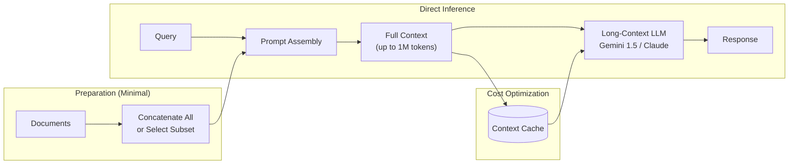

# Long-Context RAG / "RAG-less"

**Category**: Context-Extended
**Maturity**: Production-Proven
**Primary Source**: Google. (February 2024). "Introducing Gemini 1.5." Technical Report.

---

## Overview

Long-context models challenge the fundamental assumption behind RAG: that we need retrieval because models can't process all relevant information at once. With context windows reaching 1 million tokens (Gemini 1.5) to 200K tokens (Claude 3), it's now possible to include entire knowledge bases in a single prompt.

The approach is deceptively simple: instead of retrieving relevant chunks, include everything. For a 500-page document, simply pass all 500 pages to the model and ask your question. No chunking, no embedding, no retrieval pipeline.

However, long-context is not a universal replacement for RAG. Critical limitations include:
- **Multi-needle degradation**: While single-needle recall is ~99% at 1M tokens, finding multiple facts drops to ~60%
- **Cost**: 1M tokens of input costs $15-60 per query
- **Latency**: 5-30 seconds for long context processing

The practical guidance is: use long-context for <200K tokens or high-value single-document analysis; use RAG for larger corpora or cost-sensitive applications.

---

## Architecture Diagram



---

## How It Works

### Simple Case: Full Document in Context

```python
def long_context_qa(documents: List[str], query: str) -> str:
    """
    Answer questions by including full documents in context.
    No retrieval, no chunking - just direct context inclusion.
    """
    # Concatenate all documents
    full_context = "\n\n---\n\n".join([
        f"Document {i+1}:\n{doc}"
        for i, doc in enumerate(documents)
    ])

    prompt = f"""You are an expert analyst. Answer questions based on the provided documents.

{full_context}

Question: {query}

Answer:"""

    return llm.generate(prompt, max_tokens=4096)
```

### With Context Caching (Cost Optimization)

```python
def cached_long_context_qa(
    documents: List[str],
    queries: List[str],
    cache_ttl: int = 3600
) -> List[str]:
    """
    Use context caching for multiple queries over same documents.
    Caching can reduce costs by 90% for repeated context.
    """
    full_context = "\n\n---\n\n".join(documents)

    # Create cached context (one-time cost)
    cache_id = llm.create_cached_context(
        content=full_context,
        ttl=cache_ttl
    )

    # Process queries using cached context
    responses = []
    for query in queries:
        response = llm.generate_with_cache(
            cache_id=cache_id,
            query=query
        )
        responses.append(response)

    return responses
```

### Hybrid: Long-Context + RAG

For very large corpora, combine approaches:

```python
def hybrid_long_context_rag(
    corpus: List[str],
    query: str,
    retriever: Retriever,
    context_budget: int = 100000  # tokens
) -> str:
    """
    Retrieve relevant subset, then use long-context for that subset.
    Best of both: focused retrieval + full context understanding.
    """
    # Step 1: Retrieve potentially relevant documents
    candidates = retriever.retrieve(query, top_k=50)

    # Step 2: Select documents within context budget
    selected = []
    current_tokens = 0
    for doc in candidates:
        doc_tokens = count_tokens(doc.text)
        if current_tokens + doc_tokens <= context_budget:
            selected.append(doc.text)
            current_tokens += doc_tokens

    # Step 3: Use full selected context
    context = "\n\n---\n\n".join(selected)

    prompt = f"""Based on the following relevant documents, answer the question.

{context}

Question: {query}

Answer:"""

    return llm.generate(prompt)
```

---

## When to Use Long-Context vs RAG

### Use Long-Context When:

| Scenario | Reason |
|----------|--------|
| Corpus < 200K tokens | No retrieval needed; full context fits |
| Single document deep analysis | Need holistic understanding |
| High-value queries | Worth the compute cost |
| Complex cross-references | Model can see all connections |
| Quality > Cost | Budget for expensive inference |

### Use RAG When:

| Scenario | Reason |
|----------|--------|
| Corpus > 1M tokens | Exceeds context window |
| High query volume | Long-context cost prohibitive |
| Need for precision | RAG + reranking more accurate for specific facts |
| Real-time latency needs | RAG is faster (50-500ms vs 5-30s) |
| Frequent corpus updates | RAG supports incremental updates |

### Anthropic's Guidance (September 2024)

> "For knowledge bases up to 200,000 tokens (roughly 500 pages), you may not need RAG at all. Simply include the entire knowledge base in the prompt and use prompt caching for cost efficiency."

---

## Implementation

### Basic Long-Context Pipeline

```python
from typing import List, Optional
import tiktoken

class LongContextQA:
    """
    Simple long-context Q&A system without retrieval.
    """

    def __init__(
        self,
        model: str = "gemini-1.5-pro",
        max_context: int = 1000000
    ):
        self.model = model
        self.max_context = max_context
        self.encoder = tiktoken.get_encoding("cl100k_base")

    def load_documents(self, documents: List[str]) -> str:
        """Load and concatenate documents within context limit."""
        full_text = ""
        for i, doc in enumerate(documents):
            doc_text = f"\n\n=== Document {i+1} ===\n{doc}"
            if self.count_tokens(full_text + doc_text) > self.max_context * 0.9:
                print(f"Warning: Truncating at document {i+1}")
                break
            full_text += doc_text
        return full_text

    def count_tokens(self, text: str) -> int:
        """Count tokens in text."""
        return len(self.encoder.encode(text))

    def query(
        self,
        context: str,
        question: str,
        system_prompt: Optional[str] = None
    ) -> str:
        """Query the documents."""
        if system_prompt is None:
            system_prompt = """You are an expert analyst. Answer questions
            based solely on the provided documents. If the answer is not
            in the documents, say so."""

        prompt = f"""{system_prompt}

Documents:
{context}

Question: {question}

Answer:"""

        # Check total tokens
        total_tokens = self.count_tokens(prompt)
        if total_tokens > self.max_context:
            raise ValueError(f"Context too long: {total_tokens} tokens")

        return llm.generate(prompt, model=self.model)


# Usage example
qa = LongContextQA()
context = qa.load_documents([doc1, doc2, doc3])  # Total ~150K tokens

# Multiple queries over same context
answer1 = qa.query(context, "What are the main themes?")
answer2 = qa.query(context, "Summarize the key findings")
answer3 = qa.query(context, "What are the recommendations?")
```

---

## Use Cases

### Example 1: Contract Analysis
- **Scenario**: Law firm analyzing a 200-page merger agreement
- **Why this architecture**: Need to understand cross-references, defined terms, and interconnected clauses
- **Expected outcome**: Comprehensive analysis without losing context between sections

### Example 2: Code Repository Understanding
- **Scenario**: Onboarding to a 50,000-line codebase
- **Why this architecture**: Can include entire codebase; understand architecture holistically
- **Expected outcome**: Answer questions about how components interact

### Example 3: Book-Length Document Q&A
- **Scenario**: Querying a 400-page technical manual
- **Why this architecture**: Single document, need to find specific procedures that reference other sections
- **Expected outcome**: Accurate answers that properly contextualize cross-references

---

## Pros and Cons

### Advantages

- **Simplicity**: No chunking, embedding, or retrieval infrastructure needed
- **Holistic understanding**: Model sees all context; no information loss
- **Cross-reference handling**: Can understand "as mentioned in section 3.2"
- **No retrieval errors**: Every fact is in context
- **Fast iteration**: No index to rebuild when documents change

### Limitations

- **Multi-needle degradation**: ~60% recall for multiple facts at 1M tokens (vs 99% single needle)
- **High cost**: $15-60 per query at 1M tokens
- **High latency**: 5-30 seconds for long context processing
- **Context limit**: Cannot exceed model's window (currently 1-2M tokens max)
- **"Lost in the middle"**: Models still struggle with information in middle positions
- **No incremental updates**: Must reprocess entire context for changes

### Compared to Alternatives

- **vs. Traditional RAG**: Long-context is simpler but costlier; RAG is more scalable
- **vs. Contextual RAG**: Contextual RAG scales to unlimited corpus; long-context limited by window
- **vs. GraphRAG**: GraphRAG better for global sensemaking; long-context better for single documents

---

## Performance Benchmarks

| Model | Context Window | Single-Needle Recall | Multi-Needle Recall | Source |
|-------|---------------|---------------------|---------------------|--------|
| Gemini 1.5 Pro | 1M tokens | ~99% | ~60% (1M tokens) | Google, 2024 |
| Claude 3 | 200K tokens | ~99% | Higher at 200K | Anthropic, 2024 |
| GPT-4 Turbo | 128K tokens | High | N/A | OpenAI, 2024 |

---

## Cost Analysis

### Per-Query Costs (as of 2024)

| Model | 100K Input | 500K Input | 1M Input |
|-------|-----------|-----------|----------|
| Gemini 1.5 Pro | $0.35 | $1.75 | $3.50 |
| Claude 3 Opus | $1.50 | N/A (200K limit) | N/A |
| GPT-4 Turbo | $1.00 | N/A (128K limit) | N/A |

### With Context Caching

| Provider | Cache Creation | Cached Query |
|----------|---------------|--------------|
| Anthropic | Full price | 90% discount |
| Google | Full price | 75% discount |

**Break-even**: Context caching pays off after ~3-5 queries on same context.

---

## Best Practices

1. **Use context caching** for repeated queries
2. **Structure documents clearly** with headers and sections
3. **Place important content early** to mitigate "lost in middle"
4. **Consider hybrid approach** for very large corpora
5. **Monitor multi-needle tasks** where performance degrades

---

## References

1. Google. (February 2024). "Introducing Gemini 1.5." Technical Report.
2. Databricks. (2024). "Long Context RAG Capabilities."
3. LlamaIndex. (2024). "Towards Long Context RAG."
4. Anthropic. (September 2024). "Introducing Contextual Retrieval." (Section on when RAG is not needed)
5. GDELT Project. (May 2024). Analysis of long-context vs RAG tradeoffs.
