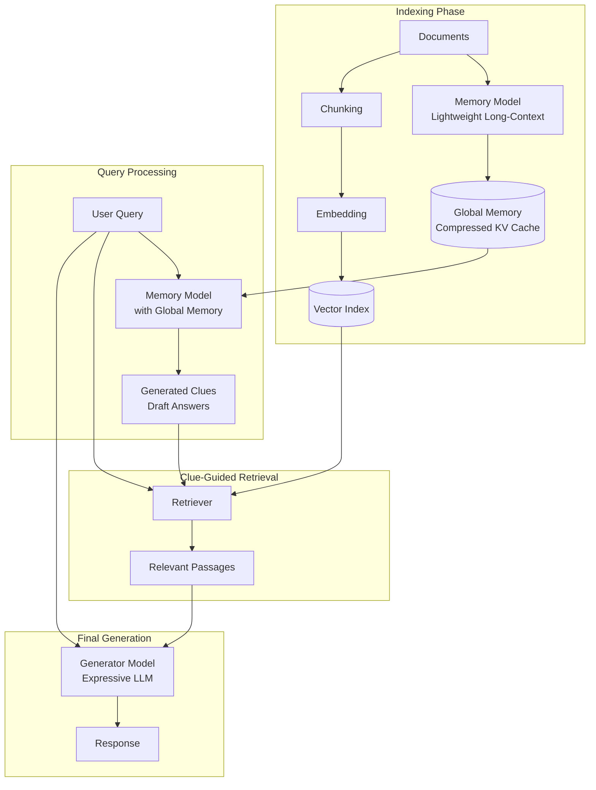

# MemoRAG (Memory-Enhanced RAG)

**Category**: Context-Extended
**Maturity**: Research
**Primary Source**: Qian, H., et al. (2024). "MemoRAG: Moving towards Next-Gen RAG Via Memory-Inspired Knowledge Discovery." *TheWebConf 2025*. [arXiv:2409.05591](https://arxiv.org/abs/2409.05591)

---

## Overview

MemoRAG introduces a **dual-system architecture** inspired by cognitive science, combining a lightweight "memory model" for global understanding with a powerful "retrieval + generation" system for detailed answers. This addresses two fundamental limitations of traditional RAG:

1. **Explicit query requirement**: Traditional RAG needs clearly stated queries that can be matched to documents
2. **Well-structured knowledge assumption**: Traditional RAG assumes documents contain discrete, retrievable facts

MemoRAG's memory model can process extremely long contexts (1M+ tokens), form a global "memory" of the corpus, and generate retrieval clues even when queries are ambiguous or implicit. These clues then guide the retrieval system to find relevant passages.

The approach excels at:
- **Ambiguous queries**: "Tell me something interesting" without specific targets
- **Distributed evidence**: Facts scattered across many documents
- **Complex summarization**: Holistic understanding of large datasets

---

## Architecture Diagram



---

## How It Works

### Dual-System Design

**System 1: Memory Model (Light but Long-Range)**
- Processes the entire corpus (up to 1M tokens)
- Creates compressed "global memory" via KV cache compression
- Generates draft answers/clues without needing to retrieve first
- Trained with RLGF (Reinforcement Learning from Generation Feedback)

**System 2: Generator Model (Expressive but Limited Context)**
- Traditional RAG-style retrieval + generation
- Uses clues from memory model to guide retrieval
- Produces final polished answer with retrieved evidence

### Memory Formation

The memory model compresses long documents into a form it can reason about:

```
Documents (1M tokens) → Memory Model → Compressed Memory (KV cache)
```

This memory allows the model to "know" about the entire corpus without needing retrieval for initial understanding.

### Clue Generation

When a query arrives, the memory model generates retrieval clues:

```
Query: "What was the main controversy?"
Memory Model: "The main controversy involved the CEO's resignation
and the leaked financial documents..."
```

These clues—even if partially incorrect—provide better retrieval queries than the original ambiguous question.

---

## Implementation

### Memory Model Setup

```python
from typing import List, Dict
import torch

class MemoRAGSystem:
    """
    MemoRAG: Dual-system RAG with memory-enhanced retrieval.
    """

    def __init__(
        self,
        memory_model: LongContextLM,  # e.g., MemoRAG-qwen2-7b
        generator_model: LanguageModel,
        retriever: Retriever,
        max_memory_tokens: int = 1000000
    ):
        self.memory_model = memory_model
        self.generator = generator_model
        self.retriever = retriever
        self.max_memory_tokens = max_memory_tokens
        self.global_memory = None

    def build_memory(self, documents: List[str]) -> None:
        """
        Build global memory from document corpus.

        The memory model processes all documents and creates a
        compressed representation (KV cache) for efficient querying.
        """
        # Concatenate documents
        full_corpus = "\n\n".join([
            f"Document {i+1}:\n{doc}"
            for i, doc in enumerate(documents)
        ])

        # Truncate if needed
        tokens = self.memory_model.tokenize(full_corpus)
        if len(tokens) > self.max_memory_tokens:
            tokens = tokens[:self.max_memory_tokens]
            full_corpus = self.memory_model.detokenize(tokens)

        # Create memory (compressed KV cache)
        self.global_memory = self.memory_model.create_memory(full_corpus)
        print(f"Memory created from {len(tokens)} tokens")

    def generate_clues(self, query: str, num_clues: int = 3) -> List[str]:
        """
        Use memory model to generate retrieval clues.

        The memory model uses its global understanding to generate
        draft answers/clues that can guide retrieval.
        """
        prompt = f"""Based on your memory of the documents, generate
helpful search clues for answering this question:

Question: {query}

Generate {num_clues} clues that would help find relevant information:"""

        # Generate with global memory context
        response = self.memory_model.generate_with_memory(
            prompt,
            memory=self.global_memory,
            max_tokens=200
        )

        # Parse clues
        clues = [line.strip() for line in response.split('\n') if line.strip()]
        return clues[:num_clues]
```

### Full MemoRAG Pipeline

```python
def memorag_query(
    self,
    query: str,
    top_k: int = 5
) -> str:
    """
    MemoRAG query pipeline.

    Steps:
    1. Generate clues using memory model
    2. Retrieve using both query and clues
    3. Generate final answer with retriever model
    """
    # Step 1: Generate clues from global memory
    clues = self.generate_clues(query, num_clues=3)

    # Step 2: Retrieve using query + clues
    all_results = []

    # Retrieve for original query
    query_results = self.retriever.retrieve(query, top_k=top_k)
    all_results.extend(query_results)

    # Retrieve for each clue
    for clue in clues:
        clue_results = self.retriever.retrieve(clue, top_k=3)
        all_results.extend(clue_results)

    # Deduplicate and rank
    seen = set()
    unique_results = []
    for result in all_results:
        key = (result.doc_id, result.chunk_idx)
        if key not in seen:
            seen.add(key)
            unique_results.append(result)

    # Take top-k after deduplication
    final_passages = unique_results[:top_k]

    # Step 3: Generate final answer
    context = "\n\n".join([r.text for r in final_passages])

    prompt = f"""Answer the question based on the provided context.

Context:
{context}

Question: {query}

Answer:"""

    return self.generator.generate(prompt)


# Alternative: Direct memory-based generation for simple queries
def memorag_direct(self, query: str) -> str:
    """
    For simple queries, generate directly from memory without retrieval.
    Faster but less grounded.
    """
    prompt = f"""Based on your knowledge of the documents, answer:

Question: {query}

Answer:"""

    return self.memory_model.generate_with_memory(
        prompt,
        memory=self.global_memory,
        max_tokens=500
    )
```

### Adaptive Mode Selection

```python
def memorag_adaptive(self, query: str) -> str:
    """
    Adaptively choose between direct generation and retrieval.

    Use direct generation for:
    - Summarization tasks
    - Global understanding questions

    Use retrieval for:
    - Specific fact queries
    - Citation-needed questions
    """
    # Classify query type
    query_type = self._classify_query(query)

    if query_type == "global":
        # Direct generation from memory
        return self.memorag_direct(query)
    else:
        # Full retrieval pipeline
        return self.memorag_query(query)

def _classify_query(self, query: str) -> str:
    """Classify query as 'global' or 'specific'."""
    global_keywords = ["summarize", "main themes", "overview",
                       "what is this about", "general"]

    query_lower = query.lower()
    for keyword in global_keywords:
        if keyword in query_lower:
            return "global"

    return "specific"
```

---

## Use Cases

### Example 1: Ambiguous Query Handling
- **Scenario**: User asks "What should I know about this?" over a large document corpus
- **Why this architecture**: Traditional RAG has no good embedding for ambiguous queries; memory model understands enough to generate specific clues
- **Expected outcome**: Memory generates clues like "key events," "main actors," "controversies," guiding focused retrieval

### Example 2: Distributed Evidence Collection
- **Scenario**: Question requires synthesizing information from 50+ documents
- **Why this architecture**: Memory model has global view; can identify that evidence is spread across documents
- **Expected outcome**: Clues point to different document clusters, improving recall

### Example 3: Large Corpus Summarization
- **Scenario**: "What are the main conclusions across these 100 research papers?"
- **Why this architecture**: Global sensemaking requires seeing everything; memory model processes full corpus
- **Expected outcome**: Thematic summary drawing from memory's holistic understanding

---

## Pros and Cons

### Advantages

- **Handles ambiguous queries**: Memory model infers intent even when query is vague
- **Global understanding**: Processes 1M+ tokens for holistic comprehension
- **Better retrieval**: Generated clues often retrieve better than raw queries
- **Accepted at TheWebConf 2025**: Peer-reviewed research
- **Flexible**: Can use direct generation or retrieval as appropriate

### Limitations

- **Complex architecture**: Requires two models (memory + generator)
- **Memory model training**: Requires specialized training with RLGF
- **Compute intensive**: Memory formation requires long-context processing
- **Memory quality dependent**: Poor memory model = poor clues
- **Research stage**: Limited production deployments as of early 2025

### Compared to Alternatives

- **vs. Traditional RAG**: MemoRAG handles ambiguous queries; Traditional requires explicit queries
- **vs. Long-Context**: MemoRAG uses retrieval for evidence; Long-Context relies solely on attention
- **vs. GraphRAG**: Both enable global sensemaking; MemoRAG uses neural memory, GraphRAG uses explicit graphs

---

## Models and Resources

### Available Models

| Model | Size | Context | Source |
|-------|------|---------|--------|
| MemoRAG-qwen2-7b | 7B | 1M tokens | HuggingFace |
| MemoRAG-mistral-7b | 7B | Variable | HuggingFace |

### Resources

- **Paper**: [arXiv:2409.05591](https://arxiv.org/abs/2409.05591)
- **GitHub**: [qhjqhj00/MemoRAG](https://github.com/qhjqhj00/MemoRAG)
- **HuggingFace**: Available model checkpoints

---

## Performance Considerations

| Component | Latency | Notes |
|-----------|---------|-------|
| Memory formation | 30-60s | One-time per corpus |
| Clue generation | 500-1500ms | Per query |
| Retrieval | 50-200ms | Standard retrieval |
| Generation | 500-2000ms | Standard generation |
| **Total query** | **2-5s** | End-to-end |

---

## References

1. Qian, H., et al. (2024). "MemoRAG: Moving towards Next-Gen RAG Via Memory-Inspired Knowledge Discovery." *TheWebConf 2025*. [arXiv:2409.05591](https://arxiv.org/abs/2409.05591)
2. GitHub: [qhjqhj00/MemoRAG](https://github.com/qhjqhj00/MemoRAG)
