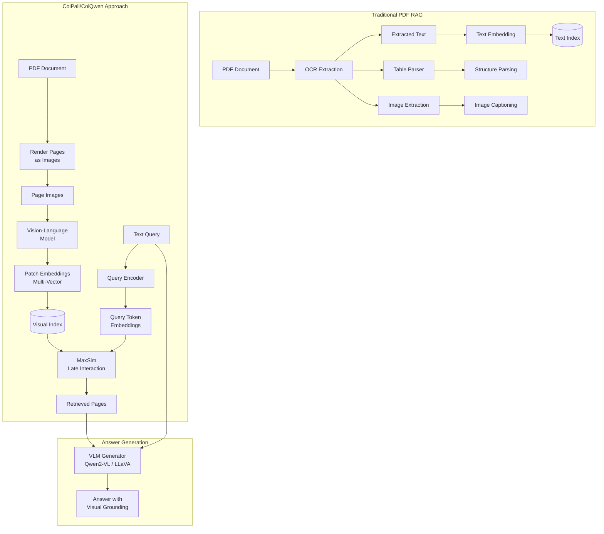

# Multimodal RAG (ColPali / ColQwen)

**Category**: Retriever-centric
**Maturity**: Early Adoption
**Primary Source**: Faysse, M., et al. (2024). "ColPali: Efficient Document Retrieval with Vision Language Models." [arXiv:2407.01449](https://arxiv.org/abs/2407.01449)

---

## Overview

Multimodal RAG with ColPali/ColQwen represents a paradigm shift in document retrieval: instead of extracting text from PDFs (via OCR), parsing tables, and separately handling images, these systems **treat each page as an image** and use vision-language models to create embeddings directly from the visual representation.

The key insight is that OCR pipelines fail on complex documents:
- **Tables**: Structure is lost in text extraction
- **Charts/Graphs**: Visual information cannot be captured as text
- **Complex layouts**: Multi-column PDFs, forms, and mixed content
- **Scanned documents**: OCR errors compound downstream

ColPali combines **ColBERT's late interaction** approach with **PaLI-GeMMA** (a vision-language model), enabling:
- Direct image-to-embedding without OCR
- Token-level visual feature matching
- Preservation of spatial relationships and layout

ColQwen2 extends this with the Qwen2-VL model, improving multilingual support and visual understanding.

---

## Architecture Diagram



---

## How It Works

### ColPali Architecture

**Step 1: Page Rendering**
Convert each PDF page to an image at sufficient resolution (typically 1024x1024 or similar).

**Step 2: Patch Embedding**
The vision-language model processes the image:
- Divide image into patches (e.g., 16x16 grid = 256 patches)
- Each patch gets an embedding vector
- Embeddings capture visual features AND textual content (via VLM training)

**Step 3: Late Interaction Matching**
Text queries are embedded token-by-token:
- Each query token embedding
- Matched against all patch embeddings using MaxSim
- Score = sum of max similarities

```
Query: "What is the revenue growth?"

Query Tokens: [q_what, q_is, q_the, q_revenue, q_growth]

Page Patches: 256 embeddings from page image

For each query token, find the patch with highest similarity:
- q_revenue → matches patch containing "Revenue" text/chart
- q_growth → matches patch containing growth numbers/graph

Score = sum of these max similarities
```

### Key Innovation: Visual + Textual

ColPali maps image patches into the same latent space as text. This means:
- Text in the image ("Revenue: $1.2B") creates similar embeddings to the query word "revenue"
- Charts showing growth are semantically matched to "growth" queries
- Layout information (headers, tables) is preserved

---

## Implementation

### Using ColPali for Document Retrieval

```python
from typing import List, Tuple
from PIL import Image
import torch

class ColPaliRetriever:
    """
    ColPali: Vision-Language Document Retrieval.
    Processes documents as images, no OCR required.
    """

    def __init__(self, model_name: str = "vidore/colpali-v1.2"):
        from colpali_engine.models import ColPali
        from colpali_engine.utils.processing_utils import ColPaliProcessor

        self.model = ColPali.from_pretrained(model_name)
        self.processor = ColPaliProcessor.from_pretrained(model_name)

    def index_documents(
        self,
        pdf_paths: List[str]
    ) -> List[dict]:
        """
        Index PDF documents by rendering pages as images.

        Each page becomes a set of patch embeddings.
        """
        indexed_pages = []

        for pdf_path in pdf_paths:
            # Convert PDF to images
            page_images = self._pdf_to_images(pdf_path)

            for page_num, image in enumerate(page_images):
                # Get patch embeddings
                inputs = self.processor(images=[image])
                with torch.no_grad():
                    embeddings = self.model(**inputs)

                indexed_pages.append({
                    "pdf": pdf_path,
                    "page": page_num,
                    "embeddings": embeddings,  # [num_patches, dim]
                    "image": image
                })

        return indexed_pages

    def search(
        self,
        query: str,
        indexed_pages: List[dict],
        top_k: int = 5
    ) -> List[Tuple[dict, float]]:
        """
        Search for relevant pages using late interaction.
        """
        # Encode query
        query_inputs = self.processor(text=[query])
        with torch.no_grad():
            query_embeddings = self.model.encode_query(**query_inputs)
            # [num_query_tokens, dim]

        # Score each page
        scores = []
        for page in indexed_pages:
            score = self._maxsim_score(
                query_embeddings,
                page["embeddings"]
            )
            scores.append((page, score))

        # Sort by score
        scores.sort(key=lambda x: x[1], reverse=True)

        return scores[:top_k]

    def _maxsim_score(
        self,
        query_emb: torch.Tensor,
        doc_emb: torch.Tensor
    ) -> float:
        """
        Compute MaxSim score between query tokens and document patches.
        """
        # query_emb: [num_query_tokens, dim]
        # doc_emb: [num_patches, dim]

        similarities = torch.matmul(query_emb, doc_emb.T)
        # [num_query_tokens, num_patches]

        max_sims = similarities.max(dim=1).values
        return max_sims.sum().item()

    def _pdf_to_images(self, pdf_path: str) -> List[Image.Image]:
        """Convert PDF pages to images."""
        import fitz  # PyMuPDF

        doc = fitz.open(pdf_path)
        images = []

        for page in doc:
            pix = page.get_pixmap(matrix=fitz.Matrix(2, 2))  # 2x zoom
            img = Image.frombytes("RGB", [pix.width, pix.height], pix.samples)
            images.append(img)

        return images
```

### Full Multimodal RAG Pipeline

```python
class MultimodalRAG:
    """
    Complete multimodal RAG pipeline with ColPali retrieval
    and VLM generation.
    """

    def __init__(
        self,
        retriever_model: str = "vidore/colpali-v1.2",
        generator_model: str = "Qwen/Qwen2-VL-7B-Instruct"
    ):
        self.retriever = ColPaliRetriever(retriever_model)
        self.generator = self._load_vlm(generator_model)

    def _load_vlm(self, model_name: str):
        """Load vision-language model for generation."""
        from transformers import Qwen2VLForConditionalGeneration, AutoProcessor

        model = Qwen2VLForConditionalGeneration.from_pretrained(model_name)
        processor = AutoProcessor.from_pretrained(model_name)

        return {"model": model, "processor": processor}

    def query(
        self,
        question: str,
        indexed_pages: List[dict],
        top_k: int = 3
    ) -> str:
        """
        Answer question using multimodal RAG.

        1. Retrieve relevant pages using ColPali
        2. Generate answer using VLM with page images
        """
        # Step 1: Retrieve relevant pages
        results = self.retriever.search(question, indexed_pages, top_k=top_k)

        # Step 2: Prepare images for VLM
        retrieved_images = [r[0]["image"] for r in results]

        # Step 3: Generate answer with VLM
        messages = [
            {
                "role": "user",
                "content": [
                    *[{"type": "image", "image": img} for img in retrieved_images],
                    {"type": "text", "text": f"Based on these document pages, answer: {question}"}
                ]
            }
        ]

        inputs = self.generator["processor"](
            text=[messages],
            images=retrieved_images,
            return_tensors="pt"
        )

        outputs = self.generator["model"].generate(**inputs, max_new_tokens=500)
        answer = self.generator["processor"].decode(outputs[0], skip_special_tokens=True)

        return answer
```

---

## Use Cases

### Example 1: Financial Report Analysis
- **Scenario**: Querying annual reports with complex tables, charts, and multi-column layouts
- **Why this architecture**: OCR fails on tables; charts carry critical information (growth trends, comparisons)
- **Expected outcome**: Accurate retrieval and answers incorporating visual data

### Example 2: Scientific Papers with Figures
- **Scenario**: Research papers where figures and diagrams contain key results
- **Why this architecture**: "What does Figure 3 show?" requires visual understanding
- **Expected outcome**: Direct visual reasoning without figure captioning

### Example 3: Scanned Historical Documents
- **Scenario**: Archive of scanned contracts, forms, and handwritten notes
- **Why this architecture**: OCR quality is poor; visual retrieval works on raw scans
- **Expected outcome**: Functional retrieval on documents where OCR-based RAG fails

---

## Pros and Cons

### Advantages

- **No OCR required**: Eliminates OCR errors and pipeline complexity
- **Preserves layout**: Tables, charts, and spatial relationships intact
- **Better on visual content**: Charts, diagrams, figures directly searchable
- **End-to-end trainable**: Single model, no separate components
- **SOTA performance**: Outperforms all OCR-based PDF retrieval (Faysse et al., 2024)

### Limitations

- **Compute intensive**: VLM inference is expensive
- **Higher latency**: 500-2000ms per query vs 50-200ms for text RAG
- **Storage overhead**: Page images + patch embeddings larger than text
- **Resolution dependent**: Very small text may not be captured
- **Early stage**: Fewer production deployments than text RAG

### Compared to Alternatives

- **vs. OCR + Text RAG**: ColPali wins on complex documents; Text RAG wins on simple, clean text
- **vs. Hybrid (OCR + Images)**: ColPali is simpler (single pipeline) but may miss very small text
- **vs. ColBERT**: Same late interaction, but ColPali adds vision modality

---

## Model Options

| Model | Base VLM | Features | Source |
|-------|----------|----------|--------|
| ColPali v1.2 | PaLI-GeMMA | Original ColPali | Hugging Face |
| ColQwen2 | Qwen2-VL-2B | Multilingual, better VLM | Hugging Face |
| ColSmol | SmolVLM | Smaller, faster | Hugging Face |

---

## Performance Benchmarks

### Document Retrieval (ViDoRe Benchmark)

| Method | NDCG@5 | Notes |
|--------|--------|-------|
| BM25 (OCR text) | Lower | Text-only baseline |
| Dense Retrieval (OCR) | Medium | Single-vector on OCR text |
| ColPali | **Highest** | Vision-based, no OCR |

*ColPali outperforms all SOTA PDF retrieval methods (Faysse et al., 2024)*

---

## Infrastructure Requirements

### Storage
- **Per page**: ~2MB (image) + ~1MB (embeddings) = ~3MB
- **1000-page document**: ~3GB indexed

### Compute
- **Indexing**: GPU recommended (3-5 seconds per page)
- **Query**: GPU for VLM generation; CPU possible for retrieval only

### Libraries
```python
# Core dependencies
pip install colpali-engine
pip install transformers
pip install torch
pip install pdf2image  # or PyMuPDF
pip install Pillow
```

---

## References

1. Faysse, M., et al. (2024). "ColPali: Efficient Document Retrieval with Vision Language Models." [arXiv:2407.01449](https://arxiv.org/abs/2407.01449)
2. GitHub: [illuin-tech/colpali](https://github.com/illuin-tech/colpali)
3. Hugging Face: [vidore/colpali-v1.2](https://huggingface.co/vidore/colpali-v1.2)
4. Together.ai. (2024). "Multimodal Document RAG with Llama 3.2 Vision and ColQwen2."
