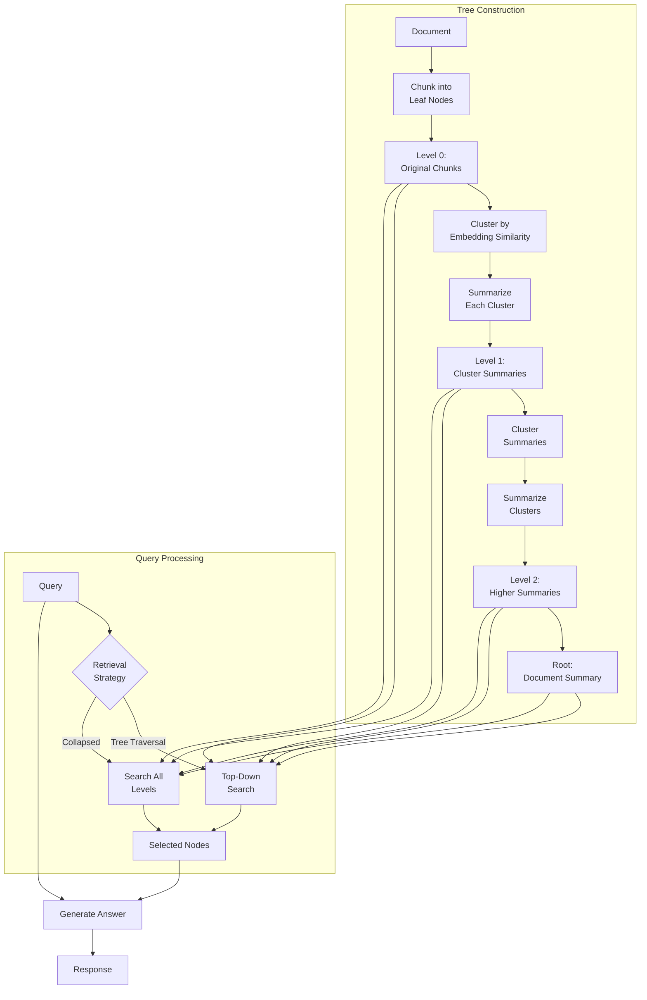

# RAPTOR (Recursive Abstractive Processing for Tree-Organized Retrieval)

**Category**: Structure-Aware
**Maturity**: Research
**Primary Source**: Sarthi, P., et al. (2024). "RAPTOR: Recursive Abstractive Processing for Tree-Organized Retrieval." *ICLR 2024*. [arXiv:2401.18059](https://arxiv.org/abs/2401.18059)

---

## Overview

RAPTOR addresses a fundamental limitation of flat chunk retrieval: the inability to answer questions at different levels of abstraction. "What is chapter 3 about?" requires a summary, while "What specific date did the event occur?" requires detail. Traditional RAG retrieves chunks at a single granularity level.

RAPTOR constructs a tree structure from documents by recursively:
1. Clustering text chunks based on semantic similarity
2. Summarizing each cluster
3. Embedding the summaries
4. Clustering and summarizing the summaries
5. Repeating until reaching a single root summary

At query time, RAPTOR can retrieve from any level of the tree—leaf chunks for details, mid-level summaries for section understanding, or root summaries for document-level themes.

In benchmarks, RAPTOR with GPT-4 achieves **20% absolute accuracy improvement** on the QuALITY benchmark compared to previous best results.

---

## Architecture Diagram



---

## How It Works

### Tree Construction

**Step 1: Chunking**
Split document into leaf chunks (e.g., 100-200 tokens each)

**Step 2: Clustering**
Use soft clustering (Gaussian Mixture Models) based on embedding similarity:
- Chunks in same cluster discuss related topics
- Soft clustering allows chunks to belong to multiple clusters

**Step 3: Summarization**
For each cluster, generate an abstractive summary using an LLM:
```
Summarize the following text chunks, capturing the key information:
[Chunk 1]
[Chunk 2]
...
Summary:
```

**Step 4: Recursion**
- Embed the summaries
- Cluster the summaries
- Summarize the clusters
- Repeat until reaching a small number of root nodes

**Result**: A tree where:
- Leaves = original chunks (high detail)
- Mid-levels = section summaries (moderate abstraction)
- Root = document summary (high abstraction)

### Retrieval Strategies

**Tree Traversal (Top-Down)**:
1. Start at root
2. Select children most similar to query
3. Recurse into selected subtrees
4. Return leaf nodes reached

**Collapsed Tree**:
1. Pool all nodes (all levels) together
2. Retrieve top-k most similar nodes regardless of level
3. Higher levels are naturally retrieved for abstract queries

---

## Implementation

### Tree Construction

```python
from typing import List, Dict
from sklearn.mixture import GaussianMixture
import numpy as np

class RAPTORTree:
    """
    RAPTOR: Recursive Abstractive Processing for Tree-Organized Retrieval.
    """

    def __init__(
        self,
        embedding_model,
        summarizer: LanguageModel,
        chunk_size: int = 200,
        max_cluster_size: int = 10
    ):
        self.embedding_model = embedding_model
        self.summarizer = summarizer
        self.chunk_size = chunk_size
        self.max_cluster_size = max_cluster_size
        self.tree = {}  # level -> list of nodes

    def build_tree(self, document: str) -> Dict:
        """
        Build RAPTOR tree from document.

        Steps:
        1. Chunk document into leaf nodes
        2. Recursively cluster and summarize
        3. Store tree structure
        """
        # Level 0: Original chunks
        chunks = self._chunk_document(document)
        embeddings = self.embedding_model.encode(chunks)

        self.tree[0] = [
            {"text": chunk, "embedding": emb, "children": []}
            for chunk, emb in zip(chunks, embeddings)
        ]

        current_level = 0

        # Build higher levels until converged
        while len(self.tree[current_level]) > 1:
            next_level = self._build_next_level(current_level)
            if len(next_level) == len(self.tree[current_level]):
                break  # No further reduction possible
            current_level += 1
            self.tree[current_level] = next_level

        return self.tree

    def _chunk_document(self, document: str) -> List[str]:
        """Split document into chunks."""
        words = document.split()
        chunks = []
        for i in range(0, len(words), self.chunk_size):
            chunk = " ".join(words[i:i + self.chunk_size])
            chunks.append(chunk)
        return chunks

    def _build_next_level(self, current_level: int) -> List[Dict]:
        """Build next level by clustering and summarizing."""
        nodes = self.tree[current_level]
        embeddings = np.array([n["embedding"] for n in nodes])

        # Determine number of clusters
        n_clusters = max(1, len(nodes) // self.max_cluster_size)

        # Soft clustering with GMM
        gmm = GaussianMixture(n_components=n_clusters, covariance_type='full')
        gmm.fit(embeddings)
        responsibilities = gmm.predict_proba(embeddings)

        # Create clusters (soft assignment)
        clusters = []
        for cluster_idx in range(n_clusters):
            # Get nodes with high responsibility for this cluster
            cluster_nodes = [
                nodes[i] for i in range(len(nodes))
                if responsibilities[i, cluster_idx] > 0.3
            ]
            if cluster_nodes:
                clusters.append(cluster_nodes)

        # Summarize each cluster
        next_level = []
        for cluster_idx, cluster_nodes in enumerate(clusters):
            # Combine texts for summarization
            combined_text = "\n\n".join([n["text"] for n in cluster_nodes])

            # Generate summary
            summary = self._summarize(combined_text)

            # Embed summary
            summary_embedding = self.embedding_model.encode([summary])[0]

            next_level.append({
                "text": summary,
                "embedding": summary_embedding,
                "children": [nodes.index(n) for n in cluster_nodes]
            })

        return next_level

    def _summarize(self, text: str) -> str:
        """Generate summary of text using LLM."""
        prompt = f"""Summarize the following text, capturing the key information and main points:

{text[:3000]}  # Truncate if too long

Summary:"""
        return self.summarizer.generate(prompt, max_tokens=200)
```

### Retrieval

```python
class RAPTORRetriever:
    """Retrieve from RAPTOR tree using different strategies."""

    def __init__(self, tree: RAPTORTree, embedding_model):
        self.tree = tree.tree
        self.embedding_model = embedding_model

    def retrieve_collapsed(
        self,
        query: str,
        top_k: int = 5
    ) -> List[Dict]:
        """
        Collapsed retrieval: search all levels simultaneously.
        Good for queries that could match any abstraction level.
        """
        query_embedding = self.embedding_model.encode([query])[0]

        # Collect all nodes from all levels
        all_nodes = []
        for level, nodes in self.tree.items():
            for node in nodes:
                all_nodes.append({
                    "text": node["text"],
                    "embedding": node["embedding"],
                    "level": level
                })

        # Compute similarities
        for node in all_nodes:
            node["similarity"] = cosine_similarity(
                query_embedding, node["embedding"]
            )

        # Sort by similarity
        all_nodes.sort(key=lambda x: x["similarity"], reverse=True)

        return all_nodes[:top_k]

    def retrieve_tree_traversal(
        self,
        query: str,
        top_k: int = 5,
        beam_width: int = 3
    ) -> List[Dict]:
        """
        Tree traversal: top-down search from root.
        Good for hierarchical exploration.
        """
        query_embedding = self.embedding_model.encode([query])[0]

        # Start at highest level
        max_level = max(self.tree.keys())
        current_nodes = self.tree[max_level]

        # Traverse down
        for level in range(max_level, 0, -1):
            # Score current level nodes
            scored = []
            for node in current_nodes:
                sim = cosine_similarity(query_embedding, node["embedding"])
                scored.append((node, sim))

            # Select top beam_width nodes
            scored.sort(key=lambda x: x[1], reverse=True)
            selected = [n for n, _ in scored[:beam_width]]

            # Expand to children
            child_indices = set()
            for node in selected:
                child_indices.update(node.get("children", []))

            # Get child nodes
            if level > 0 and child_indices:
                current_nodes = [
                    self.tree[level - 1][i]
                    for i in child_indices
                    if i < len(self.tree[level - 1])
                ]
            else:
                current_nodes = selected

        # Final scoring at leaf level
        results = []
        for node in current_nodes:
            sim = cosine_similarity(query_embedding, node["embedding"])
            results.append({"text": node["text"], "similarity": sim, "level": 0})

        results.sort(key=lambda x: x["similarity"], reverse=True)
        return results[:top_k]
```

---

## Use Cases

### Example 1: Book-Length Document Q&A
- **Scenario**: Q&A over a 500-page textbook
- **Why this architecture**: Questions range from "What is the book about?" to "What example is given on page 234?"
- **Expected outcome**: Tree levels match query abstraction; 20% accuracy improvement

### Example 2: Research Paper Corpus
- **Scenario**: Querying 100 papers in a research area
- **Why this architecture**: "What are the main research themes?" vs "What dataset did Smith et al. use?"
- **Expected outcome**: High-level summaries for theme questions; leaf chunks for specifics

### Example 3: Legal Document Analysis
- **Scenario**: Analyzing lengthy regulatory documents
- **Why this architecture**: "What is the overall intent?" vs "What is the specific penalty?"
- **Expected outcome**: Appropriate abstraction level automatically retrieved

---

## Pros and Cons

### Advantages

- **Multi-scale retrieval**: Handles queries at any abstraction level
- **20% accuracy gain**: On QuALITY benchmark with GPT-4 (Sarthi et al., 2024)
- **Outperforms baselines**: F-1 scores 1.8%+ higher than DPR, 5.3%+ higher than BM25
- **Linear scaling**: Tree construction cost scales linearly with document length
- **Interpretable**: Tree structure shows document hierarchy

### Limitations

- **High indexing cost**: Multiple LLM calls for summarization
- **Summary quality dependent**: Tree quality depends on summarization quality
- **Static structure**: Tree must be rebuilt when documents change
- **Complex implementation**: More infrastructure than flat RAG
- **Clustering sensitivity**: GMM parameters affect tree structure

### Compared to Alternatives

- **vs. Traditional RAG**: RAPTOR handles multi-scale queries; Traditional only retrieves chunks
- **vs. GraphRAG**: GraphRAG uses entity relationships; RAPTOR uses semantic clustering. GraphRAG better for relational queries.
- **vs. Long-Context**: RAPTOR scales beyond context limits; Long-context limited by window size

---

## Performance Benchmarks

| Dataset | Method | Accuracy | Source |
|---------|--------|----------|--------|
| QuALITY | Previous SOTA | - | - |
| QuALITY | RAPTOR + GPT-4 | +20% absolute | Sarthi et al., 2024 |
| NarrativeQA | BM25 | Baseline | Sarthi et al., 2024 |
| NarrativeQA | DPR | +1.8% F-1 | Sarthi et al., 2024 |
| NarrativeQA | RAPTOR | +5.3% F-1 | Sarthi et al., 2024 |

---

## Cost Analysis

### Tree Construction
- **Embedding**: Same as traditional RAG
- **Summarization**: ~1 LLM call per 5-10 chunks per level
- **Example**: 1000-chunk document with 5 levels ≈ 500 summarization calls

### Query Time
- **Collapsed**: Single embedding comparison (fast)
- **Tree traversal**: Multiple comparisons but limited by beam width

---

## References

1. Sarthi, P., et al. (2024). "RAPTOR: Recursive Abstractive Processing for Tree-Organized Retrieval." *ICLR 2024*. [arXiv:2401.18059](https://arxiv.org/abs/2401.18059)
2. GitHub: [parthsarthi03/raptor](https://github.com/parthsarthi03/raptor)
