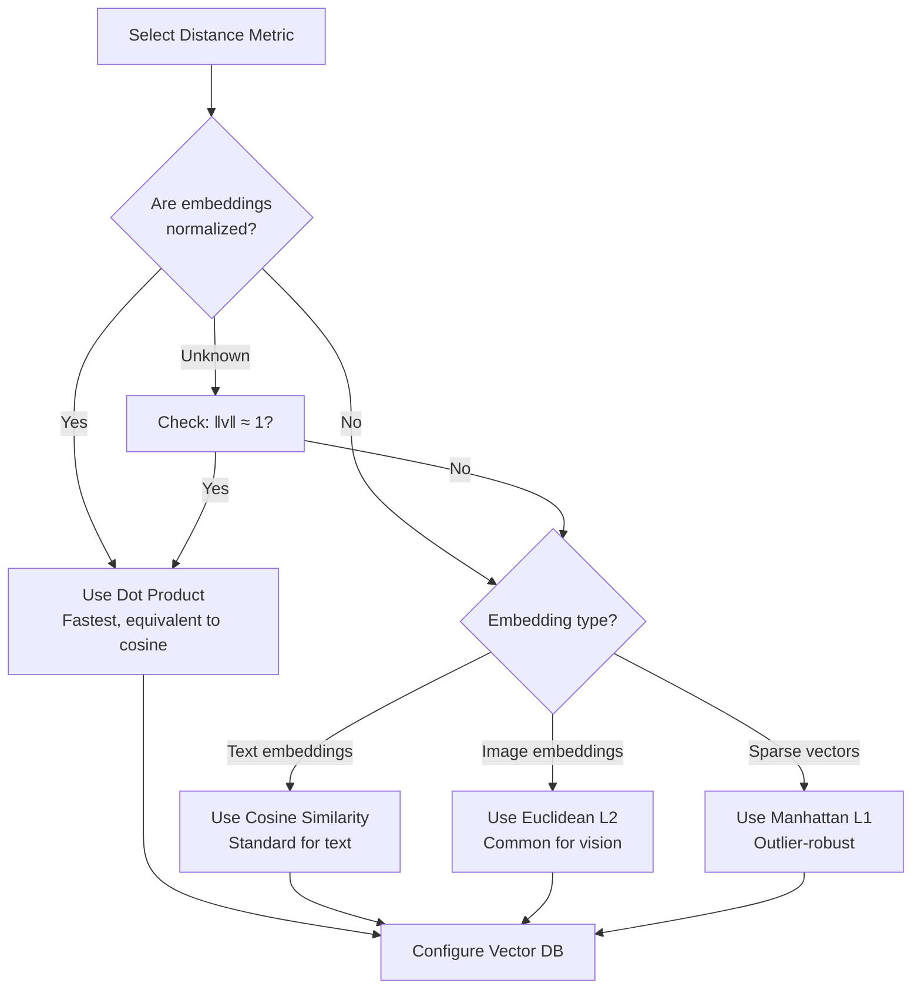

# Semantic Search Fundamentals: Distance Metrics & Similarity Functions

**Category**: Foundational Concepts
**Applies To**: All vector-based RAG architectures
**Audience**: Engineers implementing retrieval systems

---

## Overview

At the core of every RAG system is a similarity search: given a query embedding, find the most similar document embeddings. The choice of **distance metric** or **similarity function** significantly impacts retrieval quality, and the right choice depends on your embedding model, data characteristics, and use case.

This document covers:
1. Common similarity/distance metrics and their mathematical foundations
2. When to use each metric
3. Normalization considerations
4. Vector database support
5. Performance implications

---

## Quick Reference: Metric Comparison

| Metric | Formula | Range | Best For | Normalized Vectors? |
|--------|---------|-------|----------|---------------------|
| **Cosine Similarity** | (A·B)/(‖A‖‖B‖) | [-1, 1] | Text similarity, most RAG | Works with any |
| **Dot Product** | A·B | (-∞, +∞) | Normalized embeddings, speed | Requires normalized |
| **Euclidean (L2)** | √Σ(aᵢ-bᵢ)² | [0, +∞) | Image embeddings, clustering | Works with any |
| **Manhattan (L1)** | Σ|aᵢ-bᵢ| | [0, +∞) | Sparse vectors, outlier-robust | Works with any |

**Key Insight**: For **normalized vectors**, cosine similarity and dot product produce identical rankings. Most modern embedding models output normalized vectors, making dot product the fastest choice.

---

## Detailed Metric Analysis

### 1. Cosine Similarity

**The most common choice for text RAG.**

#### Mathematical Definition

```
cosine_similarity(A, B) = (A · B) / (‖A‖ × ‖B‖)

Where:
- A · B = Σ(aᵢ × bᵢ)  (dot product)
- ‖A‖ = √Σ(aᵢ²)       (L2 norm / magnitude)
```

#### Properties
- **Range**: [-1, 1]
  - 1 = identical direction (most similar)
  - 0 = orthogonal (unrelated)
  - -1 = opposite direction (most dissimilar)
- **Magnitude-invariant**: Only considers angle between vectors
- **Symmetric**: sim(A,B) = sim(B,A)

#### When to Use
- ✅ Text embeddings (OpenAI, Cohere, Voyage, etc.)
- ✅ When document length varies (normalizes for magnitude)
- ✅ When using non-normalized embeddings
- ✅ Default choice for semantic search

#### When to Avoid
- ❌ Already normalized vectors (use dot product for speed)
- ❌ When magnitude carries meaning (rare in text)

#### Implementation

```python
import numpy as np

def cosine_similarity(a: np.ndarray, b: np.ndarray) -> float:
    """
    Compute cosine similarity between two vectors.

    Returns value in [-1, 1], higher is more similar.
    """
    dot_product = np.dot(a, b)
    norm_a = np.linalg.norm(a)
    norm_b = np.linalg.norm(b)

    if norm_a == 0 or norm_b == 0:
        return 0.0

    return dot_product / (norm_a * norm_b)


def cosine_similarity_batch(query: np.ndarray, documents: np.ndarray) -> np.ndarray:
    """
    Compute cosine similarity between query and multiple documents.

    Args:
        query: Shape (dim,)
        documents: Shape (num_docs, dim)

    Returns:
        Similarities: Shape (num_docs,)
    """
    # Normalize
    query_norm = query / np.linalg.norm(query)
    doc_norms = documents / np.linalg.norm(documents, axis=1, keepdims=True)

    # Dot product of normalized vectors = cosine similarity
    return np.dot(doc_norms, query_norm)
```

---

### 2. Dot Product (Inner Product)

**Fastest option for normalized vectors.**

#### Mathematical Definition

```
dot_product(A, B) = A · B = Σ(aᵢ × bᵢ)
```

#### Properties
- **Range**: (-∞, +∞) for unnormalized; [-1, 1] for normalized
- **Computationally cheapest**: No square roots or divisions
- **For normalized vectors**: Equivalent to cosine similarity

#### Key Relationship

```
If ‖A‖ = ‖B‖ = 1 (normalized):
    cosine_similarity(A, B) = dot_product(A, B)
```

Most embedding models (OpenAI `text-embedding-3-*`, Cohere, etc.) output **normalized vectors**, making dot product the optimal choice.

#### When to Use
- ✅ Normalized embeddings (most modern models)
- ✅ Maximum retrieval speed
- ✅ Large-scale systems where compute matters

#### When to Avoid
- ❌ Non-normalized embeddings (use cosine instead)
- ❌ When magnitude should influence ranking

#### Implementation

```python
def dot_product(a: np.ndarray, b: np.ndarray) -> float:
    """
    Compute dot product between two vectors.

    For normalized vectors, this equals cosine similarity.
    """
    return np.dot(a, b)


def dot_product_batch(query: np.ndarray, documents: np.ndarray) -> np.ndarray:
    """
    Compute dot product between query and multiple documents.

    Fastest similarity computation for normalized vectors.
    """
    return np.dot(documents, query)


# Check if vectors are normalized
def is_normalized(vectors: np.ndarray, tolerance: float = 1e-6) -> bool:
    """Check if vectors have unit norm."""
    norms = np.linalg.norm(vectors, axis=-1)
    return np.allclose(norms, 1.0, atol=tolerance)
```

---

### 3. Euclidean Distance (L2 Distance)

**Measures absolute distance in vector space.**

#### Mathematical Definition

```
euclidean_distance(A, B) = ‖A - B‖₂ = √Σ(aᵢ - bᵢ)²
```

#### Properties
- **Range**: [0, +∞)
  - 0 = identical vectors
  - Higher = more different
- **Magnitude-sensitive**: Affected by vector norms
- **Triangle inequality**: d(A,C) ≤ d(A,B) + d(B,C)

#### Relationship to Cosine Similarity

For **normalized vectors**:
```
euclidean_distance² = 2 - 2 × cosine_similarity

Therefore:
- cosine_sim = 1  →  L2_dist = 0
- cosine_sim = 0  →  L2_dist = √2 ≈ 1.414
- cosine_sim = -1 →  L2_dist = 2
```

This means for normalized vectors, **L2 distance and cosine similarity produce equivalent rankings** (just inverted: min L2 = max cosine).

#### When to Use
- ✅ Image embeddings (CLIP, etc.)
- ✅ Clustering algorithms (k-means uses L2)
- ✅ When absolute position in space matters
- ✅ Some specialized embedding models trained with L2

#### When to Avoid
- ❌ Variable-length text (use cosine to normalize)
- ❌ When only direction matters (most text search)

#### Implementation

```python
def euclidean_distance(a: np.ndarray, b: np.ndarray) -> float:
    """
    Compute Euclidean (L2) distance between two vectors.

    Returns value in [0, +∞), lower is more similar.
    """
    return np.linalg.norm(a - b)


def euclidean_distance_batch(query: np.ndarray, documents: np.ndarray) -> np.ndarray:
    """
    Compute Euclidean distances between query and multiple documents.

    Uses squared distance for efficiency (same ranking, avoids sqrt).
    """
    # Squared Euclidean distance (faster, same ranking)
    diff = documents - query
    return np.sum(diff ** 2, axis=1)


# Optimized using the expansion: ‖a-b‖² = ‖a‖² + ‖b‖² - 2(a·b)
def euclidean_distance_optimized(
    query: np.ndarray,
    documents: np.ndarray,
    doc_norms_squared: np.ndarray = None
) -> np.ndarray:
    """
    Optimized Euclidean distance using precomputed norms.

    ‖a-b‖² = ‖a‖² + ‖b‖² - 2(a·b)
    """
    query_norm_sq = np.dot(query, query)

    if doc_norms_squared is None:
        doc_norms_squared = np.sum(documents ** 2, axis=1)

    dot_products = np.dot(documents, query)

    squared_distances = query_norm_sq + doc_norms_squared - 2 * dot_products
    return np.sqrt(np.maximum(squared_distances, 0))  # Avoid negative due to float errors
```

---

### 4. Manhattan Distance (L1 Distance)

**Sum of absolute differences; more robust to outliers.**

#### Mathematical Definition

```
manhattan_distance(A, B) = ‖A - B‖₁ = Σ|aᵢ - bᵢ|
```

#### Properties
- **Range**: [0, +∞)
- **Outlier-robust**: Less sensitive to single large differences
- **Sparse-friendly**: Efficient for sparse vectors
- **Also called**: Taxicab distance, city block distance

#### When to Use
- ✅ Sparse embeddings (bag-of-words, TF-IDF)
- ✅ When outlier dimensions should have less influence
- ✅ High-dimensional spaces (L1 can work better than L2)

#### When to Avoid
- ❌ Dense neural embeddings (L2/cosine typically better)
- ❌ Most standard RAG applications

#### Implementation

```python
def manhattan_distance(a: np.ndarray, b: np.ndarray) -> float:
    """
    Compute Manhattan (L1) distance between two vectors.

    Returns value in [0, +∞), lower is more similar.
    """
    return np.sum(np.abs(a - b))


def manhattan_distance_batch(query: np.ndarray, documents: np.ndarray) -> np.ndarray:
    """
    Compute Manhattan distances between query and multiple documents.
    """
    return np.sum(np.abs(documents - query), axis=1)
```

---

## Metric Selection Guide

### Decision Flowchart



### Quick Selection Table

| Embedding Model | Normalized? | Recommended Metric |
|-----------------|-------------|-------------------|
| OpenAI text-embedding-3-* | Yes | Dot Product or Cosine |
| OpenAI text-embedding-ada-002 | Yes | Dot Product or Cosine |
| Cohere embed-* | Yes | Dot Product or Cosine |
| Voyage AI | Yes | Dot Product or Cosine |
| BGE embeddings | Yes | Dot Product or Cosine |
| Sentence-Transformers (default) | No | Cosine Similarity |
| CLIP (vision) | No | Euclidean L2 or Cosine |
| BM25/TF-IDF (sparse) | No | Cosine or L1 |

---

## Vector Database Support

### Metric Support by Database

| Database | Cosine | Dot Product | Euclidean | Manhattan | Notes |
|----------|--------|-------------|-----------|-----------|-------|
| **Pinecone** | ✅ | ✅ | ✅ | ❌ | Default: cosine |
| **Weaviate** | ✅ | ✅ | ✅ | ✅ | Default: cosine |
| **Qdrant** | ✅ | ✅ | ✅ | ✅ | Default: cosine |
| **Milvus** | ✅ | ✅ (IP) | ✅ | ❌ | IP = Inner Product |
| **Chroma** | ✅ | ❌ | ✅ | ❌ | Default: L2 |
| **pgvector** | ✅ | ✅ | ✅ | ❌ | All via operators |
| **FAISS** | ✅ | ✅ | ✅ | ❌ | Index-dependent |

### Configuration Examples

```python
# Pinecone
import pinecone

pinecone.create_index(
    name="my-index",
    dimension=1536,
    metric="cosine"  # or "dotproduct", "euclidean"
)

# Qdrant
from qdrant_client import QdrantClient
from qdrant_client.models import Distance, VectorParams

client.create_collection(
    collection_name="my_collection",
    vectors_config=VectorParams(
        size=1536,
        distance=Distance.COSINE  # or DOT, EUCLID, MANHATTAN
    )
)

# Weaviate
import weaviate

client.schema.create_class({
    "class": "Document",
    "vectorIndexConfig": {
        "distance": "cosine"  # or "dot", "l2-squared", "manhattan"
    }
})

# pgvector (PostgreSQL)
# Operators: <=> (cosine), <#> (inner product), <-> (L2)
cursor.execute("""
    SELECT id, content, embedding <=> %s AS distance
    FROM documents
    ORDER BY distance
    LIMIT 10
""", (query_embedding,))

# FAISS
import faiss

# For cosine similarity with FAISS, normalize vectors and use Inner Product
faiss.normalize_L2(vectors)  # Normalize in-place
index = faiss.IndexFlatIP(dimension)  # Inner Product index
index.add(vectors)

# Or use L2 index directly
index = faiss.IndexFlatL2(dimension)
```

---

## Performance Considerations

### Computational Complexity

| Metric | Operations per Comparison | Relative Speed |
|--------|--------------------------|----------------|
| Dot Product | d multiplications, d-1 additions | **Fastest** (1x) |
| Cosine | Dot + 2 norms + 1 division | ~2-3x slower |
| Euclidean | d subtractions, d multiplications, d-1 additions, 1 sqrt | ~1.5x slower |
| Manhattan | d subtractions, d absolute values, d-1 additions | ~1.2x slower |

*d = embedding dimension (typically 384-3072)*

### SIMD Optimization

Modern CPUs use SIMD (Single Instruction, Multiple Data) for vector operations:

```python
# NumPy automatically uses SIMD
similarities = np.dot(documents, query)  # Highly optimized

# For maximum performance, ensure:
# 1. Contiguous memory layout (C-order)
documents = np.ascontiguousarray(documents)

# 2. Aligned memory (some libraries)
# 3. Appropriate dtype (float32 often faster than float64)
documents = documents.astype(np.float32)
```

### Approximate vs Exact Search

For large-scale systems, **approximate nearest neighbor (ANN)** algorithms trade accuracy for speed:

| Index Type | Metrics Supported | Speed | Recall |
|------------|------------------|-------|--------|
| Flat (brute force) | All | 1x | 100% |
| IVF | All | 10-100x | 95-99% |
| HNSW | All | 100-1000x | 95-99% |
| PQ (Product Quantization) | L2, IP | 100-1000x | 90-98% |

```python
# FAISS example: IVF with HNSW for fast approximate search
import faiss

dimension = 1536
num_clusters = 1024

# Create index
quantizer = faiss.IndexHNSWFlat(dimension, 32)  # HNSW for clustering
index = faiss.IndexIVFFlat(quantizer, dimension, num_clusters, faiss.METRIC_INNER_PRODUCT)

# Train on sample data
index.train(sample_vectors)
index.add(all_vectors)

# Search with nprobe (accuracy-speed tradeoff)
index.nprobe = 10  # Search 10 clusters
distances, indices = index.search(query_vectors, k=10)
```

---

## Normalization Best Practices

### When to Normalize

```python
import numpy as np

def normalize_vectors(vectors: np.ndarray) -> np.ndarray:
    """
    L2-normalize vectors to unit length.

    After normalization:
    - Cosine similarity = Dot product
    - Euclidean distance ∝ (1 - cosine similarity)
    """
    norms = np.linalg.norm(vectors, axis=1, keepdims=True)
    # Avoid division by zero
    norms = np.maximum(norms, 1e-10)
    return vectors / norms


# Check if model outputs normalized vectors
def check_normalization(embedding_model, sample_texts):
    """Test if embedding model outputs normalized vectors."""
    embeddings = embedding_model.encode(sample_texts)
    norms = np.linalg.norm(embeddings, axis=1)

    print(f"Norms - Min: {norms.min():.4f}, Max: {norms.max():.4f}, Mean: {norms.mean():.4f}")

    if np.allclose(norms, 1.0, atol=0.01):
        print("✓ Vectors are normalized. Use dot product for fastest search.")
    else:
        print("✗ Vectors are NOT normalized. Use cosine similarity or normalize first.")
```

### Normalization at Index Time vs Query Time

```python
# Option 1: Normalize at index time (recommended)
# Store normalized vectors, use dot product for search
normalized_docs = normalize_vectors(document_embeddings)
index.add(normalized_docs)

# At query time
normalized_query = normalize_vectors(query_embedding.reshape(1, -1))[0]
results = index.search(normalized_query)

# Option 2: Use cosine similarity (handles normalization internally)
# No need to normalize, but slightly slower
index = create_cosine_index()
index.add(document_embeddings)  # Store as-is
results = index.search(query_embedding)
```

---

## Common Pitfalls

### 1. Mixing Normalized and Unnormalized Vectors

```python
# WRONG: Adding unnormalized vectors to normalized index
normalized_index.add(new_unnormalized_vectors)  # Bad results!

# CORRECT: Normalize before adding
normalized_index.add(normalize_vectors(new_vectors))
```

### 2. Using Wrong Metric for Model

```python
# Some models are trained with specific metrics
# Check model documentation!

# Example: Sentence-BERT default uses cosine
from sentence_transformers import SentenceTransformer
model = SentenceTransformer('all-MiniLM-L6-v2')
# Use cosine similarity, NOT dot product (unless you normalize)
```

### 3. Ignoring Metric in ANN Index

```python
# WRONG: Creating L2 index but expecting cosine behavior
index = faiss.IndexFlatL2(dim)  # L2 distance

# CORRECT for cosine: Normalize + Inner Product
faiss.normalize_L2(vectors)
index = faiss.IndexFlatIP(dim)  # Inner Product = Cosine for normalized
```

---

## Practical Recommendations

### For Most RAG Applications

1. **Check if your embedding model outputs normalized vectors** (most do)
2. **If normalized**: Use **dot product** for maximum speed
3. **If not normalized**: Use **cosine similarity** or normalize at index time
4. **Configure your vector database** to use the matching metric

### Code Template

```python
class SemanticSearch:
    """Production-ready semantic search with proper metric handling."""

    def __init__(
        self,
        embedding_model,
        vector_db,
        metric: str = "auto"
    ):
        self.embedding_model = embedding_model
        self.vector_db = vector_db

        # Auto-detect if embeddings are normalized
        if metric == "auto":
            self.normalized = self._check_normalized()
            self.metric = "dot_product" if self.normalized else "cosine"
        else:
            self.metric = metric
            self.normalized = (metric == "dot_product")

    def _check_normalized(self) -> bool:
        """Check if embedding model outputs normalized vectors."""
        test_emb = self.embedding_model.encode(["test"])
        norm = np.linalg.norm(test_emb[0])
        return abs(norm - 1.0) < 0.01

    def index(self, documents: List[str]) -> None:
        """Index documents with proper normalization."""
        embeddings = self.embedding_model.encode(documents)

        if self.metric == "dot_product" and not self.normalized:
            embeddings = normalize_vectors(embeddings)

        self.vector_db.add(embeddings, documents)

    def search(self, query: str, top_k: int = 10) -> List[dict]:
        """Search with the configured metric."""
        query_emb = self.embedding_model.encode([query])[0]

        if self.metric == "dot_product" and not self.normalized:
            query_emb = query_emb / np.linalg.norm(query_emb)

        return self.vector_db.search(query_emb, top_k=top_k, metric=self.metric)
```

---

## References

1. Embedding Model Documentation:
   - [OpenAI Embeddings](https://platform.openai.com/docs/guides/embeddings)
   - [Cohere Embed](https://docs.cohere.com/docs/embeddings)
   - [Sentence-Transformers](https://www.sbert.net/)

2. Vector Database Documentation:
   - [Pinecone Metrics](https://docs.pinecone.io/docs/indexes#distance-metrics)
   - [Weaviate Distance Metrics](https://weaviate.io/developers/weaviate/config-refs/distances)
   - [Qdrant Metrics](https://qdrant.tech/documentation/concepts/search/#metrics)
   - [FAISS Wiki](https://github.com/facebookresearch/faiss/wiki)

3. Mathematical Background:
   - Johnson, W. B., & Lindenstrauss, J. (1984). Extensions of Lipschitz mappings into a Hilbert space.
   - Aggarwal, C. C., et al. (2001). On the surprising behavior of distance metrics in high dimensional space. *ICDT*.
