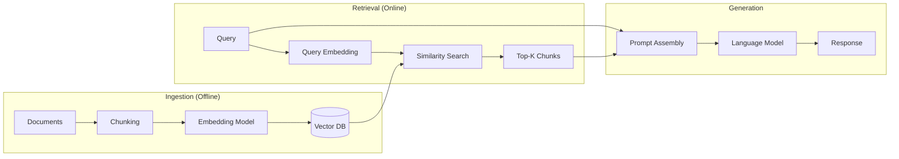

# Traditional (Naive) RAG

**Category**: Retriever-centric
**Maturity**: Production-Proven
**Primary Source**: Lewis, P., et al. (2020). "Retrieval-Augmented Generation for Knowledge-Intensive NLP Tasks." [arXiv:2005.11401](https://arxiv.org/abs/2005.11401)

---

## Overview

Traditional RAG, introduced by Lewis et al. at Facebook AI Research in 2020, established the foundational paradigm of combining dense retrieval with sequence-to-sequence generation. The architecture follows a simple linear pipeline: given a query, retrieve relevant documents from a corpus, then condition the language model's generation on both the query and retrieved context.

The key insight was that instead of storing all knowledge in model parameters (which leads to hallucination and inability to update), the model could dynamically access an external knowledge base at inference time. This allows the knowledge to be updated without retraining and provides citations for generated content.

Traditional RAG remains the most widely deployed architecture due to its simplicity and low operational cost, though it has known limitations around context loss during chunking and the "lost in the middle" phenomenon where models struggle to use information from the middle of long contexts (Liu et al., 2023).

---

## Architecture Diagram



---

## How It Works

### Ingestion Phase
1. **Chunking**: Documents are split into fixed-size chunks (typically 256-1024 tokens) with optional overlap (10-20%)
2. **Embedding**: Each chunk is converted to a dense vector using an embedding model (e.g., text-embedding-3-small, BGE, GTE)
3. **Indexing**: Vectors are stored in a vector database with associated metadata

### Retrieval Phase
1. **Query Embedding**: The user query is embedded using the same model
2. **Similarity Search**: Top-k most similar chunks are retrieved using cosine similarity or dot product
3. **Context Assembly**: Retrieved chunks are concatenated (usually ordered by relevance score)

### Generation Phase
1. **Prompt Construction**: Query + retrieved context are formatted into a prompt
2. **LLM Generation**: The language model generates a response conditioned on the prompt
3. **Response Delivery**: The generated text is returned, optionally with source citations

---

## Implementation

### Ingestion Pipeline

```python
from typing import List
import numpy as np

def ingest_documents(
    documents: List[str],
    chunk_size: int = 512,
    chunk_overlap: int = 50,
    embedding_model: str = "text-embedding-3-small"
) -> VectorIndex:
    """
    Ingest documents into a vector index for retrieval.

    Steps:
    1. Split each document into overlapping chunks
    2. Generate embeddings for each chunk
    3. Store in vector database with metadata
    """
    chunks = []
    metadata = []

    # Step 1: Chunk documents with overlap
    for doc_id, doc in enumerate(documents):
        doc_chunks = split_into_chunks(doc, chunk_size, chunk_overlap)
        for chunk_idx, chunk in enumerate(doc_chunks):
            chunks.append(chunk)
            metadata.append({
                "doc_id": doc_id,
                "chunk_idx": chunk_idx,
                "text": chunk
            })

    # Step 2: Generate embeddings (batch for efficiency)
    embeddings = embedding_model.encode(chunks, batch_size=32)

    # Step 3: Create and populate vector index
    index = VectorIndex(dimension=embeddings.shape[1])
    index.add(embeddings, metadata)

    return index

def split_into_chunks(text: str, size: int, overlap: int) -> List[str]:
    """Split text into overlapping chunks by token count."""
    tokens = tokenize(text)
    chunks = []
    start = 0
    while start < len(tokens):
        end = min(start + size, len(tokens))
        chunk_tokens = tokens[start:end]
        chunks.append(detokenize(chunk_tokens))
        start += size - overlap
    return chunks
```

### Retrieval Pipeline

```python
def retrieve_and_generate(
    query: str,
    index: VectorIndex,
    llm: LanguageModel,
    top_k: int = 5,
    max_context_tokens: int = 4000
) -> str:
    """
    Retrieve relevant chunks and generate a response.

    Steps:
    1. Embed the query
    2. Retrieve top-k similar chunks
    3. Assemble context within token budget
    4. Generate response with LLM
    """
    # Step 1: Embed query
    query_embedding = embedding_model.encode([query])[0]

    # Step 2: Retrieve top-k chunks
    results = index.search(query_embedding, top_k=top_k)

    # Step 3: Assemble context (truncate if needed)
    context_chunks = []
    current_tokens = 0
    for result in results:
        chunk_text = result.metadata["text"]
        chunk_tokens = count_tokens(chunk_text)
        if current_tokens + chunk_tokens <= max_context_tokens:
            context_chunks.append(chunk_text)
            current_tokens += chunk_tokens
        else:
            break

    context = "\n\n---\n\n".join(context_chunks)

    # Step 4: Generate response
    prompt = f"""Answer the question based on the provided context.

Context:
{context}

Question: {query}

Answer:"""

    response = llm.generate(prompt)
    return response
```

---

## Use Cases

### Example 1: Customer Support FAQ Bot
- **Scenario**: E-commerce company with 5,000 FAQ entries and product documentation
- **Why this architecture**: Simple queries ("How do I return an item?"), low latency requirements (<500ms), cost-sensitive deployment
- **Expected outcome**: 70-80% of queries answered correctly with sub-200ms retrieval

### Example 2: Internal Documentation Search
- **Scenario**: Engineering team with Confluence/Notion documentation, 10,000 pages
- **Why this architecture**: Engineers ask specific questions, documents are relatively standalone, need quick iteration
- **Expected outcome**: Fast deployment (1-2 days), reasonable accuracy for factual lookups

### Example 3: Academic Paper Q&A
- **Scenario**: Research assistant for querying a collection of 1,000 papers
- **Why this architecture**: Starting point before investing in more complex architectures
- **Expected outcome**: Works well for specific fact retrieval, struggles with synthesis questions

---

## Pros and Cons

### Advantages

- **Simplicity**: Can be implemented in <100 lines of code; minimal moving parts
- **Low latency**: 50-200ms typical query time with optimized vector DB
- **Low cost**: ~$0.10-0.50 per million tokens for embedding; inference costs only for generation
- **Easy to debug**: Linear pipeline makes issues traceable
- **Mature tooling**: Extensive SDK support (LangChain, LlamaIndex, Haystack)

### Limitations

- **Context loss during chunking**: Chunks like "In this section, we describe..." lose meaning without document context (Anthropic, 2024)
- **"Lost in the middle" phenomenon**: LLMs struggle to use information from middle positions in long contexts (Liu et al., 2023)
- **No semantic understanding of relevance**: Pure vector similarity misses nuanced relevance; exact term matches may fail
- **Retrieval failure rate**: ~5.7% of relevant documents not retrieved in top-20 with embeddings alone (Anthropic, 2024)
- **No multi-hop reasoning**: Cannot connect information across multiple documents

### Compared to Alternatives

- **vs. Hybrid RAG**: Hybrid adds BM25 for exact term matching; ~20% improvement in retrieval for technical queries with specific terminology
- **vs. Contextual RAG**: Contextual adds chunk-specific context before embedding; 35% reduction in retrieval failures but higher indexing cost
- **vs. Self-RAG**: Self-RAG adds retrieval decisions and self-critique; much better factuality but requires fine-tuning

---

## Performance Benchmarks

| Metric | Value | Source |
|--------|-------|--------|
| Top-20 retrieval failure rate | 5.7% (baseline) | Anthropic, 2024 |
| Typical latency | 50-200ms | Industry benchmarks |
| Cost per 1M tokens indexed | $0.10-0.50 | OpenAI/Cohere pricing |

---

## When to Upgrade

Consider moving beyond Traditional RAG when:

1. **Retrieval quality is insufficient**: More than 10% of queries return irrelevant results
2. **Queries contain technical terminology**: Exact term matching is needed (→ Hybrid RAG)
3. **Documents require context to understand**: Chunks lose meaning in isolation (→ Contextual RAG)
4. **Multi-hop reasoning is needed**: Questions require connecting multiple documents (→ GraphRAG)
5. **High factuality is required**: Cannot tolerate hallucinations (→ Self-RAG or CRAG)

---

## References

1. Lewis, P., et al. (2020). "Retrieval-Augmented Generation for Knowledge-Intensive NLP Tasks." *NeurIPS*. [arXiv:2005.11401](https://arxiv.org/abs/2005.11401)
2. Liu, N., et al. (2023). "Lost in the Middle: How Language Models Use Long Contexts." [arXiv:2307.03172](https://arxiv.org/abs/2307.03172)
3. Anthropic. (September 2024). "Introducing Contextual Retrieval." [anthropic.com](https://www.anthropic.com/news/contextual-retrieval)
4. Gao, Y., et al. (2023). "Retrieval-Augmented Generation for Large Language Models: A Survey." [arXiv:2312.10997](https://arxiv.org/abs/2312.10997)
